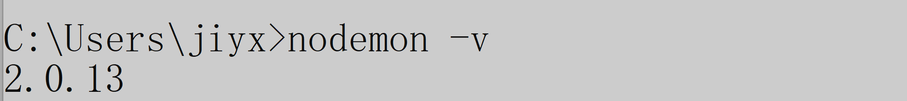
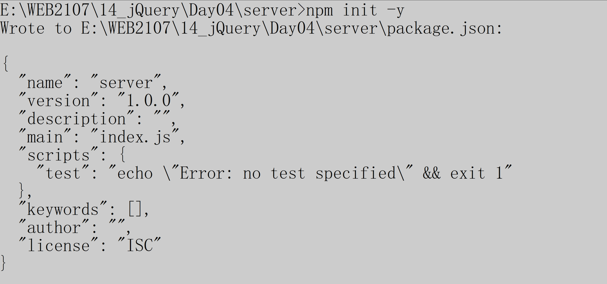
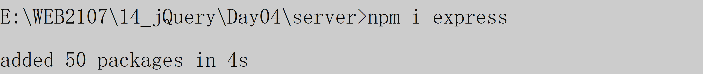
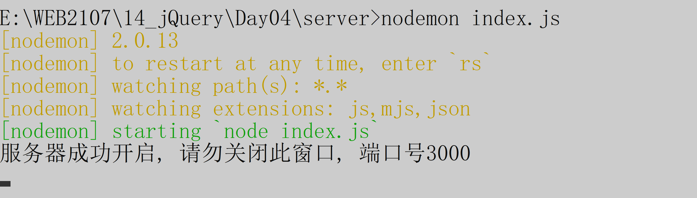
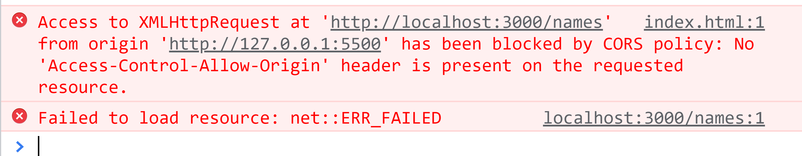
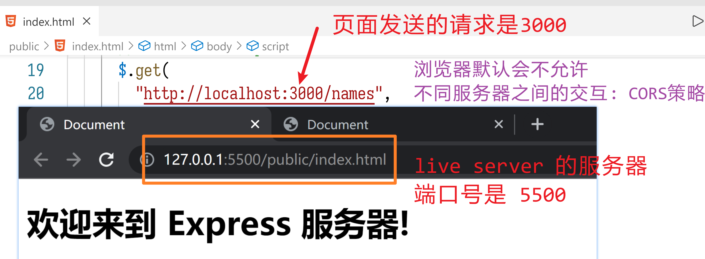

# jQuery04

> 确保 `开通网络!`,  没网的 找 项目经理!
>
> 下节课 讲解 AJAX

## banner动画

```html
<!DOCTYPE html>
<html lang="en">
  <head>
    <meta charset="UTF-8" />
    <meta http-equiv="X-UA-Compatible" content="IE=edge" />
    <meta name="viewport" content="width=device-width, initial-scale=1.0" />
    <title>Document</title>
    <style>
      #banner {
        /* border: 2px solid red; */
        border-radius: 4px;
        width: 300px;
        height: 150px;
        /* 超出部分: 隐藏 */
        overflow: hidden;
        /* 为子元素中的 绝对定位方法 提供服务 */
        position: relative;
      }

      #btns {
        /* 绝对定位: 相对于祖先元素中, 首个定位方式的元素 */
        position: absolute;
        top: 50%;
        transform: translateY(-50%);
        width: 100%;
        display: flex;
        justify-content: space-between;
        /* margin-top: -5px; */
      }

      /* 图片所在的容器 */
      #banner > div:first-child {
        /* calc: 计算器 */
        /* 考虑后期可能有需求变更, 例如图片宽度, 数量发生变化, 此处的计算器写法 就更加容易读, 容易改 */
        width: calc(4 * 300px);
        /* 相对定位: 相对于当前所在位置, 进行位置调整 */
        position: relative;
        /* 负数: 向左移动 */
        /* left: -300px; */
      }

      #banner img {
        /* display: none; */
        width: 300px;
        height: 150px;
        /* 空白: img是行元素 -- 行高, 所以默认四周有空白 */
        /* 浮动布局: 就不再具有行元素/块元素的概念 */
        float: left;
      }
    </style>
  </head>
  <body>
    <!-- 1. 一个窗口, 把超出部分隐藏 -->
    <div id="banner">
      <!-- 2. 1个整体容器, 存放并排的四张图 -->
      <div>
        
        
        
        
      </div>
      <div id="btns">
        <button>&lt;</button>
        <button>&gt;</button>
      </div>
    </div>

    <script src="./vendor/jquery-3.6.0.min.js"></script>
    <script>
      // 点击下一页按钮: 让图片所在的div, left移动
      $("#btns>button:eq(1)").click(function () {
        // 防止动画持续期间, 按钮被再次点击
        $("#btns>button").prop("disabled", true) //让按钮不可用

        // 动画的参数: 支持复合运算符写法
        // -= : 相对于当前位置, left = left - 300px
        let $box = $("#banner>div:eq(0)")
        // 判断当前是否为最后一张图, 如果是则回到0的位置
        let w = $box.width() //元素的宽度
        let left = $box.css("left") //左侧的偏移量
        console.log(w, left)
        // -900px 说明是最后一张
        if (left == "-900px") {
          // animate(动画效果, 时长, 回调函数)
          $box.animate({ left: 0 }, () => {
            console.log(this)
            $("#btns>button").prop("disabled", false)
          }) //滑动到初始位置
        } else {
          //普通函数: this指向 与执行时所在对象一致
          //箭头函数: 自身没有this, 使用声明时所在作用域的this
          $box.animate({ left: "-=300px" }, () => {
            console.log(this)
            $("#btns>button").prop("disabled", false)
          })
        }
      })

      // 定时滚动: 每三秒滚动一次
      setInterval(() => {
        // 触发 下一页的 点击事件即可!
        console.log($("#btns>button:eq(1)"))
        // 原生DOM对象, 有方法 click, 触发后就是点击事件
        // 此click是原生DOM对象的方法, 不是 JQ对象的. 实现的功能不同
        // [0]: 用于获取 JQ对象查找到的 原生DOM元素
        $("#btns>button:eq(1)")[0].click()
      }, 3000)

      // 练习: 完成 上一页 按钮
      $("#btns>button:eq(0)").click(function () {
        //1.当前按钮不可用, 防止多次点击bug
        $("#btns>button").prop("disabled", true)

        let options = { left: "+=300px" }

        let $box = $("#banner>div:eq(0)")
        // if的简化写法, 省略{}
        console.log($box.css("left"))
        if ($box.css("left") == "0px") options.left = "-900px"

        $box.animate(options, () => {
          // 必须用箭头函数, this才能指向按钮
          $("#btns>button").prop("disabled", false)
        })
      })
    </script>
  </body>
</html>

```

## AJAX

```html
<!DOCTYPE html>
<html lang="en">
  <head>
    <meta charset="UTF-8" />
    <meta http-equiv="X-UA-Compatible" content="IE=edge" />
    <meta name="viewport" content="width=device-width, initial-scale=1.0" />
    <title>Document</title>
  </head>
  <body>
    <!-- ajax: jQuery对ajax进行了封装, 使用起来特别简单 -->
    <script src="./vendor/jquery-3.6.0.min.js"></script>
    <script>
      // 接口地址:
      // 网址: http://www.codeboy.com:9999
      let url = "http://www.codeboy.com:9999/data/product/list.php"

      // jqajax
      // ajax: 是最完整的格式, 可定制性最强
      $.ajax({
        type: "GET", //请求类型: GET 和 POST
        // url: url, //请求地址
        url, //语法糖, 如果 属性名:变量名  恰好相同, 则可以简化
        // 路径?参数=值&参数=值
        // 当前请求的参数 pno 代表页数
        data: "pno=1", //请求的参数
        dataType: "json", //返回值的类型, 通常是json
        // 请求成功后的回调函数
        success: function (response) {
          // response: 请求的返回值
          console.log(response)
        },
      })

      // 简化写法: jqget   -- 专门发get请求
      // get(请求地址, 参数, 回调函数)
      // 参数: 可以是字符串写法 也支持 对象写法
      $.get(url, { pno: 2 }, function (data, textStatus, jqXHR) {
        // 默认3个值, data最常用, 后两个几乎不用, 不用了解
        console.log(data)
      })

      // post:  jqpost
      // 参数2: 支持字符串和对象 两种写法
      $.post(url, "pno=3", function (data, textStatus, jqXHR) {
        console.log(data)
      })
    </script>
  </body>
</html>

```

## 实战

```html
<!DOCTYPE html>
<html lang="en">
  <head>
    <meta charset="UTF-8" />
    <meta http-equiv="X-UA-Compatible" content="IE=edge" />
    <meta name="viewport" content="width=device-width, initial-scale=1.0" />
    <title>Document</title>
  </head>
  <body>
    <div id="content">
      <!-- 每一项的样子: 把返回值数组进行forEach遍历, 用模板字符串拼接成如下格式, 最后添加到 id='content' 的元素中! -->
      <div>
        
        <div>标题</div>
        <div>时间</div>
      </div>
    </div>

    <!-- 发请求->把数据转为html代码->添加到页面上 -->
    <script src="./vendor/jquery-3.6.0.min.js"></script>
    <script>
      // 发请求-> 看数据
      let url = "https://api.apiopen.top/getWangYiNews"
      // 参数页数为 page=1 代表第一页,  是get请求

      // 常见错误: 默认的参数1 是个字符串, 需要自行修改!
      $.get(url, { page: 1 }, function (data, textStatus, jqXHR) {
        console.log(data)
        // 任务: 把数据拼接到 html 中, 然后添加到页面上
        let all_el = ""

        data.result.forEach(item => {
          let el = `<div>
                      
                      <div>${item.title}</div>
                      <div>${item.passtime}</div>
                    </div>`
          all_el += el //拼接每次循环得到的html代码
        })
        // 放在 id='content' 的元素中, 需要解析
        $("#content").html(all_el)
      })
    </script>
  </body>
</html>

```


```html
<!DOCTYPE html>
<html lang="en">
  <head>
    <meta charset="UTF-8" />
    <meta http-equiv="X-UA-Compatible" content="IE=edge" />
    <meta name="viewport" content="width=device-width, initial-scale=1.0" />
    <title>Document</title>
    <style>
      .cell {
        border-radius: 3px;
        border: 1px solid lightgray;
        box-shadow: 0 0 3px 3px rgba(0, 0, 0, 0.1);
        margin: 6px;
        overflow: hidden;
        display: inline-block;
        width: 200px;
      }
      .cell > img {
        width: 200px;
        height: 200px;
        transition-duration: 0.2s;
      }
      .cell > img:hover {
        transform: scale(1.2);
      }
      .cell > img + div {
        padding: 4px;
        /* z-index: 调整层级, 搭配 position 使用 */
        position: relative;
        z-index: 1;
      }
      /* 截图软件: snipaste  -- windows商店里提供的软件 */
      .cell > img + div > div:first-child {
        color: #1dabf3;
        font-size: 1.2em;
      }

      .cell > img + div > div:nth-child(2) {
        font-size: 14px;
        /* 面试题: 谷歌浏览器, 文字最小为12px, 如果想更小怎么办? */
        /* 利用缩小可以实现 */
        /* transform: scale(0.25); */
        /* 固定写法: 文字保留指定行数 */
        display: -webkit-box;
        -webkit-box-orient: vertical;
        -webkit-line-clamp: 3;
        overflow: hidden;
      }

      .cell > div > div:last-child {
        display: flex;
        justify-content: space-between;
        margin-top: 6px;
      }

      .cell > div > div:last-child > div:last-child,
      .minus,
      .add {
        display: inline-block;
        padding: 4px;
        background-color: #1dabf3;
        border-radius: 4px;
        color: white;
        font-size: 12px;
      }

      .minus,
      .add {
        padding: 4px 8px;
      }
    </style>
  </head>
  <body>
    <div class="content">
      <div class="cell">
        
        <div>
          <div>价格</div>
          <div>题目</div>
          <div>
            <div>
              <span>-</span>
              <span>数量</span>
              <span>+</span>
            </div>
            <div>加入购物车</div>
          </div>
        </div>
      </div>
    </div>
    <!--  -->
    <script src="./vendor/jquery-3.6.0.min.js"></script>
    <script>
      // http://www.codeboy.com:9999/data/product/list.php
      let url = "http://www.codeboy.com:9999/data/product/list.php"

      $.get(url, "", function (data, textStatus, jqXHR) {
        console.log(data)

        let all_el = ""

        data.data.forEach(item => {
          // 注意图片地址: 是一个相对路径, 数据库存储的应该是相对路径
          // 因为项目上线之后, 真正的域名地址是什么, 不一定!
          let host = "http://www.codeboy.com:9999/"

          let el = `<div class="cell">
        
        <div>
          <div>¥${item.price}</div>
          <div>${item.title}</div>
          <div>
            <div>
              <span class='minus'>-</span>
              <span>1</span>
              <span class='add'>+</span>
            </div>
            <div>加入购物车</div>
          </div>
        </div>
      </div>`

          all_el += el
        })

        $(".content").html(all_el)
      })
    </script>
  </body>
</html>

```

```html
<!DOCTYPE html>
<html lang="en">
  <head>
    <meta charset="UTF-8" />
    <meta http-equiv="X-UA-Compatible" content="IE=edge" />
    <meta name="viewport" content="width=device-width, initial-scale=1.0" />
    <title>Document</title>
  </head>
  <body>
    <div>
      <span>用户名: </span>
      <input type="text" />
    </div>
    <div>
      <span>密码: </span>
      <input type="password" />
    </div>
    <button>登录</button>

    <script src="./vendor/jquery-3.6.0.min.js"></script>
    <script>
      let url = `http://www.codeboy.com:9999/data/user/login.php`
      // uname upwd
      $("button").click(function () {
        //获取输入框中的值
        let uname = $(":text").val()
        let upwd = $(":password").val()
        // 发送登录请求: 请求方式post
        $.post(
          url,
          { uname, upwd }, //简化后
          // { uname: uname, upwd: upwd },
          function (data, textStatus, jqXHR) {
            // 用户名: doudou  密码:123456
            console.log(data)
          }
        )
      })
    </script>
  </body>
</html>

```


## 从网站抓取接口

前提: 网站没有做防盗处理


点击查看不同的请求文件, 查看接口


## CORS

跨域报错:

### 制作express服务器

- node.js: http://nodejs.cn/download/

- npm : 用于安装第三方插件, 默认从外网下载资源, 会比较慢, 所以要切换成`中国镜像`

  - 检查当前镜像:`npm config get registry`
    如下说明是原版的国外镜像

    

  - 切换为国内的淘宝镜像: 
    `npm config set registry https://registry.npm.taobao.org` 

    

安装 `nodemon` 工具: 搭配 express 使用, 会检测代码修改 然后 自动帮你重启服务器

> 安装命令: `npm i -g nodemon`
>
> > i:  install

通过 `nodemon -v` 可以测试是否已安装



---

生成 express 服务器

- 创建文件夹: `server`

- 在 server 目录下, 开启命令行工具:`npm init -y`

  

- 安装 express 模块: `npm i express`

  

- 开始书写代码: 在server 文件夹中创建 `index.js` 文件

  ```js
  //引入模块
  const express = require("express")
  // 创建服务器
  var app = express()
  
  // 在端口3000下, 开启服务器
  app.listen(3000, () => {
    console.log("服务器成功开启, 请勿关闭此窗口, 端口号3000")
  })
  // 启动服务器: 在 server文件夹下执行开启命令:
  // 1. 旧写法: node index.js   每次改动都必须手动重启服务器才生效
  // 2. 新写法: nodemon index.js   每次改动会自动重启服务器
  
  ```

- 启动服务器

  


## 跨域 CORS

> 浏览器的`安全`策略: 同源策略
>
> > 浏览器开启一个网页之后, 此网页中的JS代码 在发送请求时,  只能向`相同的服务器`发送请求: 认为这样的数据才是安全的!
> >
> > `相同`的含义: `协议://域名:端口号`  这三个要素必须都相同

典型的跨域报错样式: 关键词 `CORS`



跨域报错的原因:  不同服务器之间 发送请求导致的!




## 跨域问题的解决

由于 现代的 web项目越来越大, 目前流行 `前后端分离` 方式开发

- 前端开发人员: web(网页) app(手机端)
- 后端开发人员: Java Php, node.js, go...

为了缓解服务器的并发压力, 大项目通常要拆分出 至少3个服务器

- 接口服务器 : 提供数据库相关操作
- 前端服务器: 展示 HTML 界面
- 静态资源服务器: 图片, 视频, 音频...

由于拆分多个服务器, 必定会不同源, 所以浏览器的同源策略非常碍事!!

主流的解决方案有三种:

1. 服务器可接触: 此方案最简单, 只要在服务器上添加 白名单 允许即可!

   `最常见, 最实用, 最简单, 最推荐`!!

2. 服务器不可接触: 需要`代理`服务器解决

   

3. JSONP: 目前基本被淘汰... 所以不讲.


服务器代码:

```js
//引入模块
const express = require("express")
// http: 服务器发http请求的模块
const http = require("http")

// 创建服务器
var app = express()
// 配置静态文件所在的目录
app.use(express.static("public"))

// 运行CORS: 让所有请求, 都可以被任意来源进行访问
// all: 代表所有请求方式, 例如 get post head put ....
// * : 通配符, 代表所有请求的接口地址
app.all("*", function (req, res, next) {
  // Access-Control-Allow-Origin
  // 接受 - 控制 - 允许 - 来源
  // 代表: 服务器允许来自 参数2 来源的访问
  // * :通配符,  代表所有
  res.header("Access-Control-Allow-Origin", "*")
  //
  // 特殊指定: 只允许来自 localhost:5500 的访问
  // 修改 127.0.0.1 为 localhost, 则会报错!
  // res.header("Access-Control-Allow-Origin", "http://127.0.0.1:5500")

  // 防止中文乱码, 通常添加:
  // 返回值是 json 格式:  javascript/json
  res.header("content-type", "javascript/json;charset=utf-8")

  next() // next() 代表可以继续执行后续代码
})

// 在端口3000下, 开启服务器
app.listen(3000, () => {
  console.log("服务器成功开启, 请勿关闭此窗口, 端口号3000")
})
// 启动服务器: 在 server文件夹下执行开启命令:
// 1. 旧写法: node index.js   每次改动都必须手动重启服务器才生效
// 2. 新写法: nodemon index.js   每次改动会自动重启服务器

app.get("/hello", (req, res) => {
  res.send("Hello Express!")
})

app.get("/names", (req, res) => {
  let names = ["lily", "lucy", "john", "marry", "亮亮"]
  res.send(names)
})

// 跨域: 浏览器有跨域问题
// 服务器node.js 没有跨域问题
// 代理:  网页 请求-> express服务器 -> 请求斗鱼的服务器
app.get("/douyu/list", function (req, res) {
  let url = "http://m.douyu.com/api/room/list?page=2&type=yz"
  //服务器发请求, 依赖于 http 模块
  http.get(url, data => {
    //data: 就是请求的返回值, 来自于douyu
    var str = ""
    // 底层的请求是分批的, 需要一段一段拼接所有的返回值
    data.on("data", function (chunk) {
      str += chunk
    })
    // 拼接结束时, 返回完整的内容!
    data.on("end", function () {
      res.send(JSON.parse(str))
    })
  })
})

```

请求代码

```html
<!DOCTYPE html>
<html lang="en">
  <head>
    <meta charset="UTF-8" />
    <meta http-equiv="X-UA-Compatible" content="IE=edge" />
    <meta name="viewport" content="width=device-width, initial-scale=1.0" />
    <title>Document</title>
  </head>
  <body>
    <h1>欢迎来到 Express 服务器!</h1>

    <script src="./jquery-3.6.0.min.js"></script>

    <script>
      // 注意!!!!  通过 localhost:3000 运行,  采用 express 服务器!!!
      // 请求当前服务器上的 /names 接口数据
      //
      // CORS: 右键->open live server 运行此html
      $.get(
        "http://localhost:3000/names",
        "",
        function (data, textStatus, jqXHR) {
          console.log(data)
          data.forEach(item => {
            // append: 增加到子元素的末尾
            $("body").append(`<li>${item}</li>`)
          })
        }
      )

      // 直接发请求, 斗鱼服务器会拒绝, 因为浏览器的同源策略不允许
      // 改成向我们的express 服务器发请求,  express 再去斗鱼请求, 即可
      // 因为 服务器没有同源策略 , 可以随便发
      // 这种功能的服务器 称为 代理服务器
      $.get(
        // "https://m.douyu.com/api/room/list?page=2&type=yz",
        "http://localhost:3000/douyu/list",
        "",
        function (data, textStatus, jqXHR) {
          console.log(data)
        }
      )
    </script>
  </body>
</html>

```


