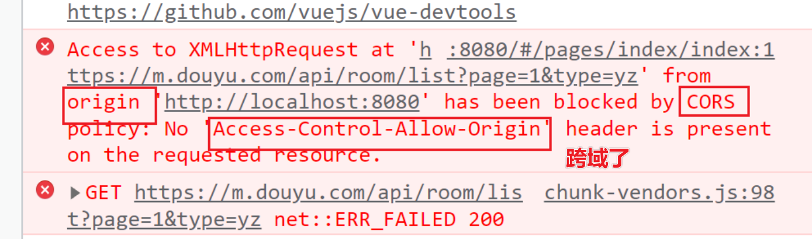
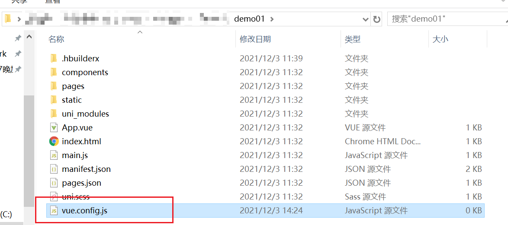
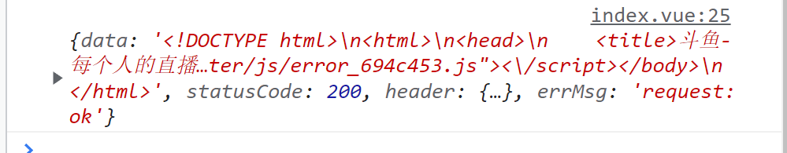

# uniapp04

## 复习

项目就是多个案例[功能,页面]组合成的.

完成一个案例,可以遵循步骤:

`发请求=>拿数据=>存本地=>做展示`

**发请求**: ajax知识点  

>原生写法: **xmlhttprequest**
>
>jQuery写法: $.get()  $.post  $.ajax()........
>
>Vue 本身没有封装请求方法    习惯使用axios
>
>微信小程序   wx.request
>
>`uniapp   uni.request`
>
>react  fetch语法  
>
>angular  内置了请求对象   httpclient

**拿数据**:  在发送请求之后,封装的请求方法中会有一个回调函数.在请求成功时触发.在这个方法中,打印返回的数据.  console.log

**存本地**: 在组件页面中,想要在页面上展示数据,必须将数据存储到组件中的data里,computed计算属性中

- 初始化数据   key:value    data:null     null  为空
- 在请求成功方法函数中  把数据存储到本地    `this.data = res.data`

**做展示**:  将数据显示到页面模板中

uniapp是基于vue.js的.渲染数据和vue的语法一致.

**插值**:`{{num}}`  {{}}范围是JS代码范围  {{1+1}}

**属性操作**:  v-bind  `:src="item.pic"`   动态绑定属性   属性的值会根据后面的变量进行改变   

**事件绑定**:  v-on    `@click="方法名"`   绑定的方法 是具体触发事件后,要执行的代码   方法  需要在methods中定义

指令:  `v-for(item,index) in data :key="index"`

- item   遍历data中每一个元素
- index  索引 下标   
- :key   渲染的时候回使用    要求是唯一值

​    v-if    `v-if="data"`    判断渲染    远程接口数据  加载需要时间 判断当数据没有返回时,就不渲染  

## 框架语法学习

### 案例:商品列表

请求接口获取商品列表数据,遍历显示数据,实现触底加载数据,下拉刷新数据,回到顶部按钮.

下拉刷新需要在pages.json开启下拉刷新功能

```json
"pages": [{
		"path": "pages/index/index",
		"style": {
			"navigationBarTitleText": "uni-app",
            // 开启下拉刷新
			"enablePullDownRefresh": true
		}
	}],
```

接口地址:

> http://www.codeboy.com:9999/data/product/list.php

```vue
<template>
	<view>
		<!-- 商品列表 -->
		<!-- 发送请求=>拿数据=>存本地=>做展示 -->
		<!-- 4.做展示 -->
		<!-- 远程加载数据  如果没有数据请求回来 为null 判断数据为null 就不渲染页面 -->
		<uni-list v-if="data">
			<uni-list-item v-for="(item, index) in data.result" :key="index">
				<!-- 自定义插槽 -->
				<template slot="body">
					<view class="cell">
						<!-- 图片 -->
						<!-- <image
							:src="`http://www.codeboy.com:9999/${item.pic}`"
						></image> -->
						<image :src="item.image" mode=""></image>
						<view>
							<!-- 产品名称 -->
							<view>{{ item.title }}</view>
							<!-- 价格 -->
							<!-- <view>{{ item.price }}</view> -->
							<view>¥{{ item.passtime }}</view>
						</view>
					</view>
				</template>
			</uni-list-item>
		</uni-list>
		<!-- 加载组件  提示文字 -->
		<!-- uload -->
		<!-- status 取值就三个 more  loading  noMore -->
		<uni-load-more :status="status"></uni-load-more>
		<!-- 回到顶部按钮 -->
		<view class="btn-gotop" @click="goTop" v-show="showBtn">
			<uni-icons color="white" size="30" type="arrowthinup"></uni-icons>
		</view>
	</view>
</template>

<script>
export default {
	data() {
		return {
			// 是否显示回到顶部按钮
			showBtn: false,
			data: null,
			// 加载组件的状态
			status: 'more',
			// 记录当前页码
			page: 1
		};
	},
	// 下拉事件
	onPullDownRefresh() {
		console.log('下拉刷新触发了');
		// 请求第一页
		this.getData();
	},
	// 触底事件
	onReachBottom() {
		// console.log('到底了,加载数据');
		// 触底后 加载组件的状态需要改变 loading
		this.status = 'loading';
		// 请求数据
		this.getData(this.page + 1);
		// 触底翻页之后,当前页码数 需要+1
		this.page += 1;
	},
	// 监听滚动事件
	onPageScroll(e) {
		// 距离顶部的距离
		console.log(e.scrollTop);
		// 距离顶部1500时,就显示回到顶部按钮
		this.showBtn = e.scrollTop > 1500;
	},
	mounted() {
		this.getData();
	},
	methods: {
		// 回到顶部方法
		goTop() {
			// 滚动到页面的位置
			uni.pageScrollTo({
				// 0 为回到顶部
				scrollTop: 0
			});
		},
		getData(page = 1) {
			// 判断默认请求第一页
			// 如果是触底事件加载 需要请求下一页
			// 1.发送请求
			uni.request({
				// url: 'http://www.codeboy.com:9999/data/product/list.php',
				// 换一个接口
				url: 'https://api.apiopen.top/getWangYiNews',
				method: 'GET',
				// 页码参数是page
				data: { page: page },
				success: res => {
					// 2.拿数据
					console.log(res);
					// 3.存本地
					// 如果页数大于1需要进行拼接新旧数据
					if (page > 1) {
						res.data.result = [
							...this.data.result,
							...res.data.result
						];
					}
					this.data = res.data;
					// 停止下拉刷新  放在请求加载完毕 并且数据返回后
					uni.stopPullDownRefresh();
				},
				fail: () => {},
				complete: () => {}
			});
		}
	}
};
</script>

<style scoped lang="scss">
.cell {
	padding: 15rpx;
	// 弹性布局
	display: flex;
	> image {
		width: 180rpx;
		height: 180rpx;
		// 方法一:最小大小
		// min-width: 180rpx;
		// 方法二: 不要弹性压缩
		// flex 代表以下三个属性 none 0 0 auto
		// flex-grow	一个数字，规定项目将相对于其他灵活的项目进行扩展的量。
		// flex-shrink	一个数字，规定项目将相对于其他灵活的项目进行收缩的量。
		// flex-basis	项目的长度。合法值："auto"、"inherit" 或一个后跟 "%"、"px"、"em" 或任何其他长度单位的数字。
		// 不要收缩
		// flex:none
		// 方法三
		flex-shrink: 0;
	}
	> view {
		// 弹性布局
		display: flex;
		// 排列方向
		flex-direction: column;
		// 对齐方式   上下两边
		justify-content: space-between;
		// 商品名称
		// 第一个view
		> view:first-of-type {
			// 两行 隐藏 ...
			text-overflow: -o-ellipsis-lastline;
			overflow: hidden;
			text-overflow: ellipsis;
			display: -webkit-box;
			-webkit-line-clamp: 2;
			line-clamp: 2;
			-webkit-box-orient: vertical;
		}
		// 价格
		// 最后一个view
		> view:last-of-type {
			color: red;
			font-size: 1.1em;
		}
	}
}
.btn-gotop {
	background-color: black;
	// 浮动
	position: fixed;
	// 定位位置
	bottom: 100rpx;
	right: 50rpx;
	// 透明度
	opacity: 0.7;
}
</style>

```

### 宫格布局

单元格的方式进行布局,常使用的双列,三列

```vue
<template>
	<view>
		<!-- ugrid -->
		<!-- 属性的值为非字符串  需要绑定属性: -->
		<uni-grid
			:column="2"
			:showBorder="false"
			:square="false"
			:highlight="false"
		>
			<uni-grid-item v-for="(item, index) in skills" :key="index">
				{{ item }}
			</uni-grid-item>
		</uni-grid>
	</view>
</template>

<script>
export default {
	data() {
		return {
			skills: ['html', 'css', 'javascript', 'vue', 'react', 'angular']
		};
	}
};
</script>

<style scoped></style>

```

### 案例:斗鱼直播列表


接口地址

>https://m.douyu.com/api/room/list?page=1&type=yz

```vue
<template>
	<!-- v-if 判断数据没有加载回来  就不渲染 -->
	<view v-if="data">
		<!-- 发请求  拿数据   存本地  做展示 -->
		<!-- 4.做展示 -->
		<uni-grid
			:column="2"
			:showBorder="false"
			:highlight="false"
			:square="false"
		>
			<uni-grid-item v-for="(item, index) in data.list">
				<view class="item">
					<!-- 图片和角标 -->
					<view>
						<!-- 图片 -->
						<image :src="item.roomSrc"></image>
						<!-- 左下角 -->
						<view>{{ item.nickname }}</view>
						<!-- 右上角 -->
						<view>{{ item.hn }}</view>
					</view>
					<view>{{ item.roomName }}</view>
					<!-- 房间名称 -->
				</view>
			</uni-grid-item>
		</uni-grid>
		<!-- 加载组件 -->
		<uni-load-more :status="status"></uni-load-more>
	</view>
</template>

<script>
export default {
	data() {
		return {
			// 初始化数据
			data: null,
			// 加载状态
			status: 'more'
		};
	},
	// 下拉刷新
	onPullDownRefresh() {
		this.getData()
		uni.stopPullDownRefresh()
	},
	// 触底事件
	onReachBottom() {
		// 触底时 修改加载组件的状态为loading
		this.status = 'loading';
		console.log('到底了,加载数据吧');
		// 获取当前页数和最大页数
		// es6 解构语法  前面的名称 必须是后面数据 this.data中存在key
		const { nowPage, pageCount } = this.data;
		// 判断如果当前页数就是最大页数 后续没有数据了 就退出
		if (nowPage === pageCount) {
			this.status = 'noMore';
			return;
		}
		// 请求翻页  +1 翻页操作
		this.getData(nowPage + 1);
	},
	mounted() {
		this.getData();
	},
	methods: {
		// 再获取一次数据
		getMore() {
			const url = '/douyu/api/room/list?page=2&type=yz';
			uni.request({
				url: url,
				method: 'GET',
				data: {},
				success: res => {
					// 2.拿数据
					console.log(res);
					// 3.存本地
					// 旧数据+新数据
					// console.log(this.data);
					// console.log(res.data.data.list);
					res.data.data.list = [
						...this.data.list,
						...res.data.data.list
					];
					this.data = res.data.data;
				},
				fail: () => {},
				complete: () => {}
			});
		},
		getData(page=1) {
			// const url = 'https://m.douyu.com/api/room/list?page=1&type=yz'
			// 配置proxy代理地址需要修改  添加一个标识头
			// 代理服务捕捉到代理标识后，会进行对应的代理操作
			const url = '/douyu/api/room/list?type=yz';
			// 1.发请求
			uni.request({
				url: url,
				method: 'GET',
				data: {page:page},
				success: res => {
					// 2.拿数据
					console.log(res);
					// 3.存本地
					// this.data = res.data.data;
					// 多获取一次数据调用
					// 如果非第一页数据 就不需要再多加载了
					if(page == 1){
						this.getMore();
					}
					if(page>1){
						res.data.data.list = [...this.data.list,...res.data.data.list]
					}
					this.data = res.data.data
				},
				fail: () => {},
				complete: () => {}
			});
		}
	}
};
</script>

<style scoped lang="scss">
.item {
	padding: 10rpx;
	image {
		width: 100%;
		height: 250rpx;
		border-radius: 6rpx;
		display: block;
	}
	> view:first-of-type {
		// 相对
		position: relative;
		> view:first-of-type {
			// 左下角
			// 绝对
			position: absolute;
			left: 0;
			bottom: 0;
			color: white;
			background-color: rgba(0, 0, 0, 0.5);
			border-radius: 6rpx;
			font-size: 0.9em;
		}
		> view:last-of-type {
			// 右上角
			// 绝对
			position: absolute;
			right: 0;
			top: 0;
			color: white;
			background-color: rgba(0, 0, 0, 0.5);
			border-radius: 6rpx;
			font-size: 0.9em;
		}
	}
	> view:last-of-type {
		font-size: 1.2em;
		overflow: hidden;
		white-space: nowrap;
		text-overflow: ellipsis;
	}
}
</style>

```

### 跨域问题

在发送请求后,看到以下错误提示,先确认接口地址是否正确,如果确定是正确,由于`浏览器`跨域了.



`HBX中内置的浏览器`,去掉了跨域问题.

跨域的问题是由于`浏览器的同源策略`.同源策略是浏览器的基本安全策略.目的是为了更加安全.

同源: 协议,主机[域名,IP],端口都一致才可以.

https://segmentfault.com/a/1190000011145364

>解决方案:
>
>- jsonp  需要服务端配置  返回数据并进行回调操作   不太流行了  
>- cors  在服务端配置运行跨域  实际公司业务采用的一种方式  要求服务端配合
>- proxy  开发过程中使用  上线也可以用   基于开发者服务器进行配置转发请求

proxy跨域方式配置:

**①在项目根目录下建立配置文件**

vue.config.js



```javascript
// vue.config.js  文件名称  在项目包的根路径下
// 导出模块
module.exports = {
	// 配置开发服务器
	devServer: {
		// 代理
		proxy: {
			// 源地址:https://m.douyu.com/api/room/list?page=1&type=yz
			// 接口编写的地址: /douyu/api/room/list?page=1&type=yz
			// 代理段
			"/douyu": {
				// 代理的域名地址
				target: "https://m.douyu.com",
				// 域名是否有变更  本地服务器localhost  m.douyu.com
				// true 代表域名不一致  大部分情况都是不一样的
				changeOrigin: true,
				// 协议http配置为false默认       https协议配置为true
				secure: true,
				// 路径重写
				pathRewrite: {
					// ^ 正则 ^xxx  xxx开头的
					"^/douyu": ""
				}
			}
		}
	}
}

```

`修改好配置一定记得重新启动项目包,使配置生效`

接口地址需要对应修改

`const url = '/douyu/api/rom/list?page=1&type=yz'`

跨域配置问题:



>1.配置文件里语法有错误,少些了,写错了
>
>2.请求地址 需要对应点改变  去掉域名 添加标识信息  `douyu`
>
>3.`修改配置文件  一定要记得重启项目包`

### 弹出层

Popup  弹出层   

```vue
<template>
	<view>
		<!-- upopup 弹出层 -->
		<button type="warn" @click="clickOpen">皮卡丘出来吧!</button>
		<!-- ref 绑定组件   使用 this.$refs.popup.属性|方法 -->
		<uni-popup ref="popup" type="center">
			<view
				style="background-color: white;font-size: 35rpx;padding: 10rpx;"
			>
				<!-- 我是弹出层 -->
				<image src="../../static/025.png" mode=""></image>
			</view>
		</uni-popup>
		<!-- 预置样式  提示  message -->
		<!-- ref 这里的popup 后面覆盖了前面的 不会冲突 -->
		<uni-popup ref="popup" type="message">
			<uni-popup-message
				type="success"
				message="恭喜你,成功了!"
				:duration="2000"
			></uni-popup-message>
		</uni-popup>
		<uni-popup ref="popup" type="share">
		    <uni-popup-share title="分享到" @select="select"></uni-popup-share>
		</uni-popup>
	</view>
</template>

<script>
export default {
	methods: {
		clickOpen() {
			// this.$refs 会把所有的组件中的属性为ref的收集起来
			// .ref绑定名称 就可以获取到这个组件的对象  通过这个对象操作对应的方法和属性即可
			this.$refs.popup.open();
		}
	}
};
</script>

<style scoped></style>

```

### Tag小标签

```vue
<template>
	<view>
		<!-- utag 标签 -->
		<uni-tag text="皮卡丘" type="default"></uni-tag>
		<uni-tag text="雷丘" type="error"></uni-tag>
		<uni-tag text="杰尼龟" type="primary"></uni-tag>
		<uni-tag text="后羿" type="success" @click="say"></uni-tag>
		<uni-tag text="钟无艳" type="warning"></uni-tag>
		<uni-tag text="圣枪游侠" type="warning" inverted></uni-tag>
		<uni-tag text="亮亮" type="warning" circle></uni-tag>
	</view>
</template>

<script>
	export default {
		methods: {
			say() {
				alert('red buff give me!')
			}
		},
	}
</script>

<style scoped>

</style>
```

