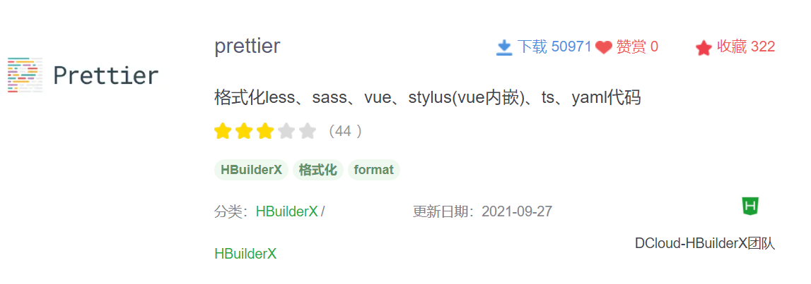
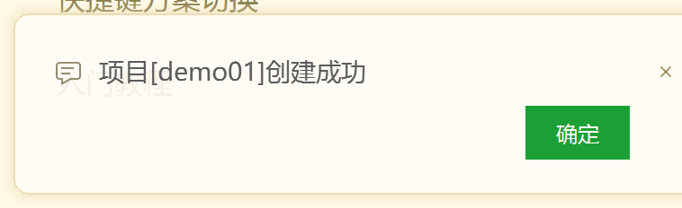
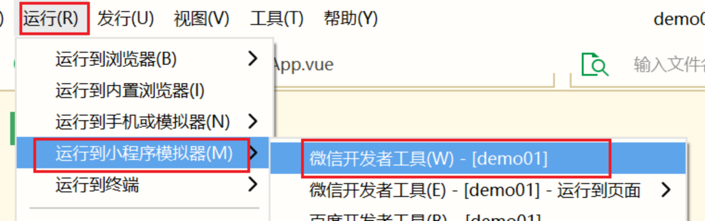

# uniapp01

>提前下载：
>
>下载新版本,之前安装卸载不用,统一环境使用相同的版本
>
>HbuilderX:https://download1.dcloud.net.cn/download/HBuilderX.3.2.16.20211122.full.zip
>
>夜神模拟器:https://res06.bignox.com/full/20211118/48ff3fed30b8470cbed44e60cbebc5da.exe?filename=nox_setup_v7.0.1.9_full.exe
>
>

介绍

>第五阶段讲师    贾思远   9年  贾老师  远哥  哈特  Heart
>
>微信:jsyheart  
>
>校区中心-班级-姓名    万寿路校区-2107-贾思远
>
>有问题交流,上课期间可能回复不及时. 有很多同学,需要慢慢回复
>
>

课程阶段

万小时定律  如果做一个事情 达到1w小时,你可以说你入门了

| 阶段                       | 内容                                                         |                        |
| -------------------------- | ------------------------------------------------------------ | ---------------------- |
| 第一阶段  服务端  编程基础 | 数据库(MySQL),JS基础,NodeJS服务端引擎,GIT版本控制            | 对于编程、语法有认识   |
| 第二阶段  布局交互         | css[sass....]样式,客户端和服务端交互ajax(xmlhttprequest对象)(请求resquest[req]、响应response[res]) | 布局页面,js交互        |
| 第三阶段  JS高级           | 事件,jQuery[查询DOM,ajax],es6相关语法,vue 单文件组件 template,script,style | JS深入,工程化,框架开发 |
| 第四阶段                   | VUE UI组件  ElementUI mint vant  微信小程序开发              | 项目,移动端            |
| 第五阶段                   | uniapp  react reactNative  angular ionic  vue项目重构        | 项目延续               |
| 第六阶段  赠课             | webpack .......                                              |                        |

第五阶段课程安排

| 课程名称 | 天数 | 内容                                                         |
| -------- | ---- | ------------------------------------------------------------ |
| uniapp   | 6天  | 基于Vue.js结合了微信小程序语法,移动App项目                   |
| react    | 8天  | react语法使用,reactNative项目  原生App                       |
| angular  | 5天  | vue借鉴了很多angular的写法,很多语法很相似,基于ionic  UI库开发项目 |
| vuePro   | 2天  | 使用重构之前的老项目(jQuery)                                 |

第1-3,4天  是基础语法学习

后面几天  就是结合框架实现项目需求  做项目  综合  flex 布局


代码和文档,阶段性[讲一段]上传到FTP,可以实时查看

先听讲老师先做,再看文档结合代码实现操作,发现问题,再总结解决

## uni-app介绍

官方地址:https://uniapp.dcloud.io/

`uni-app` 是一个使用 [Vue.js](https://vuejs.org/) 开发所有前端应用的框架，开发者编写一套代码，可发布到iOS、Android、Web（响应式）、以及各种小程序（微信/支付宝/百度/头条/飞书/QQ/快手/钉钉/淘宝）、快应用等多个平台。

好处:适合中小企业开发  开发成本低  一套代码可以生成多端使用

缺点不足:发展时间较短,有一些bug问题,需要官方逐渐修复.

## 环境部署

### HBuilderX

uniapp的编写和编译及其打包,都需要使用到它

官网：https://www.dcloud.io/hbuilderx.html


把下载好的压缩包，放在一个非系统盘（非Ｃ盘），路径不要有中文和空格．

解压压缩包，找到对应路径．启动软件.


提示选择主题配色


### Dcloud注册登录

后续安装插件和打包需要使用到.

>如果注册时,提示网络错误,网络问题,也可能服务端出问题.
>
>等等再试

注册登录,如果没有注册过,可以参看`<<Dclound账号注册.pdf>>`

登录后的效果.

### 安装插件


#### 内置浏览器

方便之后开发预览


### 必装插件

在插件市场安装插件,需要注册用户后登录.


Sass插件编译sass scss


代码格式化插件



安装之后查看已经安装的插件


### 创建项目包


创建成功的提示



## 多端运行

在项目运行的时候,需要在编辑器中,打开App.vue或者main.js,然后再去运行项目.否则会报错找不到项目启动文件.


### H5端浏览器


问题:

>运行后,不能够正常打开浏览器看到渲染的效果:
>
>1、HBuilderX版本是新的,App开发版  300+MB的   安装路径不要有中文和空格.
>
>2、HBX  插件要安装   sass/scss插件需要安装  项目包中写scss语法,需要编译
>
>3、项目包的选择是否正确,及其是否下载完整   可以下载FTP里的包,拖到HBX中,运行测试

项目包是已经生成好的,如果通过HBX运行起来?

拿到项目的压缩包解压之后,记得把目录整理为一层


### 微信小程序

可以将uniapp代码转换成微信小程序代码,可以直接转换打开到微信开发者工具.

提前安装微信开发者工具.

如果没有安装,下载地址：https://developers.weixin.qq.com/miniprogram/dev/devtools/download.html

需要将HBX和微信开发者工具进行通信.

- 需要在`微信开发者工具`打开一个端口

  

  


  `微信开发者工具配置好后,需要手动关闭它`

- `HBX设置`微信开发者工具的路径

  

  

运行项目到微信小程序开发者工具




### 模拟器手机端

双击下载到的模拟器安装包


设置调整手机模式


HBX和模拟器进行通信,将代码编译安装到模拟器中使用

- `HBX配置模拟器的adb.exe为路径位置`


修改完以上配置之后,需要重启模拟器,使HBX检测模拟器.


运行到模拟器手机端的效果


后续我们开发过程中使用H5方式预览即可,后续开发完成编译到各端再使用.

## 框架语法学习

创建项目包使用uni-app的默认模板

项目包鼠标右键点击关闭项目包


创建基础项目包


### 项目包结构


组件介绍

uni-app组件的开发方式分为两种:

- `页面`  组件作为单独的页面功能展示和使用.之前vue工程中是放在views文件夹下的.uniapp是放在pages下的.
- `组件`  作为页面一部分显示,通常它可以进行复用.在vue和uniapp工程中都放在`components`目录下

#### 组件开发使用

**①创建components文件夹**


**②右键创建组件**


`/components/my-hello/my-hello.vue`

```vue
<template>
	<view>
		hello 我是hello 组件
	</view>
</template>

<script>
	export default {
		name:"my-hello",
		data() {
			return {
				
			};
		}
	}
</script>

<style>

</style>

```

**③引入使用**

uniapp项目包中默认加载的页面配置项在page.json中.

它默认访问的页面时`/pages/index/index.vue`,在这个文件中进行调用组件.

```vue
<!-- vb 快捷提示 -->
<template>
	<!-- view  移动端使用view组件 -->
	<view>
		我是一个测试文字
		<my-hello></my-hello>
		<my-hello />
	</view>
</template>

<script>
	// vue中使用组件  引入=>注册=>标签方式调用
	// uniapp中  对于component文件夹下的组件 进行了自动加载  要遵循easycom机制
	export default {
		
	}
</script>

<style scoped>

</style>
```

### easycom机制

传统vue组件，需要安装、引用、注册，三个步骤后才能使用组件。`easycom`将其精简为一步。

只要组件安装在项目的components目录下或`uni_modules`目录下，并符合`components/组件名称/组件名称.vue`目录结构。就可以不用引用、注册，直接在页面中使用。

easycom组件规范https://uniapp.dcloud.io/component/README?id=easycom%e7%bb%84%e4%bb%b6%e8%a7%84%e8%8c%83

### 路由系统

uniapp采用了`微信小程序的路由系统`:分为两种:

>- 栈式导航  页面之间切换   返回按钮
>- 标签式导航   底部tab栏

栈式导航测试查看

**①新建页面**


`/pages/details/details.vue`

```vue
<!-- vue 单组件 文件   -->
<!-- 模板块  写html代码的 -->
<template>
	<!-- 小程序的组件  移动端适配的 -->
	<view>
		hello 我是hello 组件
	</view>
</template>
<!-- JS代码部分 -->
<script>
	export default {
		// 组件命名
		name:"my-hello",
		// 数据  本地数据  组件内部使用的
		data() {
			return {
				
			};
		}
	}
</script>

<!-- 样式  语法 css  scss -->
<style>

</style>
```

`/pages/index/index.vue`

```vue
<!-- vb 快捷提示 -->
<template>
	<!-- view  移动端使用view组件 -->
	<view>
		我是一个测试文字
		<my-hello></my-hello>
		<my-hello />
		<!-- 路由跳转 -->
		<!-- 方法一: 标签方式跳转 -->
		<!-- nav 快捷选择 -->
		<navigator url="../details/details">详情页</navigator>
		<!-- 方法二: 编程方式跳转 -->
		<button type="primary" @click="goDetail">跳转到详情页</button>
	</view>
</template>

<script>
	// vue中使用组件  引入=>注册=>标签方式调用
	// uniapp中  对于component文件夹下的组件 进行了自动加载  要遵循easycom机制
	export default {
		// vm 快捷生成
		methods: {
			goDetail() {
				// unav 快捷
				uni.navigateTo({
					// 跳转到的地址
					url: '../details/details',
				});
			}
		},
	}
</script>

<style scoped>

</style>
```

