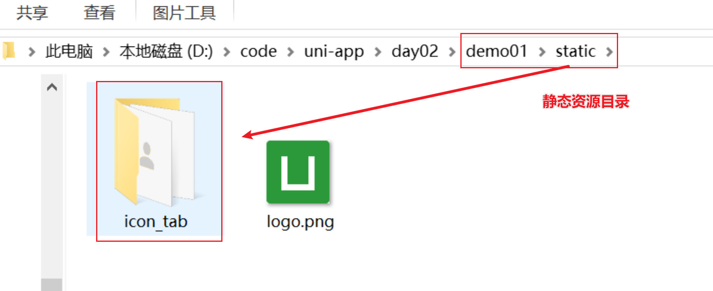
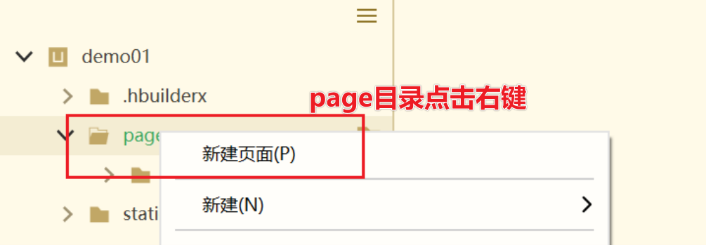
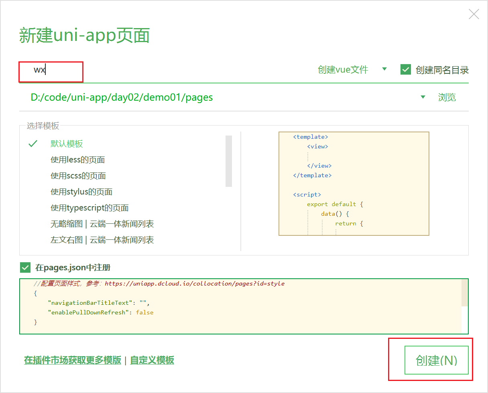
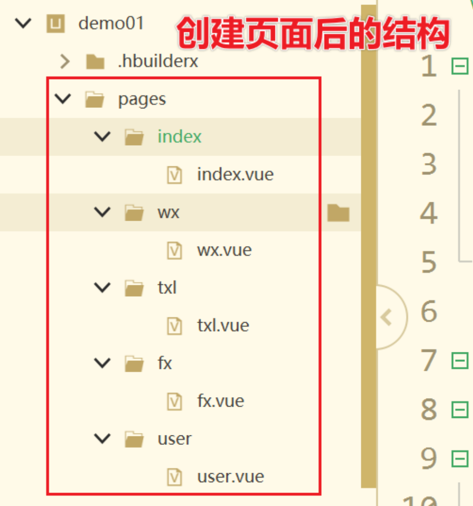
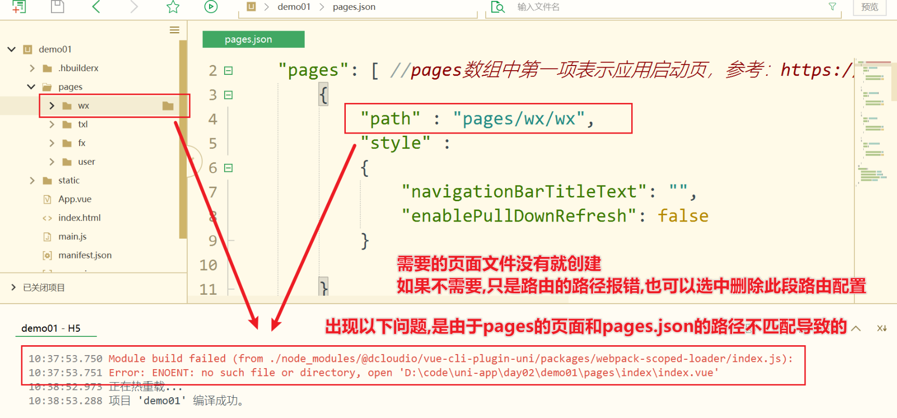
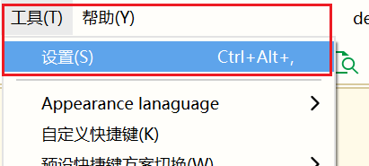
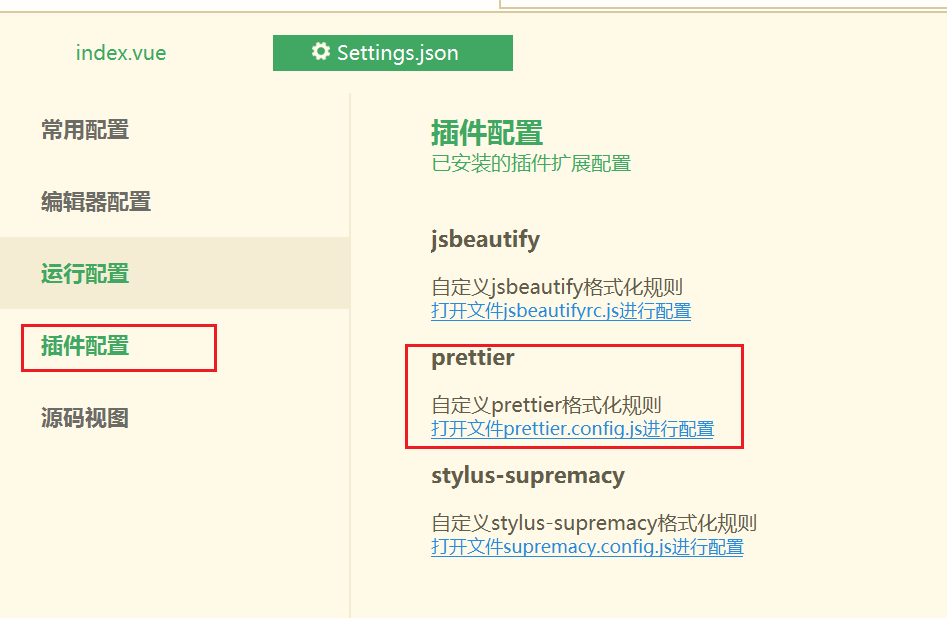
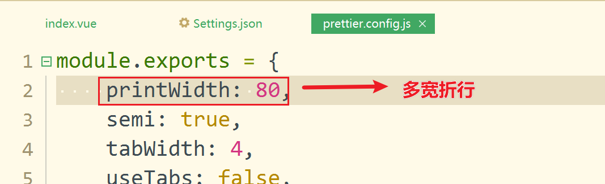

# uniapp02

## 复习

uniapp `使用一套代码,编译生成各端应用`.基于vue.js开发的解决方案.微信小城序view组件,rpx(相对像素  屏幕宽度分为750份,1rpx就是1份).

vue.js组件,语法+微信小程序的语法的结合....


Dcloud公司

环境:  HbuilderX  IDE(集成开发者工具    从开发到编译生成应用整个流程)

`H5 web端 ` 

微信小程序    微信开发者工具开启一个端口   HBX中选择对应的微信开发者工具安装路径

手机APP移动端   android模拟器  夜神模拟器  HBX中配置模拟器的`adb.exe`的路径    react reactNative[原生的APP应用  它只能运行模拟器中]


组件介绍   vue单文件组件构成  `template`模板[html],`script`脚本[行为,发送请求,JS代码],`style`[样式]

使用:   component  作为页面组件的一部分使用

​          page   作为单独页面进行加载   page.json文件配置的

easycom  uniapp 自动加载组件机制  component   uni_modules  会自动加载,直接使用.无需引入和注册

路由   微信小程序的路由系统

​      路由的形式:

- 栈式的   一页一页切换 有返回按钮

- 标签式   底部tab导航栏        

   跳转操作:

  - 标签跳转   navigator
  - 编程跳转   API  uni.navigateTo   wx.xxx


## 框架学习

### 标签式导航


实现思路

①获取图标  iconfont 阿里矢量图标

②把下载好的图片资源防止到对应目录

③建立tab栏各个页面

④在page.json中进行配置生成底部导航


实现步骤:

**①放置静态资源**



**②创建各页面**

在底部tab菜单中配置的路径,必须实际存在页面,否则会报错找不到.

页面名称:  wx,txl,fx,user







必须上面的操作,进行创建页面,默认情况下会在pages.json中添加路由配置.

**③ pages.json配置底部导航**

> 注意问题:路径报错



pages.json默认路由加载的就是第一个页面.想要显示底部导航菜单,选择把wx.vue调整到第一位.

pages.json

```json
{
	"pages": [ //pages数组中第一项表示应用启动页，参考：https://uniapp.dcloud.io/collocation/pages
		{
			"path": "pages/wx/wx",
			"style": {
				"navigationBarTitleText": "",
				"enablePullDownRefresh": false
			}

		}, {
			"path": "pages/txl/txl",
			"style": {
				"navigationBarTitleText": "",
				"enablePullDownRefresh": false
			}

		}, {
			"path": "pages/fx/fx",
			"style": {
				"navigationBarTitleText": "",
				"enablePullDownRefresh": false
			}

		}, {
			"path": "pages/user/user",
			"style": {
				"navigationBarTitleText": "",
				"enablePullDownRefresh": false
			}

		}
	],
	"globalStyle": {
		"navigationBarTextStyle": "black",
		"navigationBarTitleText": "uni-app",
		"navigationBarBackgroundColor": "#F8F8F8",
		"backgroundColor": "#F8F8F8"
	},
	"tabBar": {
		"color": "#7A7E83",
		"selectedColor": "#3cc51f",
		"borderStyle": "black",
		"backgroundColor": "#ffffff",
		"list": [{
				"pagePath": "pages/wx/wx",
				"iconPath": "static/icon_tab/wechat.png",
				"selectedIconPath": "static/icon_tab/wechat_hl.png",
				"text": "微信"
			}, {
				"pagePath": "pages/txl/txl",
				"iconPath": "static/icon_tab/txl.png",
				"selectedIconPath": "static/icon_tab/txl_hl.png",
				"text": "通讯录"
			},
			{
				"pagePath": "pages/fx/fx",
				"iconPath": "static/icon_tab/faxian.png",
				"selectedIconPath": "static/icon_tab/faxian_hl.png",
				"text": "发现"
			},
			{
				"pagePath": "pages/user/user",
				"iconPath": "static/icon_tab/user.png",
				"selectedIconPath": "static/icon_tab/user_hl.png",
				"text": "我"
			}
		]
	}
}
```

### 生命周期

从开始到结束.

在特定的生命周期节点,提供了一些方法[钩子函数],实现特定的操作

uniapp中有三种生命周期

- 应用周期   App.vue中

  onLaunch  应用首次加载时

  onShow  应用显示时

  onHide 应用隐藏时

  https://uniapp.dcloud.io/collocation/frame/lifecycle?id=%e5%ba%94%e7%94%a8%e7%94%9f%e5%91%bd%e5%91%a8%e6%9c%9f

- **页面周期**   pages中的页面  页面本身也是一个组件  所有它也具有组件周期

  `onLoad`,onShow,onHide,`onPullDownRefresh[下拉刷新事件]`,`onReachBottom[触底加载事件]`,`onPageScroll[页面滚动事件]`

  测试页面周期操作:

  `/pages/wx/wx.vue`

  ```vue
  <template>
  	<view>
  		微信页面
  	</view>
  </template>
  
  <script>
  	
  	export default {
  		// 页面加载时
  		onLoad(option){
  			// option代表路由传递过的参数
  			// clog 快捷
  			// 接收路由传递的参数
  			console.log('页面加载时')
  			console.log(option);
  		},
  		// 页面显示时
  		onShow(){
  			console.log('页面显示时');
  		},
  		// 页面隐藏时
  		onHide(){
  			console.log('页面隐藏时');
  		},
  		data() {
  			return {
  				
  			}
  		},
  		methods: {
  			
  		}
  	}
  </script>
  <style>
  </style>
  ```

  **传递页面参数**

  在pages下建立details页面组件

  `/pages/details/details.vue`

  ```vue
  <template>
  	<!-- vue 单文件 组件 -->
  	<!-- 模板  html -->
  	<!-- 微信小程序的基础组件  适配移动端的  相当于div标签 -->
  	<view>
  		这是详情页
  		<!-- vue模板中 this 不需要写 -->
  		<!-- 插值语法 -->
  		<view>name:{{options.name}}</view>
  		<view>age:{{options.age}}</view>
  		<view>nickname:{{options.nickname}}</view>
  	</view>
  </template>
  
  <script>
  	// js代码
  	export default {
  		// 页面周期
  		// onLoad:onLoad
  		// options 形参  形式参数  可自定义
  		// 参数变量名称 定义  知名见意  
  		onLoad(options) {
  			// 如何把路由传递的参数显示到页面上???
  			// vue组件中页面上显示的内容,如果是动态绑定变量 需要定义在data中,或者在计算属性中
  			// 存储到data中 本地化数据
  			this.options = options
  			console.log(options);
  			console.log('页面加载');
  		},
  		onShow(){
  			console.log('页面显示');
  		},
  		onHide(){
  			console.log('页面隐藏');
  		},
  		// 数据   组件内部数据   状态  本地数据
  		data() {
  			// 对象格式  key:value  键值对  name:"heart"
  			return {
  				// 初始化数据 null为空
  				options:null
  			}
  		},
  		// 方法  
  		methods: {
  			
  		}
  	}
  </script>
  
  <!-- 样式 -->
  <style>
  
  </style>
  
  ```
  `/pages/user/user.vue`

  ```vue
  <template>
  	<view>
  		<!-- 方式一 标签跳转 -->
  		<navigator url="/pages/details/details?name=哈特&age=18">跳转到详情页</navigator>
  		<!-- 方式二 编程方式  事件触发方法 -->
  		<button type="primary" size="mini" @click="goDetail">跳转</button>
  	</view>
  </template>
  
  <script>
  export default {
  	data() {
  		return {};
  	},
  	methods: {
  		goDetail(){
  			// unav
  			uni.navigateTo({
  				url:'/pages/details/details?name=heart&nickname=false老师',
  			});
  		}
  	}
  };
  </script>
  
  <style></style>
  
  ```

- **组件周期**   vue组件周期   pages的组件  component

​      组件的生命周期从创建=>挂载=>更新=>销毁

​      问:发请求到底在created还是mounted中?  相差没有十几毫秒的感觉

​      实际都可以,官方推荐放在mounted中.

​      `mounted`  **发送请求  获取接口数据**

​      `updated`  监听数据的改变

​      `destoryed`  回收资源  websocket回收关闭


## uni-ui组件库学习

uni-ui是DCloud提供的一个跨端ui库，它是基于vue组件的、flex布局的、无dom的跨全端ui框架。

使用uni-ui组件库,需要创建项目包的时候,选择对应模板uni-ui.

类似于之间学习Vue的UI组件库  MintUI  VantUI,不建议用,如果uniapp是使用的多端的,其它UI组件库可能兼容性不好.uni-ui组件库是官方支持的,兼容性较好一些.

UI组件文档地址:https://uniapp.dcloud.io/component/uniui/uni-ui


### 徽章

```vue
<!-- vb -->
<template>
	<!-- 移动端 使用view容器基础组件 -->
	<view>
		<!-- 数字角标  徽章 -->
		<!-- ubadge -->
		<!-- HBX属性提示  alt+/ -->
		<uni-badge text="99" type="primary"></uni-badge>
		<uni-badge text="55" type="success"></uni-badge>
		<uni-badge text="88" type="error"></uni-badge>
		<uni-badge text="99" type="warning" size="normal"></uni-badge>
		<view style="margin-top: 20px;">
			<uni-badge text="12" type="error" absolute="rightTop">
				<button type="primary" size="mini">收件信息</button>
			</uni-badge>
		</view>
	</view>
</template>

<script>
	export default {
		
	}
</script>

<style scoped>

</style>
```

### 配置prettier格式化(选做)

因为默认组件的传参比较多,一行写不下,显示不方便,通过格式化插件把属性进行折行显示.







### card

card组件一种布局组件,可以进行一些类似新闻格式的布局

```vue
<!-- vb -->
<!-- card组件 -->
<template>
	<view>
		<!-- ucard -->
		<uni-card title="标题文字" model="style" thumbnail="/static/logo.png" extra="额外信息">
			内容主体，可自定义内容及样式
			<!-- 插槽用法  -->
			<!-- action的插槽相对于 之前版本的note属性 -->
			<view slot="actions">
				底部信息
			</view>
		</uni-card>
	</view>
</template>

<script>
export default {};
</script>

<style scoped></style>

```

### 网络请求

案例:通过card组件,请求接口数据,实现一个新闻列表的展示

接口地址:

>https://api.apiopen.top/getWangYiNews

一个案例实现过程:

发请求=>拿数据=>存本地=>做展示

只不过在不同的框架语法稍有不同

```vue
<template>
	<view>
		<!-- 4.做展示 -->
		<!-- v-for vue的遍历 循环标签 指令 -->
		<!-- :key 唯一值  做渲染的时候提供渲染效率的  如果不写会报警告 -->
		<!-- :绑定属性  代表需要动态解析   如果值非字符串就需要绑定 -->
		<!-- <uni-card
			v-for="(item, index) in data"
			:key="index"
			:title="item.title"
			:thumbnail="item.image"
			:extra="item.passtime"
			mode="style"
		>
		</uni-card> -->
		<!-- 插槽写法  自定义插槽  -->
		<uni-card v-for="(item,index) in data" :key="index">
			<!-- 插槽 -->
			<!-- title 头部 -->
			<!-- template 作为包裹 没有实际意义 -->
			<template slot="title">
				<view style="font-size: 18px;font-weight: bold;padding-top: 10px;">{{ item.title }}</view>
			</template>
			<image :src="item.image" style="display: block;"></image>
			<!-- actions 尾部 -->
			<template slot="actions">
				<view>{{ item.passtime }}</view>
			</template>
		</uni-card>
	</view>
</template>

<script>
export default {
	// vdata
	data() {
		return {
			// 初始化数据 后续才可以存储到本地
			// data: []
			data: null
		};
	},
	// 发请求可不可以放在onLoad中  理论上是可以的
	mounted() {
		// 获取结构数据  this代表vue对象  当前组件
		this.getData();
	},
	methods: {
		getData() {
			// 1.发请求
			// vue axios 微信  wx.request   不管用什么 底层都是xmlhttprequest对象
			// uni.request
			// ureq快捷
			uni.request({
				// 接口地址
				// 这个接口https协议配置服务器端配置了跨域
				// 这里使用https协议
				url: 'https://api.apiopen.top/getWangYiNews',
				// 请求方法
				method: 'GET',
				// 请求携带的数据
				data: {},
				// 成功回调方法
				success: res => {
					// 2.拿数据
					console.log(res);
					// 3.存本地
					this.data = res.data.result;
				},
				// 失败回调方法
				fail: err => {
					console.log(err);
				},
				// 请求完成后的回调方法
				complete: () => {}
			});
		}
	}
};
</script>

<style scoped></style>
```

### 折叠栏

菜单的打开和关闭的效果

```vue
<template>
	<view>
		<!-- 折叠栏 -->
		<!-- ucoll -->
		<!-- :accordion="true"   accordion 语法糖写法 -->
		<uni-collapse accordion>
			<uni-collapse-item title="服务器端技术" thumb="/static/logo.png" open>
				<view>数据库MySQL</view>
				<view>NodeJS</view>
			</uni-collapse-item>
			<uni-collapse-item title="客户端技术" thumb="/static/c1.png">
				<view>HTML</view>
				<view>CSS</view>
				<view>JavaScript</view>
			</uni-collapse-item>
			<uni-collapse-item title="框架" thumb="/static/c2.png">
				<view>Vue</view>
				<view>React</view>
				<view>Angular</view>
			</uni-collapse-item>
		</uni-collapse>
	</view>
</template>

<script>
	export default {
		
	}
</script>

<style scoped>

</style>
```

