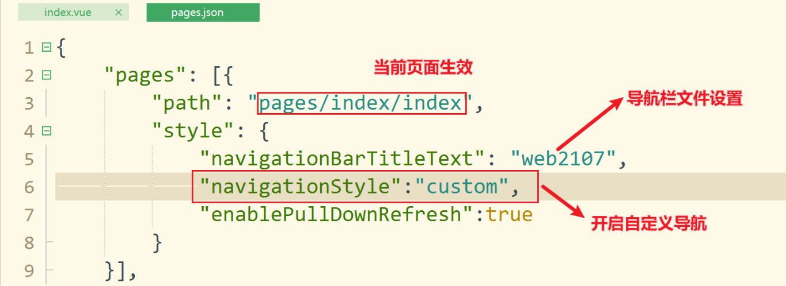
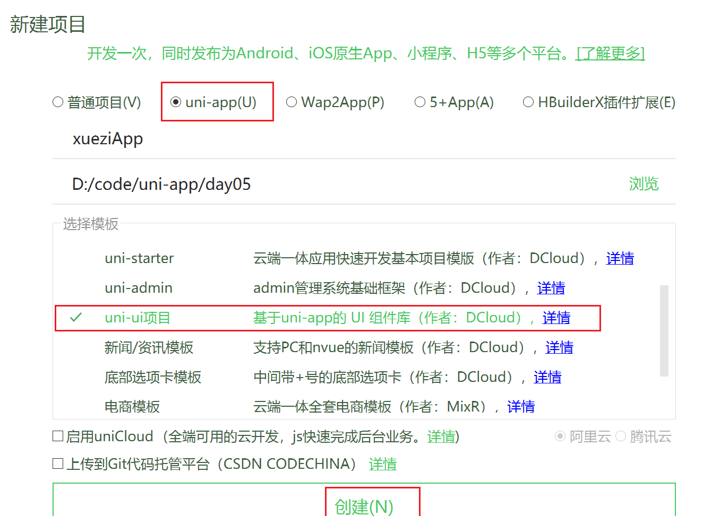
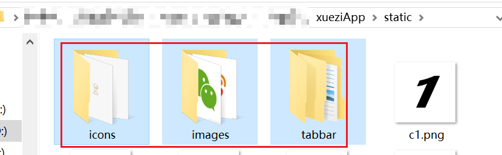
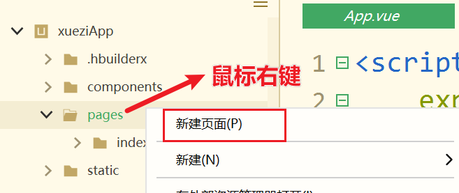
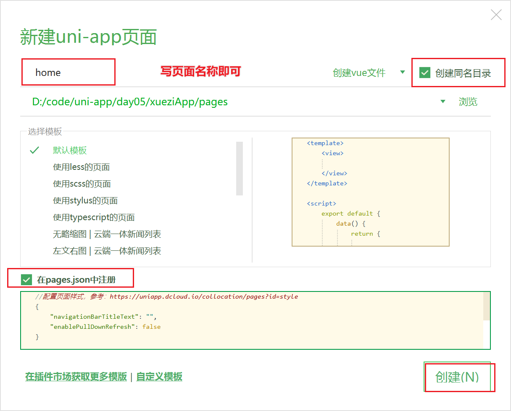
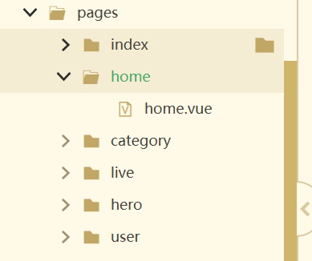

# uniapp05

## 复习

案例的实现过程:

发送请求[request请求]=>接收数据[response响应]=>存本地数据[vue data]=>做展示

前三步骤  都是在JS代码段进行编写

做展示  操作模板标签实现结构   写一些样式  

请求接口 跨域问题  只有浏览器跨域  浏览器同源策略[基本安全策略]

>jsonp  服务器端配合提供一个接口,数据返回  请求时实际不是使用js发送  封装了src属性  `<script src="xxxx.php"></sript>` 具有安全风险xss csrf 跨站脚本攻击.
>
>cors  服务端配置    上线的业务可以配置
>
>proxy  工程化的框架  自带了开发者服务器  只需要配置转发规则即可

slot插槽:  把标签或者内容 写入对应的位置

## 组件库学习

### 轮播图

```vue
<template>
	<view>
		<!-- 轮播 -->
		<!-- 自定义指示点 udot -->
		<uni-swiper-dot
			:info="banners"
			field="title"
			mode="nav"
			:current="current"
			:dotsStyles="{backgroundColor:'rgba(0, 85, 127, 0.5)'}"
		>
			<!-- 轮播图自定义指示点  需要将轮播图标签 放在中间 -->
			<swiper
				circular
				indicator-color="#103ea2"
				autoplay
				:interval="3000"
				:duration="1000"
				@change="doChange"
			>
				<!-- 轮播的每一个元素 -->
				<swiper-item v-for="(item, index) in banners" :key="index">
					<image
						:src="item.url"
						style="width:100%;height: 300rpx;"
					></image>
				</swiper-item>
			</swiper>
		</uni-swiper-dot>
		<!-- uswiper -->
	</view>
</template>

<script>
export default {
	data() {
		return {
			// 当前轮播切换到的索引下标 下标从0开始
			current: 0,
			// 轮播图数据
			banners: [
				{
					title: '联想笔记本',
					url: 'http://www.codeboy.com:9999/img/index/banner1.png'
				},
				{
					title: '戴尔笔记本',
					url: 'http://www.codeboy.com:9999/img/index/banner2.png'
				},
				{
					title: '皮面笔记本',
					url: 'http://www.codeboy.com:9999/img/index/banner3.png'
				},
				{
					title: '设计网格本',
					url: 'http://www.codeboy.com:9999/img/index/banner4.png'
				}
			]
		};
	},
	methods: {
		doChange(e) {
			// 当轮播切换时,将current当前索引 也切换
			this.current = e.detail.current;
		}
	}
};
</script>

<style scoped></style>
```

### step步骤条

```vue
<template>
	<view>
		<!-- ustep 步骤条 -->
		<uni-steps :options="options" :active="current"></uni-steps>
		<button style="background-color: purple;" @click="doClick">大象放进冰箱里</button>
		<hr>
		<uni-steps :options="options2" :active="5" direction="column"></uni-steps>
	</view>
</template>

<script>
	export default {
		data() {
			return {
				current:0,
				options: [
					{title:'第一步',desc:'打开冰箱门'},
					{title:'第二步',desc:'把大象放进去'},
					{title:'第三步',desc:'关上冰箱门'},
				],
				options1: [
					{title:'周一',desc:'鸡腿'},
					{title:'周二',desc:'海盗烤肠'},
					{title:'周三',desc:'皮蛋瘦肉粥'},
					{title:'周四',desc:'扁豆焖面'},
					{title:'周五',desc:'小龙虾面'},
					{title:'周六',desc:'KFC炸鸡'},
				],
				options2: [
					{title:'正在前往深圳龙华区',desc:'信息待更新'},
					{title:'经过郑州',desc:'郑州高新区xxx营业部'},
					{title:'已发货',desc:'在北京顺义区南法信打包好了'}
				]
			}
		},
		methods: {
			doClick() {
				// 把左边移动到右边进行运算后,再赋值给左边的
				// this.current = this.current+1
				this.current +=1
				if(this.current > 2){
					alert('大象已经放进去了!')
					this.current = 2
				}
			}
		},
	}
</script>

<style scoped>

</style>
```

### GoodsNav商品导航

uni-ui提供了一个商品购物车和购买按钮的样式,可以直接调用

```vue
<template>
	<view>
		<!-- goodsnav 商品导航 -->
		<!-- ugood -->
		<view style="height: 500rpx;">
			
		</view>
		<uni-goods-nav @click="doClick" @buttonClick="doButtonClick" />
	</view>
</template>

<script>
export default {
	methods: {
		doClick(e) {
			console.log(e);
		},
		doButtonClick(e) {
			console.log(e);
			if(e.index == 1){
				alert('别乱花钱了,再花就剁手了!!')
			}
		}
	}
};
</script>

<style scoped></style>
```

### 自定义Nav导航栏

顶部导航栏的文字是在pages.json中进行配置.

自定义导航开启方式



```vue
<template>
	<view>
		<!-- unav 定义导航栏 -->
		<uni-nav-bar
			left-icon="back"
			left-text="返回"
			right-text="朋友圈"
			title="标题"
			rightIcon="scan"
			@clickLeft="doClickLeft"
			@clickRight="doClickRight"
		></uni-nav-bar>
	</view>
</template>

<script>
export default {
	methods: {
		doClickLeft() {
			console.log('点击左边触发了');
		},
		doClickRight() {
			console.log('点击右边触发了');
			// uni.scanCode({
			// 	success: function(res) {
			// 		console.log('条码类型：' + res.scanType);
			// 		console.log('条码内容：' + res.result);
			// 	}
			// });
		}
	}
};
</script>

<style scoped></style>

```

### 条件编译

通过判断不同的终端设备[客户端],显示或者执行不同的代码段.

>正常情况,尽量的多端显示一致.
>
>接口请求 只有在`浏览器端存在跨域问题`,在微信小程序,手机APP端不跨域.
>
>判断设备类型,返回不同的接口地址.

```vue
<template>
	<view>
		<!-- 条件编译 -->
		<!-- ifdef 语法  代表条件满足 就执行后续代码 -->
		<!-- alt+/ 参数提示 -->
		<!-- #ifdef APP-PLUS -->
		<view>这是手机APP端</view>
		<!-- #endif -->
		<!-- #ifdef MP-WEIXIN -->
		<view style="height: 100rpx;"></view>
		<view>这是微信小程序</view>
		<!-- #endif -->
		<!-- #ifdef H5 -->
		<view>这是浏览器端</view>
		<!-- #endif -->
	</view>
</template>

<script>
export default {
	// 主要不同终端  只有H5端浏览器存在跨域问题
	// 接口地址  非H5 和 H5的地址不一样
	methods: {
		getData() {
			// 非H5 接口地址 就是源地址  不是浏览器 不跨域
			// #ifndef H5
			const url = 'https://m.douyu.com/api/room/list?page=1&type=yz';
			// #endif
			// #ifdef H5
			const url = '/douyu/api/room/list?page=1&type=yz';
			// #endif
		}
	}
};
</script>

<style lang="scss">
/* #ifdef APP-PLUS */
view {
	color: red;
}
/* #endif */
/* #ifndef APP-PLUS */
view {
	color: blue;
}
/* #endif */
</style>
```

### 侧边栏导航

接口地址

图书分类

>http://apis.juhe.cn/goodbook/catalog?key=2520f6a5cab03af7e23013b15842d7fc

分类下的图书

>http://apis.juhe.cn/goodbook/query?key=2520f6a5cab03af7e23013b15842d7fc&catalog_id=?

以上接口地址通过发送请求,发现它是跨域的,所以以下通过proxy[vue.config.js]代理的方式

`vue.config.js`

```javascript
// vue.config.js  文件名称  在项目包的根路径下
// 导出模块
module.exports = {
	// 配置开发服务器
	devServer: {
		// 代理
		proxy: {
			// 源地址:https://m.douyu.com/api/room/list?page=1&type=yz
			// 接口编写的地址: /douyu/api/room/list?page=1&type=yz
			// 代理段
			"/douyu": {
				// 代理的域名地址
				target: "https://m.douyu.com",
				// 域名是否有变更  本地服务器localhost  m.douyu.com
				// true 代表域名不一致  大部分情况都是不一样的
				changeOrigin: true,
				// 协议http配置为false默认       https协议配置为true
				secure: true,
				// 路径重写
				pathRewrite: {
					// ^ 正则 ^xxx  xxx开头的
					"^/douyu": ""
				}
			},
			"/juhe": {
				target: "http://apis.juhe.cn",
				changeOrigin: true,
				pathRewrite: {
					"^/juhe": ""
				}
			}
		}
	}
}
```

```vue
<template>
	<view style="display: flex;">
		<!-- 案例: 侧边栏导航切换  -->
		<!-- 发请求=>拿数据=>存本地=>做展示 -->
		<!-- 左侧菜单 -->
		<!-- windowHeight 窗口高度 -->
		<scroll-view
			scroll-y
			style="width: 30%;"
			:style="{ height: windowHeight + 'px' }"
		>
			<!-- 动态绑定的class cur 后面的表达式为真生效   遍历到的下标正好是当前选项项  就绑定cur高亮效果  -->
			<view
				v-for="(item, index) in menu"
				:key="index"
				class="menu-cell"
				:class="{ cur: index == current }"
				@click="doCheck(index)"
			>
				{{ item.catalog }}
			</view>
		</scroll-view>
		<!-- 右侧图书详情 -->
		<!-- showRight 默认渲染 展示  给true -->
		<scroll-view
			v-if="showRight"
			scroll-y
			style="width: 70%;"
			:style="{ height: windowHeight + 'px' }"
		>
			<!-- 折叠面板 -->
			<uni-collapse>
				<uni-collapse-item
					v-for="(item, index) in books"
					:key="index"
					:title="item.title"
					:thumb="item.img"
				>
					<!-- 折叠栏里面的图书信息 -->
					<view>
						<view>{{ item.sub1 }}</view>
						<view>{{ item.reading }}</view>
						<view>{{ item.bytime }}</view>
						<view>{{ item.sub2 }}</view>
					</view>
				</uni-collapse-item>
			</uni-collapse>
		</scroll-view>
	</view>
</template>

<script>
export default {
	data() {
		return {
			// 分类数据  菜单数据
			menu: null,
			// 当前选中的菜单项的 下标
			current: 0,
			// 图书数据
			books: null,
			// 右侧是否显示的状态控制
			showRight: true
		};
	},
	mounted() {
		// category  class  Menu  分类 菜单
		this.getMenu();
	},
	methods: {
		// 获取分类下的图书数据
		getBooks(id) {
			const url =
				'/juhe/goodbook/query?key=2520f6a5cab03af7e23013b15842d7fc&catalog_id=' +
				id;
			uni.request({
				url,
				method: 'GET',
				data: {},
				success: res => {
					console.log(res);
					this.books = res.data.result.data;
					// 图书数据加载完毕  先移除右侧显示  再设置显示
					this.showRight = false;
					// 当监听页面渲染完毕时 再显示出来
					// $nextTick 监听页面渲染完毕 做的操作
					// 箭头this保持的 不丢失
					this.$nextTick(()=>{
						this.showRight = true
					})
				},
				fail: () => {},
				complete: () => {}
			});
		},
		// 切换菜单
		doCheck(index) {
			this.current = index;
			// 每切换菜单 就加载对应分类下的数据
			console.log(this.menu[index].id);
			this.getBooks(this.menu[index].id);
		},
		// 获取左侧菜单数据
		getMenu() {
			const url =
				'/juhe/goodbook/catalog?key=2520f6a5cab03af7e23013b15842d7fc';
			// ureq快捷
			uni.request({
				// url: url,
				url,
				method: 'GET',
				data: {},
				success: res => {
					console.log(res);
					this.menu = res.data.result;
					// 默认请求第一项
					this.getBooks(this.menu[0].id);
				},
				fail: () => {},
				complete: () => {}
			});
		}
	},
	// 计算属性
	computed: {
		windowHeight() {
			console.log(uni.getSystemInfoSync().windowHeight);
			return uni.getSystemInfoSync().windowHeight;
		}
	}
};
</script>

<style scoped lang="scss">
.menu-cell {
	padding-top: 15rpx;
	background-color: #eeeeee;
	border-bottom: 1px solid gray;
	text-align: center;
	// 选中高亮
	// & 当前选择器
	&.cur {
		background-color: orange;
		color: #007aff;
		font-size: 1.1em;
		font-weight: bold;
	}
}
</style>
```

## 学子商城App开发

### 第五阶段目标

>企业中项目开发要求:
>
>`产品构思,原型`  产品经理   老板说了算
>
>`提供效果图`  UI设计师和美工
>
>`接口文档`    服务端工程师  php  java golang  nodejs
>
>分析需求,熟悉代码和工程规范,实现产品的功能和效果实现
>
>项目开发阶段完成之后 迭代开发 一个版本接着一个版本

### 初始化项目构建

- 创建基于uni-ni模版的项目包:xueziApp

- 底部标签导航:创建5个标签页(pages目录),名称分别为:

     图标可以自行到iconfont阿里网站找,也可以使用FTP里上传的

  - 首页(home)
  - 分类(category)
  - 游戏直播(live)
  - 英雄(hero)
  - 我的(user)

  **①创建项目包**



创建之后,运行项目,如果运行不起来,可能没有创建完整,重新创建,或者下载FTP上传的.

**②把FTP静态资源复制到static目录**



**③创建多个页面**

做底部导航,一定先创建页面.否则切换找不到页面的路径报错了.





依次创建多个页面



**④配置pages.json**

`/pages.json`

```json
.....
"tabBar": {
		"color": "#7A7E83",
		"selectedColor": "#db4890",
		"borderStyle": "black",
		"backgroundColor": "#ffffff",
		"list": [{
				"pagePath": "pages/home/home",
				"iconPath": "static/tabbar/normal/home.png",
				"selectedIconPath": "static/tabbar/selected/home.png",
				"text": "首页"
			}, {
				"pagePath": "pages/category/category",
				"iconPath": "static/tabbar/normal/fenlei.png",
				"selectedIconPath": "static/tabbar/selected/fenlei.png",
				"text": "分类"
			},
			{
				"pagePath": "pages/live/live",
				"iconPath": "static/tabbar/normal/game.png",
				"selectedIconPath": "static/tabbar/selected/game.png",
				"text": "游戏直播"
			},
			{
				"pagePath": "pages/hero/hero",
		 	"iconPath": "static/tabbar/normal/yx.png",
				"selectedIconPath": "static/tabbar/selected/yx.png",
				"text": "英雄"
			},
			{
				"pagePath": "pages/user/user",
				"iconPath": "static/tabbar/normal/user.png",
				"selectedIconPath": "static/tabbar/selected/user.png",
				"text": "我的"
			}
		]
	}
.....
```

