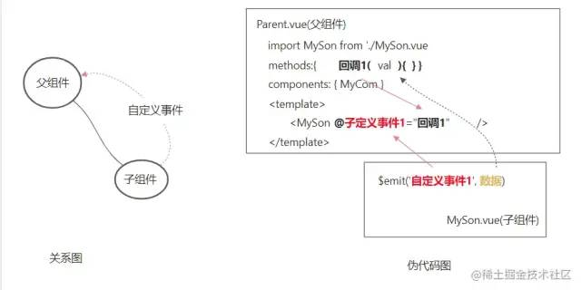
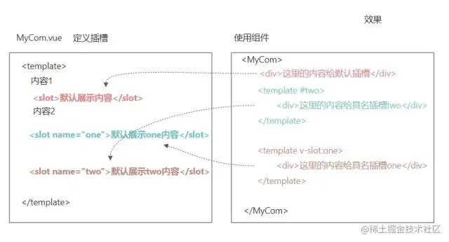

`以下来自公众号 程序员成长指北`

## vue 指令-v-model 修饰符

语法:

v-model.修饰符="vue 数据变量"

- .number 以 parseFloat 转成数字类型
- .trim 去除首尾空白字符
- .lazy 在失去焦点时触发更改而非 inupt 时

## 计算属性

- 计算属性有 **缓存** ，提高渲染性能。
- 如果在页面上需要用到 对现有的数据进行加工得到新数据，则时要**使用计算属性**

普通写法

```javascript
computed: {
	//属性名字（计算属性名称）
        //属性的值（计算属性处理函数）
        计算属性名1 () {
            // 对依赖的数据进行处理，且进行return
            return 
        }，
}
```

完整写法

```javascript
computed: {
    "属性名": {
        set(值){
            
        },
        get() {
            return "值"
        }
    }
}
```

## vue 监听器

可以监听数据（data/computed 等）的值的改变。数据的值有类型：基本数据类型，引用数据类型

深度监听

```javascript
watch: {
    "要监听的属性名": {
        immediate: true, // 立即执行
        deep: true, // 深度监听复杂类型内变化
        handler (newVal, oldVal) {
            
        }
    }
}
```

## scoped 实现组件的私有样式

```css
<stype scoped>
  h2 {} // 样式只会在当前组件内生效
</style>
```

## 父传子


## 子传父



## vue 组件生命周期

四个阶段:

- 初始化 => 创建组件 => beforeCreate created
- 挂载 => 渲染显示组件 => beforeMount mouted
- 更新 => 修改了变量 => 触发视图刷新 => beforeUpdate updated
- 销毁 => 切换页面 => 会把组件对象从内存删除 => beforeDestory destoryed

## 组件进阶-props 校验

```javascript
props: {
    // 基础的类型检查 (`null` 和 `undefined` 会通过任何类型验证)
    propA: Number,
    // 多个可能的类型
    propB: [String, Number],
    // 必填的字符串
    propC: {
      type: String,
      required: true
    },
    // 带有默认值的数字
    propD: {
      type: Number,
      default: 100
    },
    // 带有默认值的对象
    propE: {
      type: Object,
      // 对象或数组默认值必须从一个工厂函数获取
      default: function () {
        return { message: 'hello' }
      }
    },
    // 自定义验证函数
    propF: {
      validator: function (value) {
        // 这个值必须匹配下列字符串中的一个
        return ['success', 'warning', 'danger'].indexOf(value) !== -1
      }
    }
  }
```

## 组件进阶 - 动态组件

```html
<component :is="comName"></component> //comName是变量,值为需要切换的几个组件名
```

## 组件进阶-keep-alive 组件

用 keep-alive 内置的 vue 组件, 让动态组件缓存而不是销毁

```html
<keep-alive>
      <!-- vue内置的组件component, 可以动态显示组件 -->
      <component :is="comName"></component>
</keep-alive>
```

### 组件进阶-keep-alive 组件-指定缓存

语法

1. ```
   `include="组件名1,组件名2..."`
   ```
2. ```
   `:include="['组件名1'， '组件名2']"`
   ```

```html
<keep-alive include="name1,name2">
      <!-- vue内置的组件component, 可以动态显示组件 -->
      <component :is="comName"></component>
</keep-alive>
```

## 组件进阶-具名插槽

### 格式

定义：`<slot name="xxx">`

使用：

- `<template #xxx></template>`
- `<template v-slot:xxx></template>`



## 自定义指令-基本使用

```javascript
{
  data(){},
  methods: {},
  directives: {
    focus: { // 自定义指令名
        inserted(el){ // 固定配置项 - 当指令插入到标签自动触发此函数
            el.focus()
        }
    },
  },
}
```

## 自定义指令-传值和更新

目标: 使用自定义指令, 传入一个值

需求: 定义 color 指令-传入一个颜色, 给标签设置文字颜色

main.js 定义处修改一下

```javascript
directives: {
  "color":{
    inserted(el, binding){ // 插入时触发此函数
      el.style.color = binding.value;
    },
    update(el, binding){ // 更新绑定的变量时触发此函数=》手动更新
      el.style.color = binding.value;
    }
  }
}
```

Direct.vue 处更改一下

```javascript
<p v-color="theColor" @click="changeColor">使用v-color指令控制颜色, 点击变蓝</p>

<script>
  data() {
    return {
      theColor: "red",
    };
  },
  methods: {
    changeColor() {
      this.theColor = 'blue';
    },
  },
</script>
```

总结: v-xxx, 自定义指令, 获取原生 DOM, 自定义操作

## axios 请求

```javascript
 async loadData(){
       const res= await axios.get("http://.......")
      //  console.log(data);
    }
  },
 created(){
    this.loadData()
  }
```

关于本文：

来源：pain_past_is_pleasur

https://juejin.cn/post/7095724314876051492
