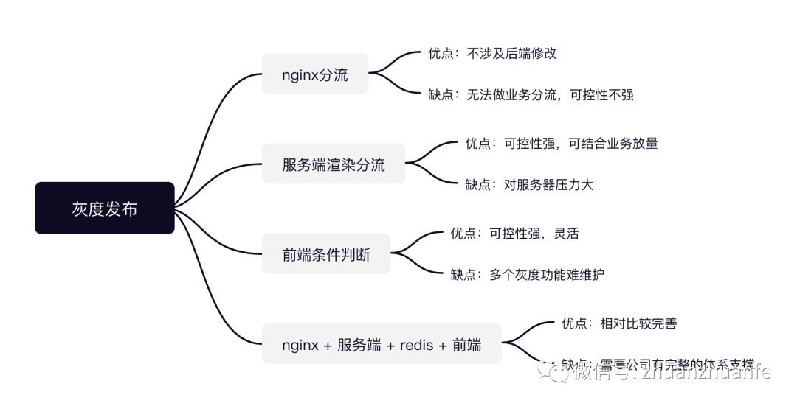
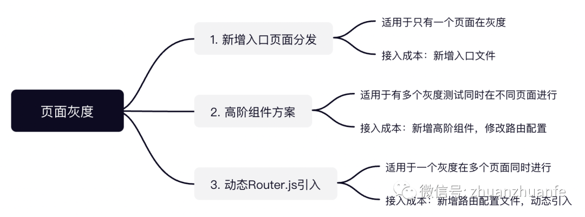

# Vue 灰度发布新功能的那些事

[` 全栈修仙之路](<javascript:void(0);>) _2022-05-18 08:22_ _发表于福建`_

`以下文章来源于大转转FE ，作者大转转FE`

## **「前言」**

什么是灰度发布？百度百科的解释如下。

> ❝ 灰度发布是指在黑与白之间，能够平滑过渡的一种发布方式。AB test 就是一种灰度发布方式，让一部分用户继续用 A，一部分用户开始用 B，如果用户对 B 没有什么反对意见，那么逐步扩大范围，把所有用户都迁移到 B 上面来。灰度发布可以保证整体系统的稳定，在初始灰度的时候就可以发现、调整问题，以保证其影响度。❞

从上可以看出，灰度发布的主要作用有以下几点：

1. 降低直接全量发布带来的影响，让少部分用户先使用新版本，如发现问题则及时做好修复，验证无重大问题则全量发布新功能
2. 通过新老版本的数据对比，决定新版本是否需要全量发布

## **「概述」**

灰度发布的方式有很多，按端可以区分服务端，客户端，Web 前端都可以做，没有最好，只有更适合自己的业务场景。

如上可以看到常见的几种灰度发布的方式，都有各自的优缺点，由于我们公司有完善的大数据 AB test 方案，所以前端只需关注接口返回的字段标识，来做具体的页面加载逻辑，今天重点讲述在前端中使用 Vue 框架中如何做灰度发布。在 Vue 中主要可以分为以下两种情况：

组件级别：

1. 组件级别动态控制只需后端回传对应方案标识即可。

页面级别：

1. 前端页面访问地址不变，同后端人员约定好 AB test 标记字段，前端根据字段返回不同的内容加载对应的页面。
2. 新旧功能区分两个页面地址，跳转页面地址由后端控制，此方案前端不需要太多改动，此文就不多说明。

先来看看日常处理的方式，一个页面可能会存在多个地方判断 AB test 逻辑，或者是更多的 AB test 同时进行，这样的页面代码逻辑复杂度相对比较高，也不够整洁易懂，当有新的 AB test 加入或者有 AB test 需要决策的时候，修改代码的成本较高，降低了代码维护的效率。

```html
<template>
      ...     <test-a v-if="testA" />     <test-b v-else-if="testB" />     ...     
  <div v-if="testA">        ...     </div>
      
  <div v-else-if="testB">        ...     </div>
      ...
</template>
<script>
      ...
      if (testA) {
          ...   
      } else if (testB) {
          ...
      }
</script>
```

接下来就开始我们今天文章的正题，看看有哪些方式可以解决以上的问题。

## **「组件级别」**

如只是简单的两个小组件功能的灰度则可以直接用 v-if 处理

```html
<testA v-if="testA" /> <testB v-else />
```

如有多个功能同时测试，可以通过 Vue 的元素加一个特殊的 isattribute 来实现，currentTabComponent 可基于接口获取或其他前端计算得出。

```html
<component :is="currentTabComponent"></component>
```

## **「页面级别」**

### **「方案一 新增入口页面分发」**

新增入口页面，将新旧版本页面升级为组件的方式引入，入口页面增加接口查询，通过 `v-if` 或通过 Vue 的 `<component>` 元素加一个特殊的 is 属性来加载页面组件。如下是通过接口查询代码示例，通过接口前置查询会带来一定的界面延迟加载，取决于接口的响应速度，我们也可以通过在 URL 增加参数获取，这时的 URL 由后端拼接好参数再返回，这样就可以避免一次接口查询。

```javascript
<template>
   <component :is="testId"></component>
</template>
<script>
  import IndexA from './index-a'
  import IndexB from './index-b'
  import {
    getTestID
  } from '@/api/getTestID'

  export default {
    name: 'index',
    components: {
      'index-a': IndexA,
      'index-b': IndexB
    },
    data() {
      return {
        testId: ''
      }
    },
    created() {
      this.getTestID()
    },
    methods: {
      async getTestID() {
        const { testId } = await getTestID({
          xxx: xxx
        })
        this.testId = testId
      }
    }
  }
</script>
```

这里直接这样加载页面级组件会导致此文件体积加大，可以将页面组件的加载方式改为异步组件，提升页面加载速度。

```javascript
components: {
 'index-a': () => import(/* webpackChunkName: "index-a" */ './index-a'),
 'index-b': () => import(/* webpackChunkName: "index-b" */ './index-b')
}
```

### **「方案二 高阶组件方案」**

在路由配置中从接口获取灰度标识数据，进行路由分发。如果不想额外增加接口查询的开销，也可以将标识数据从 URL 参数返回，此方式需要提前拼接好参数。

高阶组件的好处是所有需要灰度的加载逻辑都在路由配置文件中，统一维护，组件也可复用，不需要每个需要灰度的页面都增加一个入口文件。

组件代码

```javascript
<template>
  <component :is="com" />
</template>
<script>
export default {
  name: 'DynamicLoadComponent',
  props: {
    renderComponent: {
      type: Promise
    }
  },
  data() {
    return {
      com: () => this.renderComponent
    }
  }
};
</script>
```

router.js 配置

```javascript
{
  path: 'originPath',
  component: () => import('@/views/components/DynamicLoadComponent'),
  name: 'originPath',
  props: (route) => ({
    renderComponent: new Promise((resolve, reject) => {
      // 根据 route 拼接参数获取加载页面
      if (route.query.testA) {
          resolve(import('@/views/testA'));
      } else {
          resolve(import('@/views/testB'));
      }
      // OR 根据接口返回标识动态加载页面
      getAPIData()
        .then((response) => {
          if (response.testA) {
            resolve(import('@/views/testA'));
          } else {
            resolve(import('@/views/testB'));
          }
        })
        .catch(reject);
    }),
  })
}
```

### **「方案三 动态 Router.js 引入」**

如果是有大面积的页面替换，可采用这种方式。例如，后端开发语言更换导致接口地址及返回的字段内容都发生变化，这样会有一段时间的过渡使用，开发完一个页面上线一个页面，就可能会有 5 个页面使用新的方案，5 个页面还是保留原始方案的情况。

改造 router.js，将原始路由配置抽离到 default.js 中，再新建 java.js 将新方案路由配置写入，基于前端计算或接口返回标识动态加载路由配置文件。

```javascript
import Vue from 'vue'
import Router from 'vue-router'
import { isHitJavaAPI } from '@/config'

Vue.use(Router)

const router = new Router({
  mode: 'history',
})

const computedRouterDirectory = (routeFile) => {
  let routerConfig
  const requireRouter = require.context('.', false, /\.js$/)
  routerConfig = requireRouter.keys().filter((file) => file === `./${routeFile}.js`)[0]
  if (routerConfig) {
    routerConfig = requireRouter(routerConfig)
    routerConfig.default && router.addRoutes(routerConfig.default)
  }
}

if (isHitJavaAPI()) {
  computedRouterDirectory('java')
} else {
  computedRouterDirectory('default')
}
```

isHitJavaAPI 方法中是命中灰度的逻辑，如果这里是前端做灰度，可基于 deviceID 或 UA 等计算。如果这里是调用接口获取方案则需改为同步调用。

## **「总结」**

本文主要介绍了页面级别的几个灰度方案，每个方案的试用场景都有各自的优缺点，如新增入口文件，主要是针对页面变动较大且当前项目只会有一个在进行中的灰度测试；高阶组件适用于当前项目有多个进行中的灰度测试，则可复用组件；动态加载路由配置文件主要针对于当前项目有大规模的页面 UI 或逻辑更换灰度测试；通过以上几种方案都可极大的提升代码的可维护性以及解耦灰度逻辑和业务代码逻辑，当灰度测试没有问题需全量上线时，我们只需修改入口逻辑即可，无需在业务代码中去逐个修改灰度逻辑。



除开本文所介绍的几种方式，也还有其他的加载方式，如路由钩子函数拦截后做动态跳转，或者请求到后端，后端做重定向处理等。每个方式都有各自的优缺点，就看是不是你当前场景最合适的方案。如果你有其他的方案，欢迎留言和我们交流～

## **「参考」**

Vue Router 根据后台数据加载不同的组件：https://www.cnblogs.com/zhea55/p/15115555.html

components-dynamic-async：https://cn.vuejs.org/v2/guide/components-dynamic-async.html

**3**3
