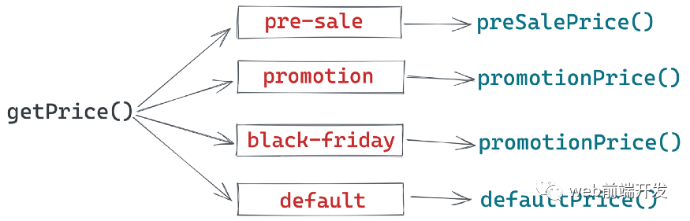
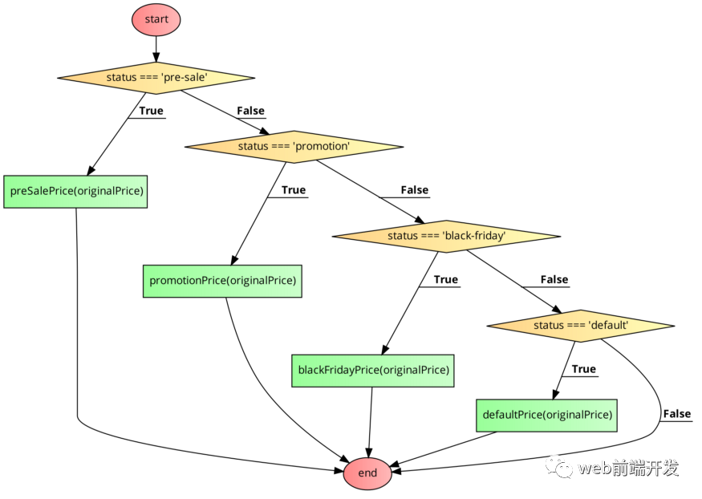
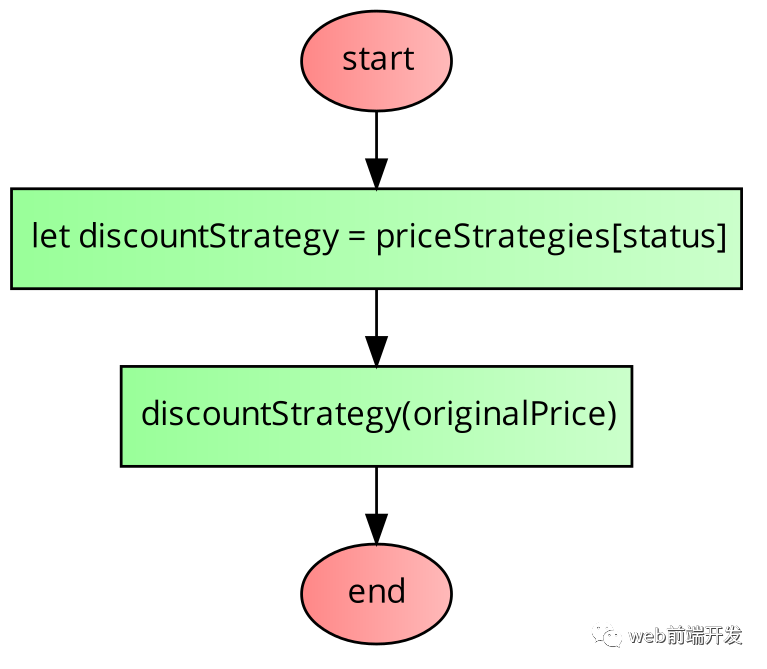
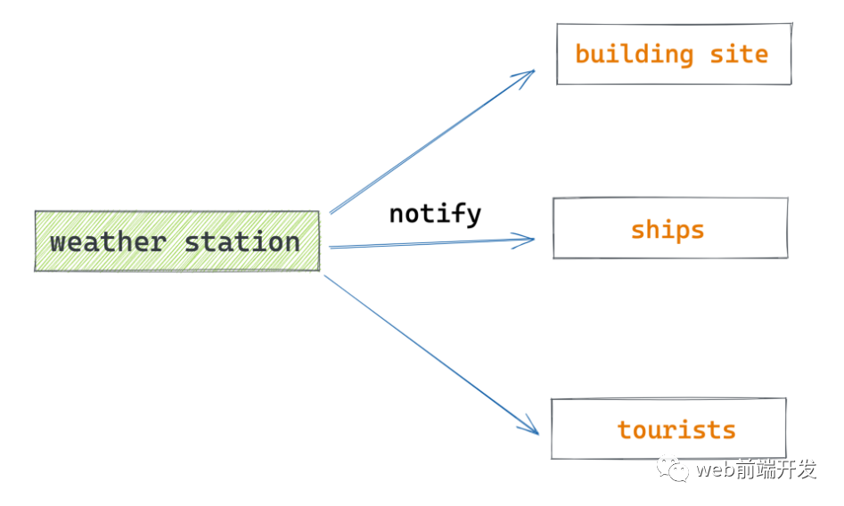
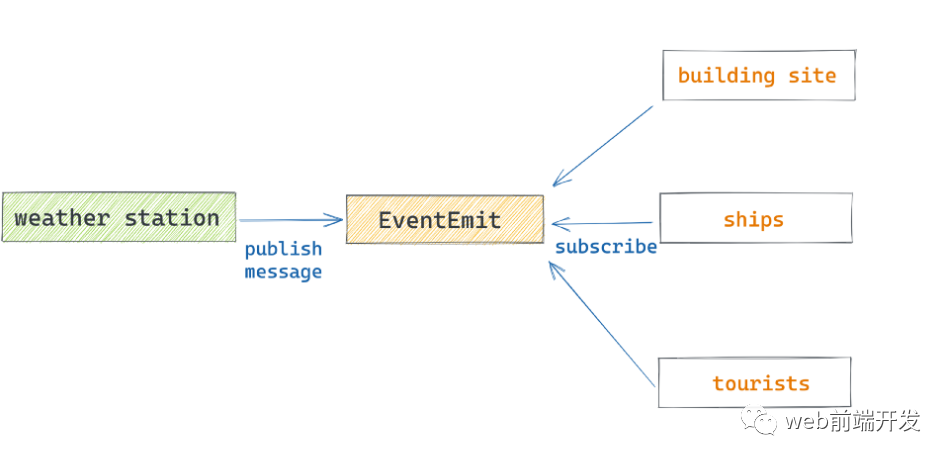
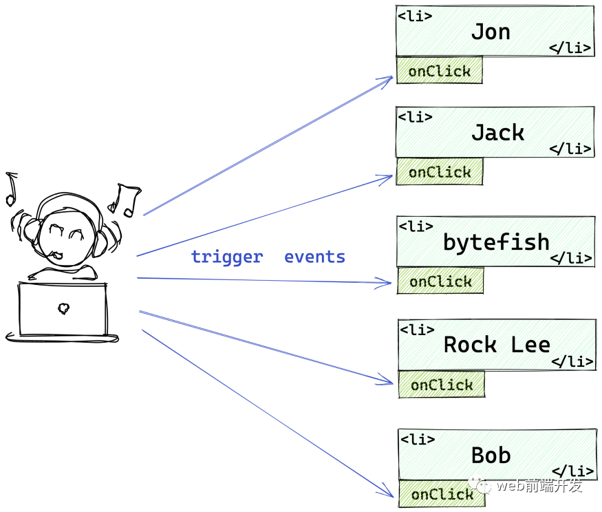
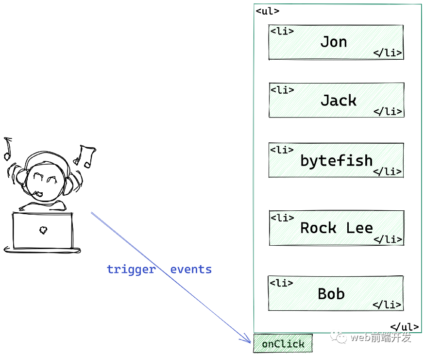
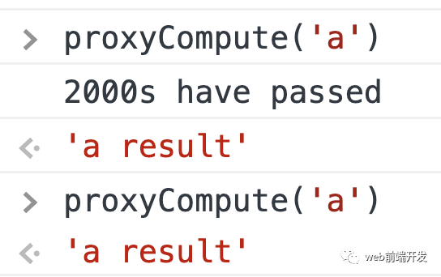

`以下内容来自公众号 web前端开发`

什么是 `设计模式`？我们为什么需要学习设计模式？

设计模式是我个人觉得可以 `更好解决问题`的一种 `方案`。

这意味着什么？如果你开发的项目的功能是固定的，永远不会调整业务，那么你就不需要使用设计模式等任何技巧。您只需要使用通常的方式编写代码并完成需求即可。

但是，我们的开发项目的需求是不断变化的，这就需要我们经常修改我们的代码。也就是说，我们现在写代码的时候，需要为未来业务需求可能发生的变化做好准备。

这时，你会发现使用设计模式可以让你的代码更具 `可扩展性`。

经典的设计模式有 23 种，但并不是每一种设计模式都被频繁使用。在这里，我介绍我最常用和最实用的 3 种设计模式。

# 常用的 3 种设计模式

## **01、策略模式**

假设您目前正在从事一个电子商务商店的项目。每个产品都有一个原价，我们可以称之为 originalPrice。但并非所有产品都以原价出售，我们可能会推出允许以折扣价出售商品的促销活动。

商家可以在后台为产品设置不同的状态。然后实际售价将根据产品状态和原价动态调整。

具体规则如下：

部分产品已预售。为鼓励客户预订，我们将在原价基础上享受 20% 的折扣。

部分产品处于正常促销阶段。如果原价低于或等于 100，则以 10%的折扣出售；如果原价高于 100，则减 10 美元。

有些产品没有任何促销活动。它们属于默认状态，以原价出售。

如果你需要写一个 getPrice 函数，你应该怎么写呢？

```javascript
function getPrice(originalPrice, status) {
  // ...
  return price
}
```

其实，面对这样的问题，如果不考虑任何设计模式，最直观的写法可能就是使用 if-else 通过多个判断语句来计算价格。

有三种状态，所以我们可以快速编写如下代码：

```javascript
function getPrice(originalPrice, status) {
  if (status === 'pre-sale') {
    return originalPrice * 0.8
  }

  if (status === 'promotion') {
    if (origialPrice <= 100) {
      return origialPrice * 0.9
    } else {
      return originalPrice - 20
    }
  }

  if (status === 'default') {
    return originalPrice
  }
}
```

有三个条件；然后，我们写三个 if 语句，这是非常直观的代码。

但是这段代码并不友好。

首先，它违反了单一职责原则。主函数 getPrice 做了太多的事情。这个函数不易阅读，也容易出现 bug。如果一个条件有 bug，整个函数就会崩溃。同时，这样的代码也不容易调试。

然后，这段代码很难应对变化。正如我在文章开头所说的那样，设计模式往往会在业务逻辑发生变化时表现出它的魅力。

假设我们的业务扩大了，现在还有另一个折扣促销：黑色星期五，折扣规则如下：

- 价格低于或等于 100 美元的产品以 20% 的折扣出售。
- 价格高于 100 美元但低于 200 美元的产品将减少 20 美元。
- 价格高于或等于 200 美元的产品将减少 20 美元。

这时候怎么扩展 getPrice 函数呢？

看起来我们必须在 getPrice 函数中添加一个条件。

```javascript
function getPrice(originalPrice, status) {
  if (status === 'pre-sale') {
    return originalPrice * 0.8
  }

  if (status === 'promotion') {
    if (origialPrice <= 100) {
      return origialPrice * 0.9
    } else {
      return originalPrice - 20
    }
  }
  if (status === 'black-friday') {
    if (origialPrice >= 100 && originalPrice < 200) {
      return origialPrice - 20
    } else if (originalPrice >= 200) {
      return originalPrice - 50
    } else {
      return originalPrice * 0.8
    }
  }

  if (status === 'default') {
    return originalPrice
  }
}
```

每当我们增加或减少折扣时，我们都需要更改函数。这种做法违反了开闭原则。修改已有函数很容易出现新的错误，也会让 getPrice 越来越臃肿。

**那么我们如何优化这段代码呢？**

首先，我们可以拆分这个函数以使 getPrice 不那么臃肿。

```javascript
function preSalePrice(origialPrice) {
  return originalPrice * 0.8
}

function promotionPrice(origialPrice) {
  if (origialPrice <= 100) {
    return origialPrice * 0.9
  } else {
    return originalPrice - 20
  }
}

function blackFridayPrice(origialPrice) {
  if (origialPrice >= 100 && originalPrice < 200) {
    return origialPrice - 20
  } else if (originalPrice >= 200) {
    return originalPrice - 50
  } else {
    return originalPrice * 0.8
  }
}

function defaultPrice(origialPrice) {
  return origialPrice
}

function getPrice(originalPrice, status) {
  if (status === 'pre-sale') {
    return preSalePrice(originalPrice)
  }

  if (status === 'promotion') {
    return promotionPrice(originalPrice)
  }

  if (status === 'black-friday') {
    return blackFridayPrice(originalPrice)
  }

  if (status === 'default') {
    return defaultPrice(originalPrice)
  }
}
```

经过这次修改，虽然代码行数增加了，但是可读性有了明显的提升。我们的 main 函数显然没有那么臃肿，写单元测试也比较方便。

但是上面的改动并没有解决根本的问题：我们的代码还是充满了 if-else，当我们增加或减少折扣规则的时候，我们仍然需要修改 getPrice。

想一想，我们之前用了这么多 if-else，目的是什么？

实际上，使用这些 if-else 的目的是为了对应状态和折扣策略。



我们可以发现，这个逻辑本质上是一种映射关系：产品状态与折扣策略的映射关系。

我们可以使用映射而不是冗长的 if-else 来存储映射。比如这样：

```javascript
let priceStrategies = {
  'pre-sale': preSalePrice,
  'promotion': promotionPrice,
  'black-friday': blackFridayPrice,
  'default': defaultPrice,
}
```

我们将状态与折扣策略结合起来。那么计算价格会很简单：

```javascript
function getPrice(originalPrice, status) {
  return priceStrategies[status](originalPrice)
}
```

这时候如果需要增减折扣策略，不需要修改 getPrice 函数，我们只需在 priceStrategies 对象中增减一个映射关系即可。

之前的代码逻辑如下：



现在代码逻辑：



这样是不是更简洁吗？

其实这招就是策略模式，是不是很实用？我不会在这里谈论策略模式的无聊定义。如果你想知道策略模式的官方定义，你可以自己谷歌一下。

如果您的函数具有以下特征：

判断条件很多。

各个判断条件下的代码相互独立

然后，你可以将每个判断条件下的代码封装成一个独立的函数，接着，建立判断条件和具体策略的映射关系，使用策略模式重构你的代码。

## **02、发布-订阅模式**

这是我们在项目中经常使用的一种设计模式，也经常出现在面试中。

现在，我们有一个天气预报系统：当极端天气发生时，气象站会发布天气警报。建筑工地、船舶和游客将根据天气数据调整他们的日程安排。

一旦气象站发出天气警报，他们会做以下事情：

- 建筑工地：停工
- 船舶：停泊靠岸
- 游客：取消行程

如果，我们被要求编写可用于通知天气警告的代码，你会想怎么做？

编写天气警告函数的常用方法可能是这样的：

```javascript
function weatherWarning() {
  buildingsite.stopwork()
  ships.mooring()
  tourists.canceltrip()
}
```

这是一种非常直观的写法，但是这种写法有很多不好的地方：

- 耦合度太高。建筑工地、船舶和游客本来应该是分开的，但现在它们被置于相同的功能中。其中一个对象中的错误可能会导致其他对象无法工作。显然，这是不合理的。
- 违反开闭原则。如果有新的订阅者加入，那么我们只能修改 weatherWarning 函数。

造成这种现象的原因是气象站承担了主动告知各单位的责任。这就要求气象站必须了解每个需要了解天气状况的单位。



但仔细想想，其实，从逻辑上讲，建筑工地、船舶、游客都应该依靠天气预报，他们应该是积极的一方。

我们可以将依赖项更改为如下所示：



气象站发布通知，然后触发事件，建筑工地、船舶和游客订阅该事件。

气象站不需要关心哪些对象关注天气预警，只需要直接触发事件即可。然后需要了解天气状况的单位主动订阅该事件。

这样，气象站与订阅者解耦，订阅者之间也解耦。如果有新的订阅者，那么它只需要直接订阅事件，而不需要修改现有的代码。

当然，为了完成这个发布-订阅系统，我们还需要实现一个事件订阅和分发系统。

可以这样写：

```javascript
const EventEmit = function () {
  this.events = {}
  this.on = function (name, cb) {
    if (this.events[name]) {
      this.events[name].push(cb)
    } else {
      this.events[name] = [cb]
    }
  }
  this.trigger = function (name, ...arg) {
    if (this.events[name]) {
      this.events[name].forEach((eventListener) => {
        eventListener(...arg)
      })
    }
  }
}
```

我们之前的代码，重构以后变成这样：

```javascript
let weatherEvent = new EventEmit()

weatherEvent.on('warning', function () {
  // buildingsite.stopwork()
  console.log('buildingsite.stopwork()')
})

weatherEvent.on('warning', function () {
  // ships.mooring()
  console.log('ships.mooring()')
})

weatherEvent.on('warning', function () {
  // tourists.canceltrip()
  console.log('tourists.canceltrip()')
})

weatherEvent.trigger('warning')
```

如果你的项目中存在多对一的依赖，并且每个模块相对独立，那么你可以考虑使用发布-订阅模式来重构你的代码。

事实上，发布订阅模式应该是我们前端开发者最常用的设计模式。

```javascript
element.addEventListener('click', function () {
  //...
})
// this is also publish-subscribe pattern
```

## **03、代理模式**

现在我们的页面上有一个列表：

```javascript
<ul id="container">
  <li>Jon</li>
  <li>Jack</li>
  <li>bytefish</li>
  <li>Rock Lee</li>
  <li>Bob</li>
</ul>
```

我们想给页面添加一个效果：每当用户点击列表中的每个项目时，都会弹出一条消息：Hi, I'm ${name}


我们将如何实现此功能？

大致思路是给每个 li 元素添加一个点击事件。

```javascript
<!DOCTYPE html>
<html lang="en">

<head>
  <meta charset="UTF-8">
  <meta name="viewport" content="width=device-width, initial-scale=1.0">
  <meta http-equiv="X-UA-Compatible" content="ie=edge">
  <title>Proxy Pattern</title>
</head>

<body>
  <ul id="container">
    <li>Jon</li>
    <li>Jack</li>
    <li>bytefish</li>
    <li>Rock Lee</li>
    <li>Bob</li>
  </ul>

  <script>
    let container = document.getElementById('container')

    Array.prototype.forEach.call(container.children, node => {
      node.addEventListener('click', function(e){
        e.preventDefault()
        alert(`Hi, I'm ${e.target.innerText}`)
      })
    })
</script>
</body>

</html>
```

这种方法可以满足要求，但这样做的缺点是性能开销，因为每个 li 标签都绑定到一个事件。如果列表中有数千个元素，我们是否绑定了数千个事件？

如果我们仔细看这段代码，可以发现当前的逻辑关系如下：



每个 li 都有自己的事件处理机制。但是我们发现不管是哪个 li，其实都是 ul 的成员。我们可以将 li 的事件委托给 ul，让 ul 成为这些 li 的事件代理。



这样，我们只需要为这些 li 元素绑定一个事件。

```javascript
let container = document.getElementById('container')

container.addEventListener('click', function (e) {
  console.log(e)
  if (e.target.nodeName === 'LI') {
    e.preventDefault()
    alert(`Hi, I'm ${e.target.innerText}`)
  }
})
```

这实际上是代理模式。

代理模式是本体不直接出现，而是让代理解决问题。

在上述情况下，li 并没有直接处理点击事件，而是将其委托给 ul。

现实生活中，明星并不是直接出来谈生意，而是交给他们的经纪人，也就是明星的代理人。

代理模式的应用非常广泛，我们来看另一个使用它的案例。

假设我们现在有一个计算函数，参数是字符串，计算比较耗时。同时，这是一个纯函数。如果参数相同，则函数的返回值将相同。

```javascript
function compute(str) {
  // Suppose the calculation in the funtion is very time consuming
  console.log('2000s have passed')
  return 'a result'
}
```

现在需要给这个函数添加一个缓存函数：每次计算后，存储参数和对应的结果。在接下来的计算中，会先从缓存中查询计算结果。

你会怎么写代码？

当然，你可以直接修改这个函数的功能。但这并不好，因为缓存并不是这个功能的固有特性。如果将来您不需要缓存，那么，您将不得不再次修改此功能。

更好的解决方案是使用代理模式。

```javascript
const proxyCompute = (function (fn) {
  // Create an object to store the results returned after each function execution.
  const cache = Object.create(null)

  // Returns the wrapped function
  return function (str) {
    // If the cache is not hit, the function will be executed
    if (!cache[str]) {
      let result = fn(str)

      // Store the result of the function execution in the cache
      cache[str] = result
    }

    return cache[str]
  }
})(compute)
```

这样，我们可以在不修改原函数技术的情况下为其扩展计算函数。



这就是代理模式，它允许我们在不改变原始对象本身的情况下添加额外的功能。

## **结论**

这些是我在日常项目中使用的设计模式。设计模式不是无聊的概念，它们是使我们的代码易于扩展的技术解决方案。

看起来我们必须在 getPrice 函数中添加一个条件。
