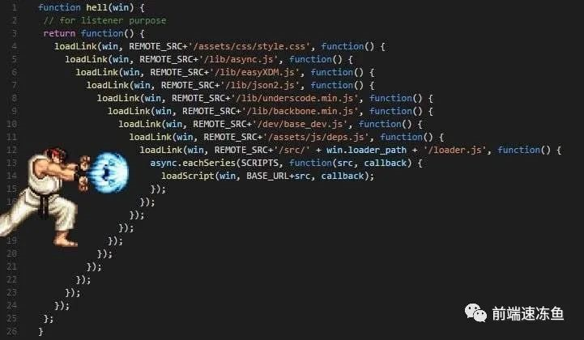

# **纯函数**

纯函数是在给定相同输入的情况下始终返回相同输出的函数。除了提供的输入之外，它不依赖于任何外部变量，也不影响/更改任何外部变量。拥有纯函数使测试变得更加容易，因为它们使测试变得超级容易，因为您可以随时存根/模拟输入并测试您的预期值。让我们看看下面的例子

```javascript
let name = 'Yu DongSu'
const splitName = () => {
  name = name.split(' ')
}
name = splitName()
console.log(name) // outputs [ 'Yu', 'DongSu' ]
```

虽然上面的代码看起来很合适。不是开玩笑。这是因为该 `splitName` 函数依赖于一个名为的外部变量 `name`，如果其他人开始更改此变量，该函数将 `splitName` 开始提供不同的输出。使它成为一个非纯函数，因为我们仍然会调用 `splitName()` 它，但输出会有所不同。

让我们把它改成一个纯函数，看看它是什么样子的：

```javascript
let name = 'Yu DongSu'
const splitName = (nameString) => {
  return nameString.split(' ')
}
name = splitName(name)
console.log(name) // outputs [ 'Yu', 'DongSu' ]
```

通过上述更改，`splitName` 现在是一个纯函数，因为：

- 它仅依赖于输入（`nameString` 输入）。
- 它不会更改/重新分配任何外部变量

# 更少或命名参数

使用函数时，我们经常使用位置参数，这些参数必须在函数声明中声明时提供。例如，在 call 中，如果不提供 and `arithmaticOp(num1, num2, operator)` ，我们就无法提供 `operator` 参数。虽然这适用于这个例子，但对于许多功能来说，这会成为一个问题。考虑以下示例:

```javascript
const createButton = (title, color, disabled, padding, margin, border, shadow) => {
  console.log(title, color, disabled, padding, margin, border, shadow)
}
```

查看上面的代码，您已经可以看到，如果我们想在调用 `createButton` + 时将任何参数设为可选（使用默认值），那将是一场灾难，可能看起来像这样：

```javascript
createButton('Sudongyu er', undefined /* optional color */, true, '2px....', undefined /* optional margin*/)
```

你可以看到上面的语句看起来一点也不 **干净** 。此外，从函数调用语句中很难看出哪个参数对应于函数的哪个参数。所以这是我们可以遵循的做法：

- 如果我们有 2 个或更少的参数，我们可以将它们保留为位置参数
- 否则，我们提供一个带有键值对的对象

让我们在上面的例子中使用这个技术，看看它是什么样子的：

```javascript
const createButton = ({ title, color, disabled, padding, margin, border, shadow }) => {
  console.log(title, color, disabled, padding, margin, border, shadow)
}

createButton({
  title: 'Sudongyu er',
  disabled: true,
  shadow: '2px....',
})
```

请注意，调用 `createButton` 函数的语句现在更简洁了。我们可以很容易地看到键值对中的哪个值对应于函数的参数。

# 对象/数组解构

考虑以下 javascript 示例，其中我们从对象中获取一些属性并分配给它们的各个变量：

```javascript
const user = {
  name: 'Sudongyu',
  email: 'hi@xxx',
  designation: 'Software Architect',
  loves: 'The Code',
}

const name = user.name
const email = user.email
const loves = user.loves
```

在上面的例子中，多次使用这个 `user.*` 符号是非常令人恶心的。这就是对象解构的用武之地。我们可以使用对象解构将上面的示例更改如下：

```javascript
const user = {
  name: 'Sudongyu',
  email: 'hi@xxx',
  designation: 'Software Architect',
  loves: 'The Code',
}

const { name, email, loves } = user
```

看！好多了。对？让我们考虑另一个例子：

```javascript
const getDetails = () => {
  return ['xxx', 'sudongyu', 'Some Street', 'Some City', 'Some Zip', 'Some Country']
}

const details = getDetails()
const uName = details[0]
const uEmail = details[1]
const uAddress = `${details[2]}, ${details[3]}, ${details[4]}, ${details[5]}`
const uFirstName = uName.split(' ')[0]
const uLastName = uName.split(' ')[1]
```

啊。我甚至讨厌编写上述示例的代码 🤣。虽然不得不这样做。您可以看到代码看起来非常怪异且难以阅读。我们可以使用 `<span> </span>Array Destructuring` 将其写得更简洁，如下所示：

```javascript
const getDetails = () => {
  return ['xxx', 'sudongyu', 'Some Street', 'Some City', 'Some Zip', 'Some Country']
}
const [uName, uEmail, ...uAddressArr] = getDetails()
const uAddress = uAddressArr.join(', ')
const [uFirstName, uLastName] = uName.split('')
console.log({
  uFirstName,
  uLastName,
  uEmail,
  uAddress,
})
```

你可以看到这有多干净 🤩

# 避免硬编码值

```javascript
/**
 * 阿巴阿巴
 *
 *
 *
 *
 *
 */

setInterval(() => {
  // do something
}, 86400000)
// WHAT IS THIS 86400000 ??? 🤔
```

看代码的人可能不知道这个数字代表什么，它是如何计算的，以及它背后的业务逻辑是什么。我们可以创建一个常量，而不是硬编码这个值，如下所示：

```javascript
const DAY_IN_MILLISECONDS = 3600 * 24 * 1000 // 86400000
setInterval(() => {
  // do something
}, DAY_IN_MILLISECONDS)
// now this makes sense
```

让我们考虑另一个例子：

```javascript
const createUser = (name, designation, type) => {
  console.log({ name, designation, type })
}

createUser('SudongYu', 'Software Architect', '1')
// WHAT IS this '1'? 🤔
```

查看调用 `createUser`方法。阅读代码的人很难理解这 `'1'`代表什么。即 `type`这是什么用户。因此，我们可以创建一个我们拥有的用户类型的对象映射，而不是在这里对值进行硬编码 `'1'`，如下所示：

```javascript
const USER_TYPES = {
  REGULAR_EMPLOYEE: '1',
}

const createUser = (name, designation, type) => {
  console.log({ name, designation, type })
}

createUser('Sudongyu', 'Software Architect', USER_TYPES.REGULAR_EMPLOYEE)
// smoooooooth 😎
```

# 避免使用简写变量名

速记变量在需要它们的地方才有意义。就像如果你有像 `x`and 这样的位置坐标 `y`，那是可行的。`p`但是，如果我们在没有上下文的情况下创建像,`t`之类的变量 `c`，那么真的很难阅读、跟踪和维护这样的代码。例如看这个例子：

```javascript
const t = 25

let users = ['Sudongyuer', 'xxx']

users = users.map((user) => {
  /**
   *
   *
   *
   *
   *
   *
   *
   *
   *
   *
   *
   *
   *
   *
   *
   *
   *
   *
   *
   *
   *
   *
   *
   *
   */

  return {
    ...user,
    tax: (user.salary * t) / 100, // WHAT IS `t` again? 🤔
  }
})
```

上面的例子表明，现在开发人员/读者必须一直向上滚动或转到定义来尝试理解这个变量是什么。因此是不干净的代码 😠。这也称为对变量进行思维导图，其中只有作者知道它们的含义。因此，我们可以给它一个适当的名称，而不是简写变量名称，如下所示：

```javascript
const taxFactor = 25

let users = ['Sudongyuer', 'xxx']

users = users.map((user) => {
  // some code
  return {
    ...user,
    tax: (user.salary * taxFactor) / 100,
  }
})
```

现在这更有意义了。

# 使用 Object.assign() 设置默认对象值

在某些情况下，您可能希望从另一个对象创建一个新对象，如果源对象没有它们，则提供一些默认值。考虑以下示例：

```javascript
const createButton = ({ title, color, disabled, padding }) => {
  const button = {}
  button.color = color || '#333'
  button.disabled = disabled || false
  button.title = title || ''
  button.padding = padding || 0
  return button
}

const buttonConfig = {
  title: 'Click me!',
  disabled: true,
}

const newButton = createButton(buttonConfig)
console.log('newButton', newButton)
```

`Object.assign()`如果源对象提供了默认属性，我们可以使用如下方式覆盖默认属性，而不是做所有这些：

```javascript
const createButton = (config) => {
  return {
    ...{
      color: '#dcdcdc',
      disabled: false,
      title: '',
      padding: 0,
    },
    ...config,
  }
}

const buttonConfig = {
  title: 'Click me!',
  disabled: true,
}

const newButton = createButton(buttonConfig)
console.log('newButton', newButton)
```

# 使用方法链（尤其是类）

如果我们知道类/对象的用户将一起使用多个函数，则方法链接是一种很有用的技术。您可能已经在诸如 moment.js 之类的库中看到了这一点。让我们看一个例子：

```javascript
class Player {
  constructor (name, score, position) {
    this.position = position;
    this.score = score;
    this.name = name;
  }
  setName(name) {
    this.name = name;
  }
  setPosition(position) {
    this.position = position;
  }
  setScore(score) {
    this.score = score;
  }
}

const player = new Player();
player.setScore(0);
player.setName('Sudongyuer');
player..setPosition([2, 0]);
console.log(player)
```

在上面的代码中，您可以看到我们需要为播放器一起调用一堆函数。如果您的对象/类是这种情况，请使用方法链接。您需要做的就是从要链接的函数中返回对象的实例。上面的例子可以修改如下来实现：

```javascript
class Player {
  constructor(name, score, position) {
    this.position = position
    this.score = score
    this.name = name
  }
  setName(name) {
    this.name = name
    return this // <-- THIS
  }
  setPosition(position) {
    this.position = position
    return this // <-- THIS
  }
  setScore(score) {
    this.score = score
    return this // <-- THIS
  }
}

const player = new Player()
player.setScore(0).setName('Sudongyuer').setPosition([2, 0])
// SUPER COOL 😎
console.log(player)
```

# 在回调上使用 Promise

承诺让我们的生活更轻松。几年前我们有一个叫做回调地狱的东西，这使得代码很难阅读。它看起来像这样：



即使我正在使用具有回调的库，我也会尝试在那里添加一个包装器来保证这一点（是的，现在这是一个术语）。让我们考虑以下示例：

```javascript
const getSocials = (callback) => {
  setTimeout(() => {
    callback({ socials: { youtube: 'xxx', twitter: 'xxx' } })
  }, 1500)
}

const getBooks = (callback) => {
  setTimeout(() => {
    callback({ books: ['React Cookbook'] })
  }, 1500)
}

const getDesignation = (callback) => {
  setTimeout(() => {
    callback({ designation: 'Software Architect' })
  }, 1500)
}

const getUser = (callback) => {
  setTimeout(() => {
    callback({ user: 'Sudongyuer' })
  }, 1500)
}

getUser(({ user }) => {
  console.log('user retrieved', user)
  getDesignation(({ designation }) => {
    console.log('designation retrieved', designation)
    getBooks(({ books }) => {
      console.log('books retrieved', books)
      getSocials(({ socials }) => {
        console.log('socials retrieved', socials)
      })
    })
  })
})
```

上述代码中的所有函数都是异步的，它们会在 1.5 秒后发回数据。现在，如果涉及 15 个不同的功能，想象一下它会是什么样子。可能就像我在上面分享的图像 😅。为了更好的可读性，我们可以 promisify 我们的函数并使用 promises，而不是这个回调地狱：

```javascript
const getSocials = () => {
  return new Promise((resolve) => {
    setTimeout(() => {
      resolve({ socials: { youtube: 'xxx', twitter: 'xxx' } })
    }, 1500)
  })
}

const getBooks = () => {
  return new Promise((resolve) => {
    setTimeout(() => {
      resolve({ books: ['React Cookbook'] })
    }, 1500)
  })
}

const getDesignation = () => {
  return new Promise((resolve) => {
    setTimeout(() => {
      resolve({ designation: 'Software Architect' })
    }, 1500)
  })
}

const getUser = () => {
  return new Promise((resolve) => {
    setTimeout(() => {
      resolve({ user: 'Sudongyuer' })
    }, 1500)
  })
}

getUser()
  .then(({ user }) => {
    console.log('user retrieved', user)
    return getDesignation()
  })
  .then(({ designation }) => {
    console.log('designation retrieved', designation)
    return getBooks()
  })
  .then(({ books }) => {
    console.log('books retrieved', books)
    return getSocials()
  })
  .then(({ socials }) => {
    console.log('socials retrieved', socials)
  })
```

您可以看到代码现在已经非常可读，因为所有语句都缩进并显示了在每个步骤 `.then()`中检索到的数据。`.then()`我们可以很容易地看到使用这种语法的步骤，因为每次 `.then()`调用都会返回下一个函数调用及其承诺。

现在我们可以把它提升一个档次，让我们的代码更具可读性。如何？通过使用 `async await`. 我们将修改我们的代码如下来实现：

```javascript
const getSocials = () => {
  return new Promise((resolve) => {
    setTimeout(() => {
      resolve({ socials: { youtube: 'xxx', twitter: 'xxx' } })
    }, 1500)
  })
}

const getBooks = () => {
  return new Promise((resolve) => {
    setTimeout(() => {
      resolve({ books: ['React Cookbook'] })
    }, 1500)
  })
}

const getDesignation = () => {
  return new Promise((resolve) => {
    setTimeout(() => {
      resolve({ designation: 'Software Architect' })
    }, 1500)
  })
}

const getUser = () => {
  return new Promise((resolve) => {
    setTimeout(() => {
      resolve({ user: 'Sudongyuer' })
    }, 1500)
  })
}

const performTasks = async () => {
  const { user } = await getUser()
  console.log('user retrieved', user)

  const { designation } = await getDesignation()
  console.log('designation retrieved', designation)

  const { books } = await getBooks()
  console.log('books retrieved', books)

  const { socials } = await getSocials()
  console.log('socials retrieved', socials)
}
```

请注意，我们将代码包装在 `performTasks()`函数中，这是一个 `async`函数，您可以看到 `async`关键字的用法。在内部，我们使用 `await`关键字进行每个函数调用，这基本上会在执行下一行代码之前等待函数的承诺得到解决。使用这种语法，我们的代码看起来好像都是同步的，但实际上是异步的。而且我们的代码更干净

# **null、undefined 和空值检查**

当我们创建了新变量，有时候想要检查引用的变量是不是为非 null 或 undefined。

JavaScript 确实有一个很好的快捷方式来实现这种检查。

```javascript
// Longhand
if (test1 !== null || test !== undefined || test1 !== '') {
  let test2 = test1
}
// Shorthand
let test2 = test1 || ''
```

# **给多个变量赋值**

```javascript
// Longhand
let test1, test2, test3
test1 = 1
test2 = 2
test3 = 3
// Shorthand
let [test1, test2, test3] = [1, 2, 3]
```

# **用于多个条件判断的 && 操作符**

如果只在变量为 true 时才调用函数，可以使用 && 操作符。

```javascript
// Longhand
if (test1) {
  callMethod()
}
// Shorthand
test1 && callMethod()
```

# **简短的函数调用**

我们可以使用三元操作符来实现多个函数调用。

```javascript
// Longhand
function test1() {
  console.log('test1')
}
function test2() {
  console.log('test2')
}
let test3 = 1
if (test3 == 1) {
  test1()
} else {
  test2()
}
// Shorthand
;(test3 === 1 ? test1 : test2)()
```

# **switch 简化**

我们可以将条件保存在键值对象中，并根据条件来调用它们

```javascript
// Longhand
switch (data) {
  case 1:
    test1()
    break
  case 2:
    test2()
    break
}
// Shorthand
let data = {
  1: test1,
  2: test2,
}
data[something] && data[something]()
```

# **指数表示法**

```javascript
// Longhand
for(let i = 0; i < 10000; i++){ ... }
// Shorthand
for(let i = 0; i < 1e4; i++) { ... }
```

# **默认参数值**

```javascript
// Longhand
function add(test1, test2) {
  if (test1 === undefined) test1 = 1
  if (test2 === undefined) test2 = 2
  return test1 + test2
}
// Shorthand
add = (test1 = 1, test2 = 2) => test1 + test2
add() // 3
```

# **解构赋值**

```javascript
// Longhand
const test1 = this.data.test1
const test2 = this.data.test2
const test3 = this.data.test3
// Shorthand
const { test1, test2, test3 } = this.data
```

# **数组 find 简化**

当我们有一个对象数组，并想根据对象属性找到特定对象，find 方法会非常有用。

```javascript
const data = [
  {
    type: 'test1',
    name: 'name1',
  },
  {
    type: 'test2',
    name: 'name2',
  },
]
function findtest1(name) {
  for (let i = 0; i < data.length; ++i) {
    if (data[i].type === 'test1' && data[i].name === name) {
      return data[i]
    }
  }
}
// Shorthand
filteredData = data.find((data) => data.type === 'test1' && data.name === 'name1')
console.log(filterdData) // { type: 'test1', name:'name1' }
```

# **条件查找简化**

如果我们要基于不同的类型调用不同的方法，可以使用多个 else if 语句或 switch，但有没有比这更好的简化技巧呢？

```javascript
// Longhand
if (type === 'test1') {
  test1()
} else if (type === 'test2') {
  test2()
} else if (type === 'test3') {
  test3()
} else {
  throw new Error('Invalid value' + type)
}
// Shorthand
let types = {
  test1: test1,
  test2: test2,
  test3: test3,
}
let func = types[type](!func) && throw new Error('Invalid value' + type)
func()
```
