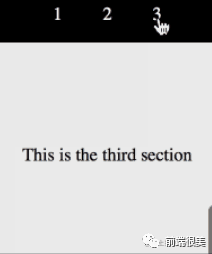
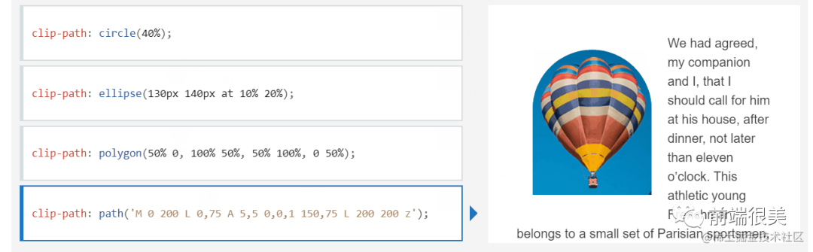
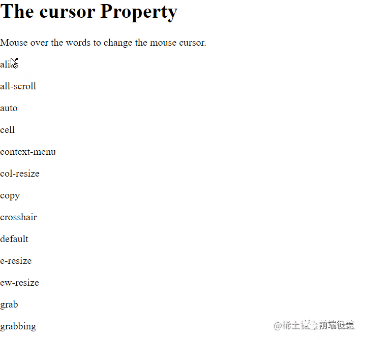
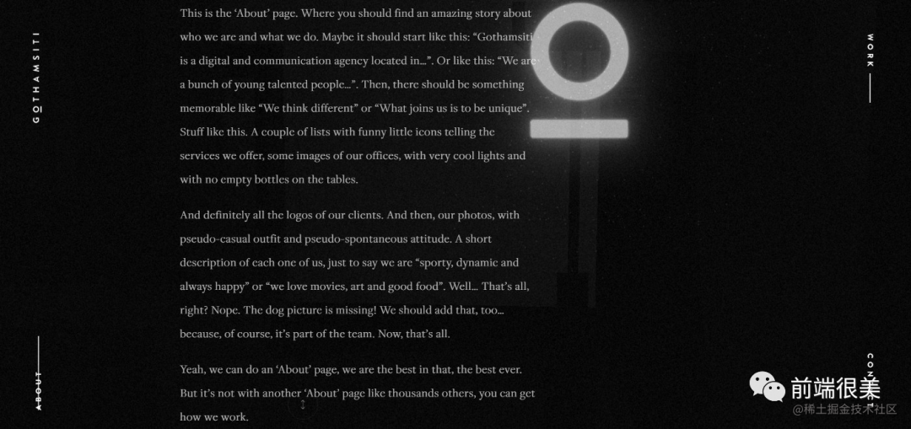
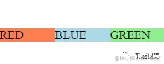

# Scroll behavior 为文档添加平滑滚动效果

```css
html  {
    scroll-behavior: smooth;
}
```

这行简单的代码可以避免编写复杂的 JavaScript。


此属性使我们能够定义当用户,单击滚动框中链接时，浏览器的滚动是跳跃还是平稳过渡。Chrome 版本 61+、Firefox 36+和 Edge 版本 79+支持此属性。

# Clip path 属性使您可以将元素裁剪为基本形状或 SVG 源

```css
clip-path: circle(40%);
clip-path: ellipse(130px 140px at 10% 20%);
clip-path: polygon(50% 0,  100% 50%,  50% 100%,  0 50%);
clip-path: path('M 0 200 L 0,75 A 5,5 0,0,1 150,75 L 200 200 z');
```



clip path CSS 属性可以使我们控制显示区域的哪一部分。区域内的内容显示，而外部隐藏。

# Filter 属性定义元素（通常是 ``）的视觉效果（如模糊和饱和度）

```css
filter: drop-shadow(16px 16px 20px red);
```


通过这行 css 代码，我们可以给图片添加滤镜效果。此属性的视觉效果包括，如阴影、模糊、颜色偏移、反转颜色等。下面给出了其中一些属性。

```css
filter: blur(5px);
filter: contrast(200%);
filter: grayscale(80%);
```

# Pseudo-classes 简化同父选择器

```css
:is(header,  main,  footer) p:hover  {
    color: red;
    cursor: pointer;
}
```

:is()函数帮助我们通过选择器列表将相同的样式应用于一组不同的元素。选择器列表作为参数传递给:is()函数，选择器列表中的任何元素都会受到影响。它可以在实现 DRY（不要重复你自己的代码）原则时发挥作用。

# User select 是否可复制文本

```css
div {
  -webkit-user-select: none; /* Safari */
  -ms-user-select: none; /* IE 10 and IE 11 */
  user-select: none; /* Standard syntax */
}
```

想阻止你的用户复制文本吗？如果是，则 user-select 属性可以帮助我们实现这个功能。user-select 属性指定用户是否可以选择文本。

# Change cursor 指针外观

```css
div {
     cursor: alias;
}
```

简单而强大的属性，可以轻松地更改标指针的外观。



不同的光标传达不同的含义。例如，可以用 cursor:grab 属性来表示可移动对象是可拖动的元素。

# Caret color 输入框光标颜色

```css
input  {
    caret-color: red;
}
```

改变输入框光标颜色，同时又不改变输入框里面的内容的颜色。

# Custom Scrollbars 自定义滚动条

```css
::-webkit-scrollbar  {
    width: 20px;
}
```

我们可以轻松地自定义滚动条，使用此属性可以给网站提供独特的触感。此外，还可以轻松更改滚动条轨迹和滑块。

```css
body::-webkit-scrollbar-track  {
      -webkit-box-shadow: inset 0 0 6px rgba(0, 0, 0, 0.9);
}
  body::-webkit-scrollbar-thumb  {
    background-color: red;
    outline: 1px solid red;
}
```

# Writing mode 规定水平还是垂直地排布文本行

```css
writing-mode: vertical-lr;
```

正确使用 `Writing mode`可以帮助你为网站增添有趣的变化。书写模式设置文本是水平排列还是垂直排列。我们还可以通过将其应用于 HTML 文件的根元素来设置整个项目。



# Border box 指定宽高

```css
box-sizing: border-box;
width: 100%;
```

将 box-sizing 设置为 border-box 是一个巧妙的技巧，可以避免任何意外的 padding 问题。它告诉浏览器在该元素的宽度和高度本身中指定的值中包含 border 和 padding。例如，如果元素宽度为 125px，则添加的任何 padding 都将包含在该宽度（125px）中。

# Place items 垂直水平位置合并

```javascript
place-items: center stretch;
```

在 `grid`布局中，align-items 属性控制垂直位置，justify-items 属性控制水平位置。这两个属性的值一致时，就可以合并写成一个值。所以，place-items: center;等同于 place-items: center center;


