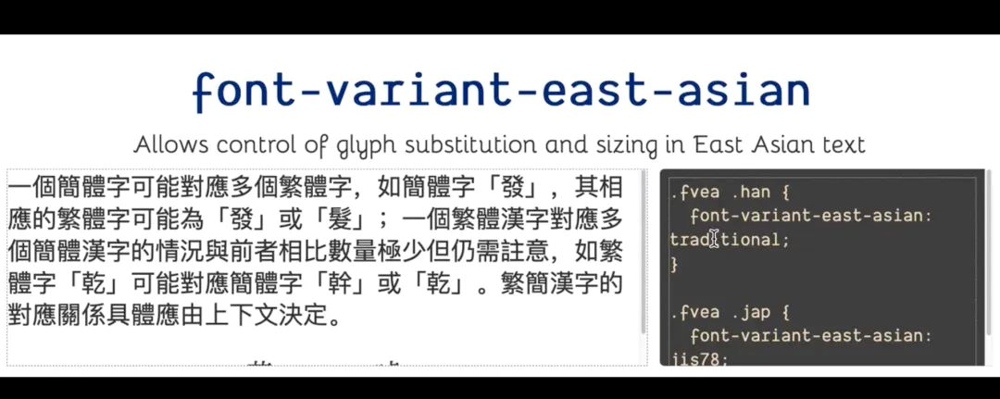

# CSS 国际化指南

```plaintext
[程序员成长指北](javascript:void(0);) *2022-05-09 09:01* *发表于北京*
以下文章来源于奇舞精选 ，作者Marthers
本人翻译者系奇舞团前端工程师
原文标题：CSS for internationalization
原文作者：Chen Hui jing
原文地址：https://chenhuijing.com/blog/css-for-i18n
```

我遇到过一些人，他们根本不认为 CSS 与国际化有关，但如果你仔细想想，国际化不仅仅是将你网站上的内容翻译成多种语言，然后一劳永逸。这些内容的呈现方式存在各种细微差别，影响母语人士使用您网站的体验。

国际化没有单一的规范定义，但 W3C 提供了以下指导：

"国际化是一种产品、应用程序或文档的设计和开发，可以方便地为不同文化、地区或语言的目标受众进行本地化。"

从 Unicode 和字符编码的使用，到为翻译内容提供服务的技术实现，以及所述内容的呈现，这是一个需要覆盖的领域。今天，我将只讨论多语言支持的 CSS 相关方面。

CSS 通过告诉浏览器页面上的元素应该如何设置样式和布局来描述网页的显示。在使用 CSS 的多语言页面上，我们可以使用几种方法将不同的样式应用于不同的语言。

除此之外，CSS 属性还为脚本和书写系统提供了布局和排版功能，而不仅仅是基于拉丁语的自上而下的水平排版功能，这种功能如今主要出现在 WEB 上。

所以，请做好准备，因为这可能会是一篇相当长的文章。¯*(ツ)*/¯

# 与语言相关的样式

你有没有想过 Chrome 怎么会问你是否想翻译网页的内容？额...不好吧，也许只有我一个人关注过这类问题?这是因为 HTML 元素上的 lang 属性。


lang 属性是一个非常重要的属性，因为它识别 WEB 上文本内容的语言，并且该信息在许多地方都被使用。前面提到的 Chrome 内置翻译，针对特定语言内容的搜索引擎，以及屏幕阅读器。

啊哈，也许你没有想到屏幕阅读器，但如果你不是一个屏幕阅读器用户或认识这样的人，它可能不会放在心上。屏幕阅读器利用语言信息，以适当的口音和正确的发音读出内容。

与语言相关的样式化的关键在于在页面标记中适当使用 lang 属性。lang 属性将 ISO 639 ^[1]^ 语言代码识别为值。

更新:Tobias Bengfort ^[2]^ 指出 lang 属性使用了一个名为 BCP 47 的 IETF 规范 ^[3]^ ，该规范很大程度上基于 ISO 639 标准。

在大多数情况下，您将使用像 zh 这样的两个字母的代码来表示中文，但是中文(包括阿拉伯语等其他语言)被认为是一种宏语言，它由许多具有更具体的主语言子标记的语言组成。

有关如何构造语言标记的深入解释，请参阅 HTML 和 XML 中的语言标记 ^[4]^ 。

一般的指导是 html 元素必须总是有一个 lang 属性集，然后由所有其他元素继承。

```html
<html lang="zh"></html>
```

在同一页上看到不同语言的内容并不少见。在本例中，您将使用 span 或 div 包装该内容，并将正确的 lang 属性应用于包装元素。

```html
<p>The fourth animal in the Chinese Zodiac is Rabbit (<span lang="zh">兔子</span>).</p>
```

既然我们已经对其进行了分类，下面的技术将假设 lang 属性已经得到了负责任的实现。

# :lang()伪类选择器

事实证明:lang()伪类选择器并不是那么有名。


但是这个伪类选择器非常酷，因为它可以识别内容的语言，即使该语言是在元素之外声明的。

例如，一行包含两种语言的标记，如下所示：

```html
<p>
    We use <em>italics</em> to emphasise words in English, <span lang="zh">但是中文则是用<em>着重号</em></span
  >.
</p>
```

可采用以下样式：

```css
em:lang(zh)  {
    font-style: normal;
    text-emphasis: dot;
}
```

如果您的浏览器支持 text-emphasis 的 CSS 属性，您应该能够看到在 em 中的每个汉字中添加的强调标记（传统上用于强调一系列东亚文本的排版符号）。Chrome 需要-webkit-前缀(此处嘘声一片)。

我们用斜体字强调英语中的单词，但是中文则是用着重号.

但关键是，lang 属性不是应用于 em 元素，而是应用于其父元素。伪类仍然有效。如果我们使用更常见的属性选择器，例如[lang=“zh]，则该属性必须位于 em 元素上才能生效。

# 使用属性选择器

这就引出了我们的下一项技术，使用属性选择器。这些允许我们选择具有特定属性或具有特定值的属性的元素。（插件时间，要了解更多关于属性选择器的信息，请尝试您自己编写的 Codrops CSS 参考条目 ^[5]^ )

有七种方法可以匹配属性选择器，但我只讨论那些我认为与匹配 lang 属性更相关的方法。我所有的例子都使用中文作为目标语言，所以 zh 及其变体。

更新：Amelia Bellamy Royds ^[6]^ 指出，我的示例使属性选择器似乎是进行部分语言标记匹配所必需的，但:lang()伪类已经涵盖了该用例。

首先，我们可以使用以下语法精确匹配 lang 属性值：

```html
[lang="zh"] /* will match only zh */
```

我之前提到过，汉语被认为是一种宏语言，这意味着它的语言标签可以由额外的细节组成，例如脚本子标签 Hans 或 Hant（W3C 说，如果需要区分，只使用脚本子标签，否则不使用）、区域子标签 HK 或 TW 等等。

重点是，语言标签可以比两个字母长。但最一般化的类别总是排在第一位，所以要针对以特定字符串开头的属性值，我们使用以下涉及^的语法：

```html
[lang^="zh"] /*将匹配zh，zh HK，zh Hans，zhong，zh123… *基本上是以zh作为前两个字符的任何内容*/
```

还有另一种涉及|的语法，它将匹配选择器中的确切值，或者匹配一个以值开头，紧接着是-的值。这似乎只是为了语言子代码匹配，不是吗？

```html
[lang|="zh"] /* 将匹配 zh, zh-HK, zh-Hans, zh-amazing, zh-123 */
```

请记住，对于属性选择器，属性必须位于您想要设置样式的元素上，如果它位于父级或祖先级，则它将不起作用。请注意，我提出的部分语言标记匹配示例已经可以通过:lang()伪类完成。

换句话说，除了 lang=“en”之外，:lang(en)还将匹配 lang=“en US”、lang=“en GB”等等。当我能想出更好的例子时，我会更新这些例子。同时，使用:lang()伪类。

# 普通类或 ID 如何？

是的。可以使用普通类或 ID。尽管你不会再利用你元素上已有的便利。（再一次，我的假设是 lang 属性被正确且负责任地应用）但当然，请继续，并为应用特定语言相关样式的元素提供类名。如果你真的想，没有人会阻止你。

# CSS 属性

好的，选择器被覆盖了。让我们来谈谈我们希望应用于与这些选择器匹配的元素的样式。

## Writing mode

writing-mode 的默认值为 horizontal-tb。完全合乎逻辑，因为网络诞生于欧洲核子研究中心，那里的官方语言是英语和法语。此外，我认为大多数网络技术都是在说英语的国家首创的。

但人类的神奇给了我们 3000 多种文字，文字和书写方向远不止从上到下的水平方向这一种方式。

传统的蒙古语从左到右垂直书写，而日语、汉语和韩语等东亚语言在垂直书写时从右到左。允许您这样做的写入模式属性分别是垂直 lr 和垂直 rl。


还有 sideways-lr 和 sideways-rl 的值，它们将符号侧向旋转。每个 Unicode 字符都有一个垂直方向属性，告知呈现引擎在默认情况下字形应该如何定向。

我们可以通过 text-orientation 属性来改变字符的朝向。当您使用垂直排版的东亚文本，并点缀以拉丁语为基础的单词或字符时，这通常会发挥作用。对于缩写，您可以选择使用 text-combination-vertical 将字母压缩到一个字符空间中。


有些人可能想知道从右到左的语言，如阿拉伯语、希伯来语或波斯语(仅举几例)，以及 CSS 是否也适用于这些脚本。简而言之，CSS 不应该用于双向样式。W3C 的指导如下:

因为方向性是文档结构的组成部分，所以应该使用标记来设置文档或信息块的方向性，或者标识文本中仅使用 Unicode 双向算法不足以实现所需方向性的位置。

这是因为通过 CSS 应用的样式有可能被关闭，被覆盖，无法识别，或者在不同的上下文中被更改/替换。相反，建议使用 dir 属性来设置显示文本的基本方向。

我强烈建议参考 HTML 中的结构化标记和从右到左的文本 ^[7]^ ，CSS vs.标记的 bidi 支持 ^[8]^ ，内联标记和 HTML 中的双向文本 ^[9]^ ，以获得更详细的解释和实现细节。

## 逻辑属性

网页上的所有东西都是一个盒子，CSS 总是使用顶部、底部、左侧和右侧的物理方向来指示我们的目标盒子的哪一边。但是，当 writing-mode 不是默认的从上到下的水平方向时，这些值往往会令人困惑。

因为规范仍然处于草案状态，所以语法可能会继续更改。即使现在，当前的浏览器实现与规范中的不同，所以一定要用 MDN: CSS 逻辑属性和值 ^[10]^ 对最新的语法进行双重检查。

更新:David Baron 指出，我使用的是规范的前一个版本中的旧语法，而在浏览器中实现的语法实际上是编辑草案中的语法。表已相应更新。

用于定位的盒子的物理边和逻辑边的书写方向及其对应值的矩阵如下(该表从写作时的规范中移除):


容器的逻辑顶部使用 inset-block-start，而容器的逻辑底部使用 inset-block-end。容器的逻辑左侧使用 inset-inline-start，而容器的逻辑右侧使用 inset-inline-end。

也有相应的边界、边距和填充的映射，它们是:

- top to block-start
- right to inline-end
- bottom to block-end
- left to inline-start

```html
<h1>A comparison of physical and logical directions for borders</h1>

<p>  Given the requirement is to have a box with a run of text within it with the   following characteristics:</p>
<ol>
    
  <li>    The border colour at the top edge <strong>of the run of text</strong> should     be red.   </li>
    
  <li>    The border colour at the right edge     <strong>of the run of text</strong> should be green.   </li>
    
  <li>    The border colour at the bottom edge     <strong>of the run of text</strong> should be blue.   </li>
    
  <li>    The border colour at the left edge     <strong>of the run of text</strong> should be yellow.   </li>
</ol>

<p>
    Using physical directions requires a modification every time the writing   direction changes, whereas using logical properties allows the same properties
    and values for all six use cases.
</p>
<hr />

<section>
    
  <h1>Physical directions</h1>
    
  <div class="phy-boxes">
        
    <article>
            
      <div class="phy-box1">
                
        <p>This is a sentence.</p>
              
      </div>
            
      <pre><code>border-top-color: tomato;
border-right-color: limegreen;
border-bottom-color: dodgerblue;
border-left-color: gold;</code></pre>
          
    </article>

        
    <article>
            
      <div class="phy-box2" dir="rtl">
                
        <p>This is a sentence.</p>
              
      </div>
            
      <pre><code>border-top-color: tomato;
border-left-color: limegreen;
border-bottom-color: dodgerblue;
border-right-color: gold;</code></pre>
          
    </article>

        
    <article>
            
      <div class="vlr phy-box3">
                
        <p>This is a sentence.</p>
              
      </div>
            
      <pre><code>border-left-color: tomato;
border-bottom-color: limegreen;
border-right-color: dodgerblue;
border-top-color: gold;</code></pre>
          
    </article>

        
    <article>
            
      <div class="vlr phy-box4" dir="rtl">
                
        <p>This is a sentence.</p>
              
      </div>
            
      <pre><code>border-left-color: tomato;
border-top-color: limegreen;
border-right-color: dodgerblue;
border-bottom-color: gold;</code></pre>
          
    </article>

        
    <article>
            
      <div class="vrl phy-box5">
                
        <p>This is a sentence.</p>
              
      </div>
            
      <pre><code>border-right-color: tomato;
border-bottom-color: limegreen;
border-left-color: dodgerblue;
border-top-color: gold;</code></pre>
          
    </article>

        
    <article>
            
      <div class="vrl phy-box6" dir="rtl">
                
        <p>This is a sentence.</p>
              
      </div>
            
      <pre><code>border-right-color: tomato;
border-top-color: limegreen;
border-left-color: dodgerblue;
border-bottom-color: gold;</code></pre>
          
    </article>
      
  </div>
</section>

<hr />

<section>
    
  <h1>Logical directions</h1>
    
  <div class="log-boxes">
        
    <div class="log-box">
            
      <p>This is a sentence.</p>
          
    </div>
        
    <div class="log-box" dir="rtl">
            
      <p>This is a sentence.</p>
          
    </div>
        
    <div class="vlr log-box">
            
      <p>This is a sentence.</p>
          
    </div>
        
    <div class="vlr log-box" dir="rtl">
            
      <p>This is a sentence.</p>
          
    </div>
        
    <div class="vrl log-box">
            
      <p>This is a sentence.</p>
          
    </div>
        
    <div class="vrl log-box" dir="rtl">
            
      <p>This is a sentence.</p>
          
    </div>
      
  </div>
    
  <pre><code>border-block-start-color: tomato;
border-inline-end-color: limegreen;
border-block-end-color: dodgerblue;
border-inline-start-color: gold;</code></pre>
</section>
```

```css
[class$='boxes']  {
    display: flex;
    flex-wrap: wrap;
    justify-content: space-around;
    gap: 1em;
}

article  {
    margin-bottom: 1em;
}

article  >  div,
[class$='box']  {
    width: 200px;
    height: 200px;
    border: 1em solid;
    position: relative;
    margin: 1em;
}

.phy-box1  {
    border-top-color: tomato;
    border-right-color: limegreen;
    border-bottom-color: dodgerblue;
    border-left-color: gold;
}

.phy-box2  {
    border-top-color: tomato;
    border-left-color: limegreen;
    border-bottom-color: dodgerblue;
    border-right-color: gold;
}

.phy-box3  {
    border-left-color: tomato;
    border-bottom-color: limegreen;
    border-right-color: dodgerblue;
    border-top-color: gold;
}

.phy-box4  {
    border-left-color: tomato;
    border-top-color: limegreen;
    border-right-color: dodgerblue;
    border-bottom-color: gold;
}

.phy-box5  {
    border-right-color: tomato;
    border-bottom-color: limegreen;
    border-left-color: dodgerblue;
    border-top-color: gold;
}

.phy-box6  {
    border-right-color: tomato;
    border-top-color: limegreen;
    border-left-color: dodgerblue;
    border-bottom-color: gold;
}

.log-box  {
    border-block-start-color: tomato;
    border-inline-end-color: limegreen;
    border-block-end-color: dodgerblue;
    border-inline-start-color: gold;
}

.vlr  {
    writing-mode: vertical-lr;
}

.vrl  {
    writing-mode: vertical-rl;
}

pre  {
    background: #2d2d2d;
    padding: 1em;
   margin: 0.5em 0;
   overflow: auto;
    color: #ccc;
    border-radius: 4px;
    width: max-content;
    margin: auto;
}
```

## 边框的物理和逻辑方向的比较

给定的要求是有一个框内的文本运行与以下特征:

- 文本运行的顶部边缘的边框颜色应为红色。
- 文本右边缘的边框颜色应为绿色。
- 文本运行的底部边缘的边框颜色应为蓝色。
- 文本的左边缘的边框颜色应为黄色。
- 使用物理方向需要在每次写入方向改变时进行修改，而使用逻辑属性则允许所有六个用例具有相同的属性和值。

### 物理方向


### 逻辑方向


大小的映射如下:宽度到 inline-size，高度到 block-size。

## 列表和计数器

数字系统是用来表示数字的书写系统，即使最常用的数字系统是印度-阿拉伯数字系统(0,1,2,3 等等)，CSS 也允许我们用其他数字系统显示有序列表。

预定义的计数器样式可以与 list-style-type 属性一起使用，该属性涵盖了从阿法尔语到乌尔都语的 174 个数字系统。你可以在 MDN ^[11]^ 上查看完整的列表。

如果你对 CSS 计数器感兴趣，我在去年的某个时候写了一篇关于它们的文章 ^[12]^ ，在文中我探索了在传统中文环境中使用的“天干”和“地支”数字系统(以及 CSS 中一个非常流行的实现，为什么不呢?)

## text-decoration

如前所述，东亚语言没有斜体的概念。相反，我们有强调点。它们可以放在字符的上方或下方，以强调文本，加强语气或避免歧义。

汉字横写时，这些点放在汉字的下方，竖写时，这些点放在汉字的右侧。


另一方面，日语在水平书写模式下，在字符上方放置强调点。为了使 CSS 属性更加通用，在 CSS text-decoration 模块第 3 级 ^[13]^ 中引入了 text-emphasis-style、text-emphasis-position 和 text-emphasis-color。


除了点之外，你可以使用不同的符号，比如圆、三角形，甚至是单个字符作为字符串。位置和颜色也可以根据各自的属性进行调整。


线条装饰也包含在同一规范中，为开发者提供了对下划线和上划线的更精细的控制（在规范的第 4 级）。但是，这对于那些经常溢出基线的升序或降序脚本尤其有用。

CSS text-decoration 模块第 4 级 ^[14]^ 涵盖了 text-decoration-skip，该模块控制当覆盖线和下划线跨越字形时如何绘制覆盖线和下划线。同样，对于像英语这样的语言来说，这种情况发生的频率较低，但对像缅甸语这样的脚本的美学影响很大。

## 字体变化

访问 OpenType 特性有两类 CSS 属性，高级属性和低级属性。本规范建议尽可能使用高级属性。这主要取决于浏览器支持。

例如，东亚字体变体允许控制具有变体的字符的字形形式，例如简体中文字形和繁体中文字形。这是同一个字符，但它们可以写得不同。




还有字体变体连字，它为连字和上下文形式提供了许多预定义的选项，如任意连字、历史连字或上下文连字。

低级属性是通过字体功能设置访问的，您可以使用 4 个字母的 OpenType 标记来切换所需的功能（这取决于您的字体是否有这些功能，但假设有）。

共有 141 个功能标签，从可选分数到对正替换，从 Ruby 符号形式到斜线零。这些 CSS 属性与字体文件本身的功能密切相关，因此外部依赖性取决于字体的选择。

# 结束

这篇文章太长了，所以我将在第二部分更详细地介绍我们如何使用之前提到的选择器来构建布局，以确保即使语言发生变化，我们的布局也能保持健壮。像 Flexbox 和 Grid 这样的现代布局属性非常适合这样的用例。

关于 CSS，我发现最有趣的事情之一是，我们如何以不同的方式将它们组合起来，以实现无数的结果，并且有超过 500 个 CSS 属性存在，这是很多可能性。我并不是说什么都可以，因为通常情况下，有很多方法可以达到相同的结果，有些方法比其他方法更合适。

然而，我们需要通过理解每种技术背后的机制，其优缺点，并意识到为什么我们会选择某种方式去做事情，从而做出最适合自己的决定。

我仍然相信，30 多年过去了，网络仍然是一个信息媒介，内容是关键。因此，无论使用何种语言或脚本，都应该优化内容的呈现。我很高兴 CSS 的不断发展为开发人员提供了实现这一目标的方法。

总之，敬请期待第二部分。

### 参考资料

[1]ISO 639-1 codes: *https://en.wikipedia.org/wiki/List_of_ISO_639-1_codes*

[2]Tobias Bengfort : *http://tobib.spline.de/xi/*

[3]BCP 47: *https://www.w3.org/International/questions/qa-html-language-declarations*

[4]Language tags in HTML and XML: *https://www.w3.org/International/articles/language-tags/*

[5]Codrops CSS reference entry: *https://tympanus.net/codrops/css_reference/attribute-selectors/*

[6]Amelia Bellamy Royds: *https://twitter.com/AmeliasBrain/status/1253053272585146368*

[7]HTML 中的结构化标记和从右到左的文本: *https://www.w3.org/International/questions/qa-html-dir*

[8]CSS vs.标记的 bidi 支持: *https://www.w3.org/International/questions/qa-bidi-css-markup*

[9]Inline markup and bidirectional text in HTML: *https://www.w3.org/International/articles/inline-bidi-markup/*

[10]MDN: CSS Logical Properties and Values: *https://developer.mozilla.org/en-US/docs/Web/CSS/CSS_Logical_Properties*

[11]list-style-type: *https://developer.mozilla.org/en-US/docs/Web/CSS/list-style-type*

[12]CSS 计数器的奇妙世界: *https://chenhuijing.com/blog/the-wondrous-world-of-css-counters*

[13]CSS Text Decoration Module Level 3: *https://drafts.csswg.org/css-text-decor-3/#emphasis-marks*

[14]CSS Text Decoration Module Level 4: *https://drafts.csswg.org/css-text-decor-4/#text-decoration-skipping*
