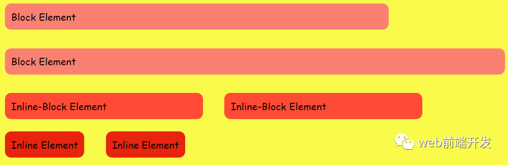
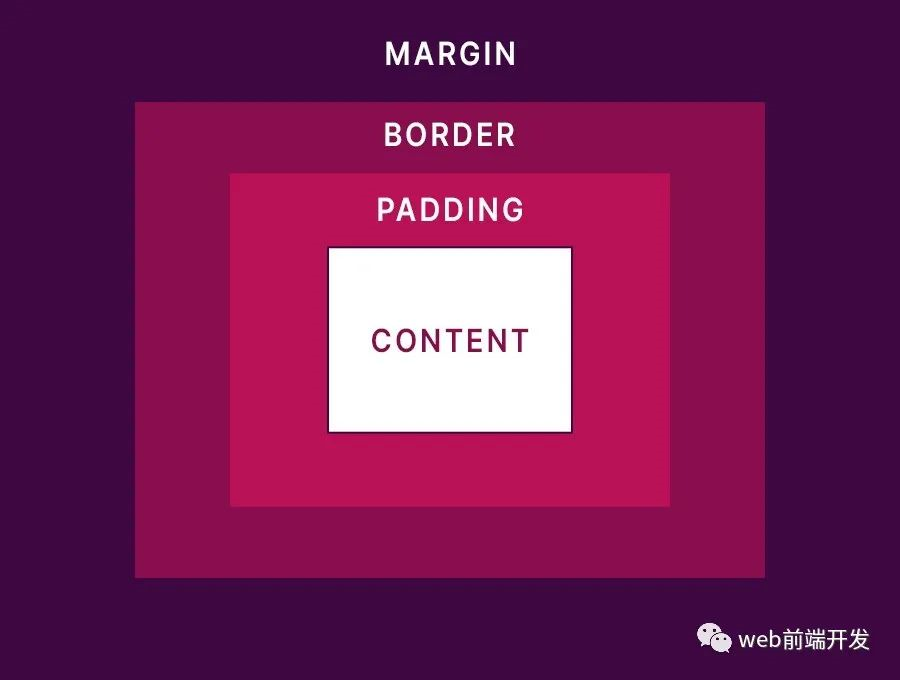
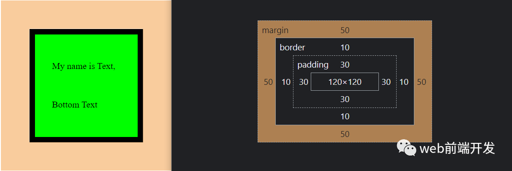

# 每个 Web 开发人员都应该知道的 7 个 CSS 核心概念

`[web前端开发](javascript:void(0);) *2022-05-08 20:49* *发表于上海*`

到目前为止，很多人不知道 CSS 是如何工作的，不过这已经不是什么秘密了，尤其是当你第一次接触 CSS 时。很难弄清楚为什么一个元素位于某个位置，或者为什么该元素具有红色，尽管使用了重要的覆盖它。

在本文中，我将介绍 7 个关于 CSS 的核心概念，它们将帮助您了解发生了什么（即使是一点点）。

请注意，这篇文章不适合 CSS 资深人士，没有任何令人兴奋的功能或类似的东西，它只涵盖了 CSS 的核心概念。

# **1、Display**

你是否曾经尝试过将两个 div 并排放置，但另一个 div 最终位于单独的一行？或者尝试将链接放在单独的行上，但其他元素以某种方式在它旁边结束？我已经覆盖了你！使用 display 属性，您可以控制元素在页面上的显示方式。

虽然很多网站都在使用 flexbox 和 grid（我不会介绍，因为今天的内容是一个初学者指南），但您肯定会遇到一个仍然使用旧显示属性进行布局的网站。



## **1.1 、显示块**

块元素默认占用 100% 的可用空间，并且不允许任何元素放置在同一行上，即使您减小宽度（如上图所示），元素大小也会减小，但仍然不会 允许在它旁边放置另一个元素。大多数 HTML 元素默认是块元素。

## **1.2 、显示内联块**

Inline-Block 元素允许将其他非块元素放置在它们旁边，并且只有在没有空间留给这些元素时才会将其他元素推到下一行。

## **1.3、 显示内联**

内联元素类似于 inline-block，因为它们允许将其他元素放在它们旁边，但是内联元素的尺寸（宽度和高度）不能更改，它们的尺寸由它们的内容（文本 和填充）。

注意：您可以使用 `<br>` 元素在 inline/inline-block 元素之后换行。

# **2、盒子模型**

在 HTML 中，一切都是一个盒子（是的，甚至圆形、三角形等都只是剪切框）。但是，这些盒子是如何工作的呢？盒子内的空白空间是如何添加的？盒子外面呢？“盒子”到底是什么？

注意：这是假设下面的代码块在使用的 CSS 文件中，它非常流行，你甚至不需要知道如果它不存在会发生什么。

<pre class="code-snippet__js" data-lang="css"><section><code><span class="code-snippet_outer"><span>* {</span></span></code><code><span class="code-snippet_outer"><span>box-sizing: border-box;</span></span></code><code><span class="code-snippet_outer"><span>}</span></span></code></section></pre>

“盒子”基本上是 HTML 元素的构建块，它由四个主要块组成：边距（margin)、边框(border)、填充(padding)和内容(content)。



## **2.1、 边距**

边距在所选元素及其周围的所有元素之间添加空白空间，并且不会影响元素内容的大小。现在有个巧妙的小秘密，从边框的外边缘开始，margin-top 将选定的元素向下推动而不移动其他元素，而 margin-bottom 将所述元素保持在原位并向下推动其他元素。margin-left 将所选元素推到右侧，并且不移动其他元素，而 margin-right 将所述元素保持在原位并将其他元素推到右侧。

虽然一开始可能听起来令人困惑，但它的工作原理是这样的，因为 HTML 是从上到下、从左到右呈现的。我强烈建议在开发工具中使用边距，以便更好地了解它的工作原理。

现在提出一个开创性的问题：假设我有两个块元素——A 和 B，A 在 B 之上——如果我添加 margin-bottom: 15px; 会发生什么；到 A 和 margin-top: 10px;给 B?

如果您认为它们之间的距离为 25 像素，我很抱歉地通知您您错了。为什么？因为边距崩溃！基本上，如果您有两个方向相反的边距，则只会渲染较大的边距（在本例中为 15px），而另一个将被忽略。所以在我们的例子中，A 和 B 仅相隔 15px。

我知道这需要消化很多，但我保证其他属性没有那么复杂。

## **2.2、 边框**

边框定义了元素边缘的外观，它还带走了内容并将内容向内推。因此，如果我们有一个 100*100px 的元素，添加一个 10px 的边框将为我们留下 90*90px 的内容。

## **2.3、 填充**

padding 在元素的边界内添加空白空间——不是空白，这意味着如果元素具有背景颜色，它将不会受到影响——从内容大小中移除，并将其向内推。使用与上面相同的示例，拥有 10 像素的边框和 10 像素的内边距将为我们留下 80x80 像素的内容。

## **2.4 、内容**

内容基本上就是计算完 padding 和 border 后剩下的空间。它是文本或图像或子 HTML 元素开始出现在所选元素中的位置。

# **3、定位**

我知道你试过给 top: 50px;你的元素，想知道为什么它没有移动，我们都去过那里。这就是为什么我们需要讨论 position 属性，它允许您控制元素的位置。

## **3.1 、static**

所有 HTML 元素都是 position: static;默认情况下。这意味着您不能使用 top、left、right、bottom 属性来移动它们，它们仍然可以使用 margin、flexbox 等来移动。但在某些情况下，您只想将该元素稍微移动到没有在它周围移动元素，这就是为什么 position: relative;接下来即将到来。

## **3.2 、relative**

好的，但相对于什么？位置：相对；意味着元素将相对于其原始位置放置，而与边距不同，不会移动它周围的任何其他元素。通过使用 relative，您现在可以使用 top、left、right 和 bottom 属性来重新定位您的元素。

## **3.3 、absolute**

我建议您将以下句子阅读 10 遍，因为一开始它很混乱。位置：绝对；相对于最近的非位置定位所选元素：静态；parent（如果没有这样的元素，它相对于 body 放置），并将元素从 HTML 流中取出，导致元素浮动在其他元素之上。您绝对应该只在创建需要浮动在其他元素之上的东西（例如弹出或关闭按钮）时才使用此属性，通常，您使用该属性的次数越少越好。

## **3.4、 Fixed**

位置：固定；与 absolute 类似，它使元素浮动在其他元素之上。但是，它始终是相对于正文放置的，即使您滚动页面，它也会保持在原来的位置。

# **4、选择器**

尽管我很想讨论这个话题，但已经有上千篇关于它的文章了，我没有太多要补充的，我最喜欢的一篇是 MDN 官方文档，（地址：https://developer.mozilla.org/en-US/docs/Web/CSS/Specificity ）

您应该在大多数时间使用类来设置元素的样式，并尽可能避免使用 !important。但是，我将在调试部分讨论如何直接从开发工具中了解哪个选择器具有更高的特异性。

# **5、 继承**

一些 CSS 属性——font-size、font-family 和 color 等等——是从它们最近的父级继承的，当且仅当它们没有为给定元素指定时。

以下 HTML：

```html
<div class="grand-parent">
  <div class="parent">
    <div class="child"></div>
  </div>
</div>
```

如果我们给祖父母 div 颜色：红色；考虑到所述 div 没有指定颜色属性，父 div 和子 div 都将具有红色文本颜色。如果它们中的任何一个指定了颜色，它将覆盖继承，不，在祖父母上添加 !important 不会覆盖其孩子的颜色。同样，我将在调试部分讨论更多关于如何查找哪些属性被继承的内容。

# **6、 z-index 堆栈**

我也希望 z-index 像具有更高 z-index 的元素将显示在顶部一样简单，但这不是它的工作原理。

再次看以下 HTML：

```html
<div class="sibling-1 oarent">
  <div class="child"></div>
</div>
<div class="sibling-2"></div>
```

考虑到兄弟 1 的 z-index: 10; 兄弟 2 的 z-index: 20; 在这种情况下，兄弟 2 将位于兄弟 1 之上，这很棒！现在，考虑 child 的 z-index: 30; 在这种情况下，它不会显示在兄弟 2 的顶部，因为它的父级 (sibling-1) 的 z-index 较小。

因此 z-index 仅适用于兄弟元素，如果该兄弟元素的 z-index 高于父元素，则子元素不能显示在其父兄弟元素的顶部。

您可能可以使用 position: absolute; 做一些巫术魔术。以及所有这些，但不建议这样做，因为它几乎不可能维护您的布局。如果您希望一个元素始终位于其他元素之上，建议您将其直接附加到正文中。

# **7、调试**

虽然调试不是 CSS 的一部分，但您可以使用开发工具来帮助您了解正在发生的事情。我在下面的例子中使用 Chrome，我没有尝试过其他浏览器，但我相信它们确实有类似的界面（无论你做什么，都不要使用 Internet Explorer。让它死吧。）

既然你已经走到了这一步，我假设你知道如何打开开发工具，所以我将跳过这部分。

打开元素选项卡并从那里选择要检查的元素。

## **7.1 、盒子模型**

在样式选项卡的最底部，您可以看到盒子模型的不同部分以及它们所覆盖的区域，将鼠标悬停在它们上方，元素的相应部分将突出显示。



## **7.2 、计算样式**

在 Styles 选项卡旁边有 Computed 选项卡，您可以在其中看到应用于所选元素的所有不同 CSS 属性。例如，如果您的元素在没有指定任何内容的情况下具有红色，您可以单击箭头图标以查看该样式的来源，它可能是继承的，也可能是由另一个选择器意外提供的。

如果一个属性变暗（如本例中的高度和宽度），很可能是因为使用了 flexbox 或网格来指定所述属性（在这种情况下，请随意检查 Layout 选项卡，如前所述，我不会介绍 那些科目）。

您很可能会遇到您不知道它们如何运作的属性（例如用户选择），在这种情况下，Google 是您最好的朋友。您需要找出该属性的作用，以了解它对您的元素有什么样的影响。

## **7.3 、选择器**

在 Styles 选项卡中，您可以看到所有针对所选元素的选择器，在以下示例中，从 5 个不同的选择器中为 span 赋予了颜色。蓝色没有被划掉的原因是它具有最高的特异性。所以选择器的特异性越高，它在列表中的位置就越高（当然！important 打破了这个规则。）

写下你的留言
