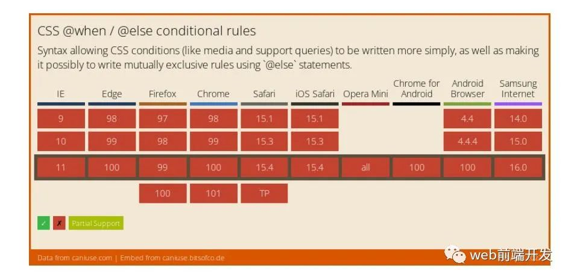

# 未来的 CSS 将引入新的媒体查询方式@when 和@else

[`web 前端开发](<javascript:void(0);>) _2022-05-12 16:00_ _发表于上海`_

`英文 | https://levelup.gitconnected.com/future-css-a-first-look-at-when-and-else-statements-44e33deeb032` --`翻译 | 杨小爱`

在 CSS 中，我们使用媒体查询来选择不同的设备。媒体查询为我们提供了一种基于多种条件选择设备的简单方法，例如屏幕尺寸、像素，格式：即打印或屏幕。

随着时间的推移，这逐渐变得更加复杂，现在，我们经常平衡许多有时相互冲突的条件。

因此，在新的 CSS 条件规则 5 规范试图通过引入两种新的媒体查询方式来解决这个问题——@when 和 @else。这些最终将允许我们直接在 vanilla CSS 中创建条件语句。让我们来看看它是如何工作的！

# **1、浏览器目前对@when/@else 的支持情况**

目前，没有浏览器原生支持@when/@else，但是，这可能很快就会改变。对@when/@else 的完全支持如下所示。



# **2、在 CSS 中使用 @when/@else**

假设我们有一组规则要应用于宽度小于 780 像素的屏幕尺寸，它支持 display: flex，而另一组规则应该适用于除此之外的任何东西。

以前，我们必须使用@media 查询来分别选择这两个东西。在选择多种不同的东西时，这变得有点混乱。

使用 @when 和 @else ，它看起来像这样：

```css
@when screen and (max-width: 780px) and supports(display: flex) {
  .my-element {
    color: red;
    display: flex;
  }
} @else {
  .my-element {
    display: block;
  }
}
```

我们还可以链接多个条件。

例如，假设我们有三个场景：最大宽度为 780px 的屏幕支持显示：flex，更大的屏幕支持显示：flex，以及其他所有内容。

在这种情况下，我们可以有多个条件：

```css
@when screen and (max-width: 780px) and supports(display: flex) {
  .my-element {
    color: red;
    display: flex;
  }
} @else screen and supports(display: flex) {
  .my-element {
    display: flex;
  }
} @else {
  .my-element {
    display: block;
  }
}
```

正如你所期望的，我们可以有更多的@else 语句，但是，上面的内容让你知道@when 和@else 在 CSS 中实现时会有多有用。

**结论**

条件语句从未出现在 vanilla CSS 中，所以，很高兴终于看到它们即将推出。它还将大大简化我们进行媒体查询的方式。

如果我们使用像 SASS 这样的第三方包，我们在 CSS 中已经有了逻辑，但是当它原生到 CSS 时，我们可以避免使用预处理器或使用此添加构建的需要。

写下你的留言
