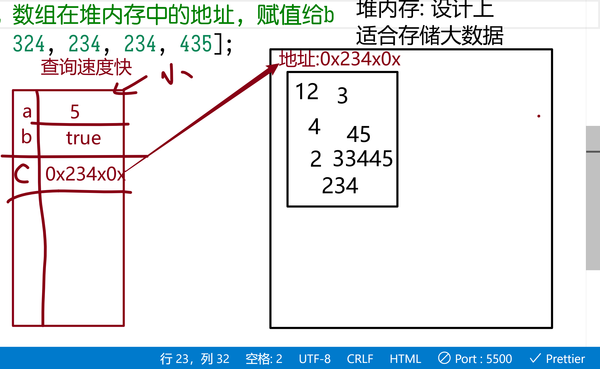

# JSCORE02

## 思考

### 正则相关

- 正则表达式的 `字面量` 写法, 用什么符号包围?
  `/正则/`

- 修饰符有哪些?
  `ig`  i忽略大小写,  g全局

- 字符串的match方法有什么使用场景?

  `查验字符串中是否含有 某些非法字符`

- 字符串的replace方法有什么使用场景?

  `抓取出内容 然后进行替换, 搭配 $1 $2 捕捉组会更 给力!`

- 正则格式验证 test 方法, 在验证时, 对正则表达式**有什么特殊要求?**

  `^正则$` 开头结尾, 代表整个字符串

- 所有正则表达式的 根本是 正则的哪个方法?

  `exec`  配合 do...while 使用!

### 函数相关

- window对象是什么?

  每个网页都自带一个window对象, 保存了JS中所有的 变量/函数, window也被称为 全局区域

- 函数接受不固定数量的参数, 用什么方式?

  `arguments`: 函数自带的, 自动保存所有传入的参数, 并且带有length属性, 代表参数个数

  利用 `for(var i=0; i<length; i++)`  可以遍历所有参数

  `arguments[i]`

- 什么是`函数重载`, 如何做?

  此概念是C语言提出, 一个函数可以通过参数个数不同/参数类型不同 在内部进行if判断, 来执行不同的逻辑操作.

  优点: 合并类似功能的函数, 减少声明的函数数量.

- 声明提升?

  `预编译`: 一个js代码在真正执行之前, 需要预读一次, 把 声明(变量, 函数)先读取. 然后再顺序执行剩余代码

  有一种称呼:`第一公民: 函数/变量的声明` 会优先处理!

- 作用域 和 作用域链?

  作用域: `Scope` 

  JS中只有两种作用域: 全局--window   局部--函数内

  作用域链:  函数内使用一个变量时, 会就近原则查找使用

  - 自己有用自己的, 自己没有向父查找, 父没有就继续向上, 直到window中也没有, 才认为不存在!

- 闭包有什么用?

  不想用全局变量 -- 全局变量不能重名,会覆盖

  手动声明一个函数作用域来保存变量

  > 大世界(window)中 创建小世界(函数), 可以创建无数个

## 正则构造函数中的转义符

```html
<!DOCTYPE html>
<html lang="en">
  <head>
    <meta charset="UTF-8" />
    <meta http-equiv="X-UA-Compatible" content="IE=edge" />
    <meta name="viewport" content="width=device-width, initial-scale=1.0" />
    <title>Document</title>
  </head>
  <body>
    <script>
      var words = "abcd 123456";

      //查找数字:  元字符 \d 代表数字
      // 转义符: 字符串中有些特殊含义的字符组合
      var a = '双引号是"';
      // 转义符会把特殊字符进行转义, 非特殊字符 则显示本身

      // "\d": 会被转义成 d
      // "\\d": 才会转义成 \d
      var reg = new RegExp("\\d", "ig");
      console.log(words.match(reg));
    </script>
  </body>
</html>

```

## 声明提升的面试题

```html
<!DOCTYPE html>
<html lang="en">
  <head>
    <meta charset="UTF-8" />
    <meta http-equiv="X-UA-Compatible" content="IE=edge" />
    <meta name="viewport" content="width=device-width, initial-scale=1.0" />
    <title>Document</title>
  </head>
  <body>
    <script>
      var n = 10;
      function outer() {
        // var n; 会被提升到这里
        function inner() {
          function center() {
            console.log(n);
          }
          center();
        }
        inner();
        var n = 15;
      }
      outer(); // 猜猜打印的是什么?
    </script>
  </body>
</html>

```


## 闭包

每个函数都是`闭包: 封闭的包围, 就是函数的{}`

函数声明时, 会自动保存其所在的`词法范围`, 可以在window中查看函数的`[[Scopes]]`属性

---

闭包在底层封装框架的时候 非常常用! 因为不能把所有变量都保存到window里, 会有全局污染

所以就必须有闭包来提供私有的范围!

## 对象

### 引用类型



对象类型是引用类型:

JS存储数据分两个位置:

位置1: 查询速度快, 但是存储的数据量小

| 变量名 | 存储的内容(能存储的数据量小, 只适合基础类型)      |
| ------ | ------------------------------------------------- |
| a      | 5                                                 |
| b      | true                                              |
| c      | 对象类型太大, 只能把地址存在这里, 例如: `0x21231` |

位置2: 查询速度慢, 但是存储的数据量大 -- `堆`

| 地址    | 数据                                             |
| ------- | ------------------------------------------------ |
| 0x21231 | [123,123,123,123,123,123,1231,23,123,123,123,21] |
| ....    | ......                                           |
| ....    | .......                                          |

使用对象时, 有两次查询过程,  先通过变量 找到其地址, 再通过地址 在 堆内存中找到对象本身

```html
<!DOCTYPE html>
<html lang="en">
  <head>
    <meta charset="UTF-8" />
    <meta http-equiv="X-UA-Compatible" content="IE=edge" />
    <meta name="viewport" content="width=device-width, initial-scale=1.0" />
    <title>Document</title>
  </head>
  <body>
    <!-- 
      JS的数据类型有哪些种?  8种
      基础类型: number string boolean null undefined + bigint symbol
      对象类型: 1类
        例如: {} [] Date Math...
      对象类型 比 基础类型 存储的内容 大的多!
     -->

    <!-- 对象是引用类型, 基础类型是数值类型 -->
    <!-- 所有的变量都是存储在内存中 -->
    <script>
      var a = 5;
      var c = a;
      a = 10;
      console.log(c); //5

      // 对象类型太大了, 只能放在 专门的 堆内存 中存储
      // 实际上是把 数组在堆内存中的地址, 赋值给b
      var b = [123, 324, 234, 234, 435]; //b实际存储的是地址 0x123123
      var k = b; //k存储就是 0x123123
      // k 和b 保存的是 对象的地址, 是同一块内存
      k.push("亮亮"); //修改就是0x123123 中存储的数组
      console.log(b); //b也是0x123123 就会同时修改
    </script>
  </body>
</html>

```

## 常见对象

```html
<!DOCTYPE html>
<html lang="en">
  <head>
    <meta charset="UTF-8" />
    <meta http-equiv="X-UA-Compatible" content="IE=edge" />
    <meta name="viewport" content="width=device-width, initial-scale=1.0" />
    <title>Document</title>
  </head>
  <body>
    <!-- 常见对象 -->
    <script>
      // 数组对象: 一个特殊的对象
      // 特点: 自动为每个元素分配属性名, 从0开始
      // 数组中都是数字下标的: 称为 索引数组
      var skills = ["js", "node.js", "express", "css"];
      //               0    1          2           3

      console.log(skills);
      // 通过下标可以取值
      console.log(skills[1]);
      // 如果读取不存在的值, 返回undefined
      console.log(skills[5]);

      // 关联数组: 属性名可以不叫1 2 3 4... 自己起名字
      skills["teacher"] = "亮亮";
      console.log(skills);
      console.log(skills["teacher"], skills.teacher);

      // 普通对象: 所有属性名都需要自己分配
      var eric = {
        name: "Eric",
        age: 29,
        phone: "10086",
        desc: function () {
          console.log("我是Eric!");
        },
      };
      console.log(eric.name, eric.age, eric.phone);
      eric.desc();
    </script>
  </body>
</html>

```

## 对象的克隆

```html
<!DOCTYPE html>
<html lang="en">
  <head>
    <meta charset="UTF-8" />
    <meta http-equiv="X-UA-Compatible" content="IE=edge" />
    <meta name="viewport" content="width=device-width, initial-scale=1.0" />
    <title>Document</title>
  </head>
  <body>
    <script>
      // 克隆对象:
      var iPhone13 = {
        name: "iPhone13 pro max",
        price: 9800,
        year: 2021,
        address: "USA",
        maker: "Apple",
        dail: function () {
          console.log("拨打电话");
        },
        visitWeb: function () {
          console.log("访问网站");
        },
      };

      // 仿造 iphone13 对象的解构, 制作一个mate50
      // var mate50 = iPhone13;
      // mate50.name = "mate50";
      // mate50.address = "中国";
      // 由于对象是引用类型, 变量中存储的是对象的地址!
      // 所以修改对象时, 会导致另一个变量的值也变化
      // console.log("iPhone13:", iPhone13);
      // console.log("mate50:", mate50);

      // 如果要 克隆/复制 一个新的对象 给变量, 则需要克隆操作
      // 分两步:
      // 1. 创建一个新的 空白对象
      // 2. 把就对象的内容 挨个复制到新对象里
      function clone(old_obj) {
        var new_obj = {}; //制作一个空白的
        // 遍历旧对象 for...in...
        for (var name in old_obj) {
          //通过属性名读值
          var value = old_obj[name];
          // console.log(name, value);
          console.log(`old_obj["${name}"]:`, value);
          // 读取了旧数组的属性名和值, 存放到新数组中
          new_obj[name] = value;
        }
        return new_obj; //返回新对象
      }

      var mate50 = clone(iPhone13);
      mate50.name = "mate 50";
      mate50.address = "中国";
      mate50.maker = "华为";

      console.log(iPhone13);
      console.log(mate50);
    </script>
  </body>
</html>

```

## 函数中的this

```html
<!DOCTYPE html>
<html lang="en">
  <head>
    <meta charset="UTF-8" />
    <meta http-equiv="X-UA-Compatible" content="IE=edge" />
    <meta name="viewport" content="width=device-width, initial-scale=1.0" />
    <title>Document</title>
  </head>
  <body>
    <script>
      // 对象中的函数, 具有关键词 this
      // this : 代表函数所在的对象
      var name = "全局变量";

      var obj = {
        name: "我是对象obj",
        desc: function () {
          var name = "函数内部";
          // this本质是一个特殊标志: 代表使用对象中的变量
          console.log(this.name); //带this 只跟当前对象有关
          console.log(name); //与作用域有关
          console.log("this:", this);
        },
      };

      obj.desc();

      // var desc = obj.desc;
      desc();

      var liangliang = {
        name: "亮亮",
        abc: obj.desc,
      };
      // 从形式上讲:  对象.方法名();
      // 粗暴理解:  方法名前面的对象, 就是方法中的this
      liangliang.abc();
    </script>
  </body>
</html>

```

## 构造函数

```html
<!DOCTYPE html>
<html lang="en">
  <head>
    <meta charset="UTF-8" />
    <meta http-equiv="X-UA-Compatible" content="IE=edge" />
    <meta name="viewport" content="width=device-width, initial-scale=1.0" />
    <title>Document</title>
  </head>
  <body>
    <script>
      // 构造函数:
      var teacher_liang = {
        name: "亮亮",
        age: 34,
        phone: "18487787877",
        intro: function () {
          console.log(`${this.name}, ${this.age}, ${this.phone}`);
        },
      };

      teacher_liang.intro();

      var teacher_yanan = {
        name: "亚楠",
        age: 19,
        phone: "18387787877",
        intro: function () {
          console.log(`${this.name}, ${this.age}, ${this.phone}`);
        },
      };

      teacher_yanan.intro();

      var teacher_ming = {
        name: "铭铭",
        age: 30,
        phone: "18587787877",
        intro: function () {
          console.log(`${this.name}, ${this.age}, ${this.phone}`);
        },
      };

      teacher_ming.intro();

      // 构造函数: 创建一类固定结构的对象
      // 系统的构造函数: new Number(); new Date(); new String()...
      // 构造函数的名字需要 大驼峰命名法 与 普通函数区分

      // 对象中, 会变化的值, 写成参数
      function Teacher(name, age, phone) {
        // this: 当前对象, 在构造函数中就代表 即将创建出来的对象
        this.name = name;
        this.age = age;
        this.phone = phone;

        this.intro = function () {
          console.log(`${this.name}, ${this.age}, ${this.phone}`);
        };
      }

      // 构造函数使用时, 必须使用new前缀, 系统才会按照构造函数进行处理

      // new: 称为 实例化 操作
      var wenhua = new Teacher("文华老师", 38, "187987979899");
      console.log(wenhua);
      wenhua.intro();

      // 矩形对象:
      var r1 = {
        width: 50,
        height: 10,
        area: function () {
          return this.width * this.height; //面积
        },
        zc: function () {
          return (this.width + this.height) * 2; //周长
        },
      };
      console.log(r1.area());
      console.log(r1.zc());

      // 练习: 制作矩形的构造函数
      // 在这里写代码....
      function Rectangle(width, height) {
        // this: 代表是对象中的
        // 不加this: 普通 var 出来的
        this.width = width;
        this.height = height;

        this.area = function () {
          return this.width * this.height;
        };

        this.zc = function () {
          return (this.width + this.height) * 2;
        };
      }

      // 最终效果:
      var r2 = new Rectangle(20, 100);
      r2.width = 25;
      console.log(r2.area());
      console.log(r2.zc());
    </script>
  </body>
</html>

```

## 原型

```html
<!DOCTYPE html>
<html lang="en">
  <head>
    <meta charset="UTF-8" />
    <meta http-equiv="X-UA-Compatible" content="IE=edge" />
    <meta name="viewport" content="width=device-width, initial-scale=1.0" />
    <title>Document</title>
  </head>
  <body>
    <script>
      // 对象的原型: __proto__
      var obj = new Object(); //等价于 {} --字面量

      // 空对象: 什么都没有?? 并不是, 带有一个 __proto__ 的变量
      // 不同的浏览器 打印的变量名不同
      // google: [[Prototype]]
      // 火狐: <prototype>
      // 360 : __proto__
      console.log(obj);
      //打印
      console.log("__proto__", obj.__proto__);

      // __proto__: 有什么用??
      console.log("toString:", obj.toString());

      // __proto__ 原型中 包含了很多对象应该具有的 共同方法
      // JS引擎有个处理方式: 如果对象调用一个方法/属性,  对象本身没有, 就会自动到 对象.__proto__ 中查找!
      console.log(obj.toString == obj.__proto__.toString); //true

      // 如果对象中有 toString 会怎么样??
      obj.toString = function () {
        return "我是空对象!";
      };
      console.log(obj);
      console.log(obj.toString());

      // 在 JAVA中, 原型就相当于 父类, 称为 继承效果

      // 什么是对象的原型???  __proto__
      // 推荐: 使用360 浏览器查看的对象, 才是准确的!
      // 任何一个对象 都应该具有很多默认的功能, 这些默认的功能都存储在__proto__中
      // 当对象调用一个功能时, 先检查自身有没有, 如果没有就会到 __proto__ 中查找!

      // 原型类似于 遗传:  构造出来之后 要携带一些 默认的功能, 都存储在原型中
    </script>
  </body>
</html>

```

## 构造函数的原型

```html
<!DOCTYPE html>
<html lang="en">
  <head>
    <meta charset="UTF-8" />
    <meta http-equiv="X-UA-Compatible" content="IE=edge" />
    <meta name="viewport" content="width=device-width, initial-scale=1.0" />
    <title>Document</title>
  </head>
  <body>
    <script>
      // 构造函数的原型
      // 对象是 构造函数制造的: 构造函数在制造对象的时候, 默认会把一个原型注入到 对象中
      function Teacher(name, age) {
        this.name = name;
        this.age = age;
      }

      // 构造函数自带原型对象, 默认是Object
      // 为了区分原型所在位置: 构造函数中叫prototype, 对象中叫 __proto__
      console.log("构造函数的原型对象:", Teacher.prototype);

      var t1 = new Teacher("亮亮", 10);
      console.log(t1);
      console.log("对象中的__proto__", t1.__proto__);

      // 对象的__proto__ 就是 构造的prototype  位置不同 名称不同而已
      console.log(t1.__proto__ == Teacher.prototype); //true
    </script>
  </body>
</html>

```

### 操作原型

```html
<!DOCTYPE html>
<html lang="en">
  <head>
    <meta charset="UTF-8" />
    <meta http-equiv="X-UA-Compatible" content="IE=edge" />
    <meta name="viewport" content="width=device-width, initial-scale=1.0" />
    <title>Document</title>
  </head>
  <body>
    <script>
      // 操作原型
      function Teacher(name, age) {
        this.name = name;
        this.age = age;
        // _: 键盘的 shift + -     - 在0的右边
        // this.__proto__.phone = "10086";
        // 构造函数隐式会声明一个 __proto__ 变量:  是对象类型
        // 其中会存放当前的构造函数本身  constructor :构造
      }
      // 通常在构造函数的外部操纵原型
      Teacher.prototype.phone = '156565656565'

      var t1 = new Teacher("亮亮", 23);
      console.log(t1);
    </script>
  </body>
</html>
	
```

## 操作原型的用途

```html
<!DOCTYPE html>
<html lang="en">
  <head>
    <meta charset="UTF-8" />
    <meta http-equiv="X-UA-Compatible" content="IE=edge" />
    <meta name="viewport" content="width=device-width, initial-scale=1.0" />
    <title>Document</title>
  </head>
  <body>
    <script>
      //ctrl+回车: 光标无视位置, 自动切换到新一行

      // 原型的作用: 构造函数中不变化的内容(函数基本都不变), 推荐放在原型中存储,  每次new的时候 就不会创建新的函数, 节省内存空间!

      function JuXing(kuan, gao) {
        this.kuan = kuan;
        this.gao = gao;

        // this.mianJi = function () {
        //   return this.kuan * this.gao;
        // };

        // this.zhouChang = function () {
        //   return (this.kuan + this.gao) * 2;
        // };
      }
      // 每次构造对象, 都需要创建新的函数 mianJi zhouChang
      // 浪费空间
      // 解决方案: 放在原型中即可
      JuXing.prototype.mianJi = function () {
        return this.kuan * this.gao;
      };

      JuXing.prototype.zhouChang = function () {
        return (this.kuan + this.gao) * 2;
      };

      var r1 = new JuXing(10, 20);
      var r2 = new JuXing(130, 20);
      var r3 = new JuXing(150, 20);
      console.log(r3.mianJi()); //clg
      console.log(r3);
      console.log(r1.mianJi == r2.mianJi); //false
      //....
    </script>
  </body>
</html>

```


## 一些基础概念信息

```html
<!DOCTYPE html>
<html lang="en">
  <head>
    <meta charset="UTF-8" />
    <meta http-equiv="X-UA-Compatible" content="IE=edge" />
    <meta name="viewport" content="width=device-width, initial-scale=1.0" />
    <title>Document</title>
  </head>
  <body>
    <script>
      // 1. 按住shift键, 就可以输出大写
      // 2. 键盘 logic的薄膜挺好用.. 推荐闲鱼->mx keys
      // 3. 关于字体,有专门的编程字体: __
      // 4. 对象类型是引用类型,  对比的是地址
      var a = {};
      var b = {};
      console.log(a == b); //false  看似一样,实际是两块不同的内存地址

      // 5. 函数是对象类型
      // 函数的本质:  new Function()
      var c = function () {}; //这是字面量写法
      var d = function () {};
      console.log(c == d);

      function Teacher(name, age) {
        this.name = name;
        this.age = age;

        // 不用此写法, 因为每次 new 都会执行, 重新覆盖 浪费性能
        this.__proto__.intro = function () {
          return `${this.name}-${this.age}`;
        };
      }
      new Teacher();
      new Teacher();
      new Teacher();
      new Teacher();

      Teacher.prototype.intro = function () {
        return `${this.name}-${this.age}`;
      };
    </script>
  </body>
</html>

```

## 原型链

```html
<!DOCTYPE html>
<html lang="en">
  <head>
    <meta charset="UTF-8" />
    <meta http-equiv="X-UA-Compatible" content="IE=edge" />
    <meta name="viewport" content="width=device-width, initial-scale=1.0" />
    <title>Document</title>
  </head>
  <body>
    <script>
      // 原型链: prototype chain
      // 对象在使用一个属性时, 会依次查找所有的 __proto__ 直到找到为止!
      // 与 作用域链是同样的道理 都是就近原则!

      // 每个自定义的对象类型, 都会自带一个__proto__, 其中包含了默认的一些方法, 如果对对象类型调用属性/方法, 找不到就到__proto__中查找
      function Demo(name) {
        this.name = name;
        //每个 !!!自定义!!! 的对象类型, 都有自带__proto__ 属性
        // 本身是隐藏的, 此处只是声明出来进行演示:
        // __proto__ = {
        //   constructor: 当前构造函数,
        //   __proto__: 原始对象,
        // 原始对象 是系统书写的, 就是最根, 原生对象就没有__proto__ 了
        // };
      }
      // Demo.prototype.toString = function () {
      //   return this.name;
      // };
      var d = new Demo("亮亮是坏人2.0");
      console.log(d);
      console.log(d.toString());

      // 切忌不要通过 google的打印去看, 不准!!
      console.log("-=====================");
      console.log(d.__proto__); //自定义对象的原型
      console.log(d.__proto__.__proto__); // 原型的原型就是Object 是最基础的对象类型
      console.log(d.__proto__.__proto__.__proto__); //系统提供的Object 的原型 是null
    </script>
  </body>
</html>

```

## 原型的用途

```html
<!DOCTYPE html>
<html lang="en">
  <head>
    <meta charset="UTF-8" />
    <meta http-equiv="X-UA-Compatible" content="IE=edge" />
    <meta name="viewport" content="width=device-width, initial-scale=1.0" />
    <title>Document</title>
  </head>
  <body>
    <script>
      // 原型的用途:  可以扩展 系统的构造函数
      var nums = [123, 134, 435, 56]; //字面量
      // new Array(123,123,123)
      // 构造函数是 Array
      Array.prototype.intro = function () {
        console.log("我是打入Array内部的小奸细: 亮亮");
        // 函数的this 代表其所在的对象；  形式上 xxx.intro() 的 xxx 肯定是this
        console.log("this:", this);
      };

      //扩展一个方法: 计算数组中元素的总和
      Array.prototype.sum = function () {
        // this 代表当前对象, 即数组本身
        var total = 0;
        // let: 块级作用域, 没有变量提升 -- 比var安全, 代替var
        for (let i = 0; i < this.length; i++) {
          const value = this[i]; //const: 常量--声明后不能修改, 安全,高效!
          total += value; //累加
        }
        return total;
      };

      console.log(nums.sum());

      console.log(Array);
      nums.intro();
    </script>
  </body>
</html>

```

## 封装框架

```js
// 扩展Array的第三方框架:

//扩展一个方法: 计算数组中元素的总和
Array.prototype.sum = function () {
  // this 代表当前对象, 即数组本身
  var total = 0;
  // let: 块级作用域, 没有变量提升 -- 比var安全, 代替var
  for (let i = 0; i < this.length; i++) {
    const value = this[i]; //const: 常量--声明后不能修改, 安全,高效!
    total += value; //累加
  }
  return total;
};

```

```html
<!DOCTYPE html>
<html lang="en">
  <head>
    <meta charset="UTF-8" />
    <meta http-equiv="X-UA-Compatible" content="IE=edge" />
    <meta name="viewport" content="width=device-width, initial-scale=1.0" />
    <title>Document</title>
  </head>
  <body>
    <!-- 以后会经常使用第三方框架, 例如 vue jQuery -->
    <script src="./16.array.js"></script>
    <script>
      var arr = [123, 123, 423, 2345];
      console.log(arr.sum()); //函数必须用()来执行
    </script>
  </body>
</html>

```


## 复习

- 闭包:

  - scopes: 作用域
  - closure: 闭包

  JS的函数有一个特性: 在声明时会自动保存其所在位置的 `词法环境`

  闭包的原理

- 正则 构造方法 的坑:

  关注转义符 \ :  会把普通字符串转化成其本身 例如 "\d" 的值是 "d", 必须写成 "

  \\\\d"才可以

  字面量方式没有坑: `/\d/`  没有引号, 就没有JS转义符的事

- 面向对象

  数据类型有 8 种

  - 基础类型7种: string number boolean null undefined + symbol bigint

  - 对象类型: 是引用类型, 变量中存储的是 对象的地址, 对象是存储在 `堆内存中`

    明白: `{} == {}` 是假的, 因为是两个内存块

- 构造函数: 适合反复创建多个 相同解构的对象

  - 函数名要大驼峰 来区分普通函数.
  - 用 new 的方式来触发构造函数

- 对象的原型: `__proto__`  凡是自定义的对象, 都会自带此变量 其中保存了对象类型的基础方法

- 构造函数的原型: `prototype`  

  在构造函数生成对象的时候, 就会把自己的prototype 传递到对象中, 改名成 `__proto__`

- 原型链: 对象在调用自身的属性时, 会先查找自身有没有, 如果没有去查 `__proto__`中有没有, 只要带`__proto__ ` 就可以进去查 --- JS引擎负责

  - 系统提供的 Object 的原型 是根, 没有更多的原型

    测试`Object.prototype.__proto__` 就是null

    因为 `Object.prototype` 是个对象类型,  对象类型的原型是`__proto__`

- 用途:
  1. 原型来保存构造方法中的 方法, 可以节省内存,  否则每次new 都会创建新函数
  2. 做框架: 向系统构造函数中 注入新的方法. 扩展系统函数!


> 基础不好的同学, 要多看这两天的视频,  有任何不明白的 都微信老师
>
> 老师 晚上营业到 12:00
>
> 国庆时间 依然 免费营业!


> 笔记软件的主题设置:  可以到 `文件`->`偏好设置`->`外观`->`获取主题`   
>
> 老师用的是 Drake 主题


