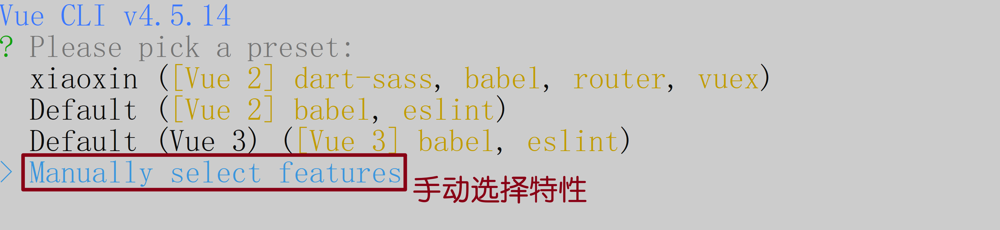
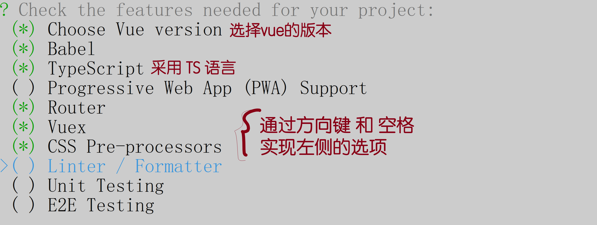
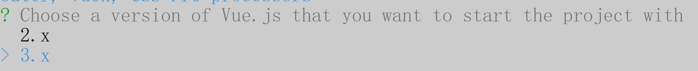
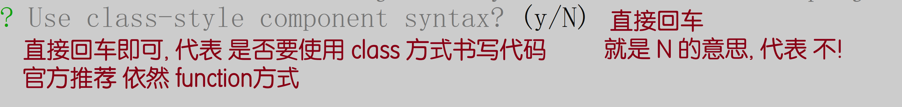
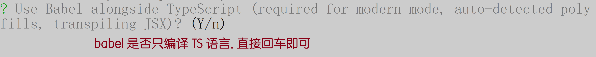
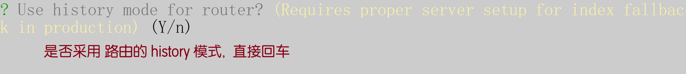
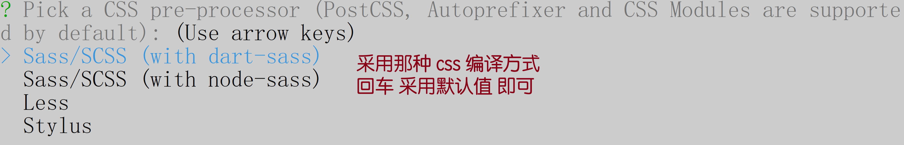
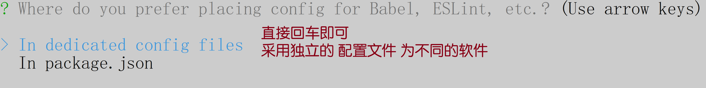
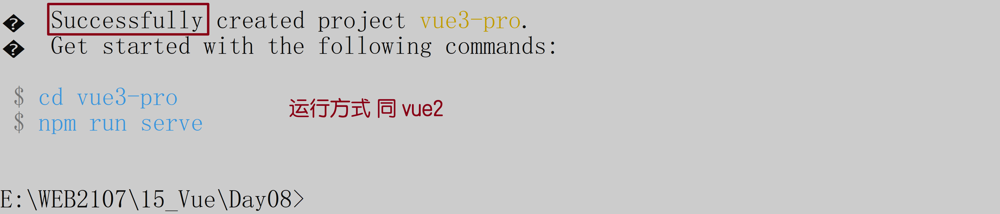
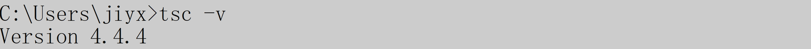

# Vue08

> 今日内容:
>
> - vue 项目 - 详情页
> - typescript 语言 -- 融合更多 JAVA 特征的 JS
> - vue3 语法

## 昨日重要内容回顾

- Vuex: `全局状态管理`

  `5个`核心属性:

  - state: 存放在 state 变量中的值, 就可以全局所有组件中 共享使用
    - 使用方式 1: `this.$store.state.xxx`
    - 使用方式 2: 官方提供的辅助函数 `mapState`
      - 使用时: 在计算属性 computed 中书写:`...mapState([属性名, 属性名...])`
  - mutations: 变化,变更. 官方为了统一修改方式, 只允许通过 mutations 中存储的函数 来修改 state 中的值
    - 写法: `函数名(state, 自定义参数){}` 参数 1 是固定的 state
    - 用法 1: `this.$store.commit('函数名', 自定义传参)`
    - 用法 2: 辅助函数 `mapMutations` , 必须在 methods 中使用, `...mapMutataions(['函数名'])`
  - getters: 计算属性
  - actions: 放置异步操作的函数
  - modules: 拆包

- 事件车: `event bus`

  > 作用: 组件间 传递事件信息; 例如 在 头部组件点击搜索按钮, 触发 商品页面的 搜索操作

  - vue 对象提供了 3 个方法:
    - `$emit(事件名, 事件参数)`: 在 vue 对象范围内 发布一个消息, 带有相应的参数
    - `$on(事件名, 回调函数)`: 在 vue 对象范围内, 监听`指定`消息. 所以事件名必须和 $emit 中的参数 1 事件名相同, 监听到之后触发回调函数, $emit 的事件参数 会作为实参 传递给 回调函数
    - `$off(事件名)`: 关闭指定事件的监听

- post 请求:

  - 特点: 参数 和 路径必须分开书写
  - 格式: `this.axios.post(url, 参数).then()`

- 带有 scoped 作用域的样式问题

  此类样式 只对当前组件生效. 对于父组件 或 子组件 没有任何影响

- meta: 路由的`元数据`属性. 用来为路由添加自定义属性

  例如:添加 title 属性, 让不同的路由 呈现不同的标签名:搭配 `document.title`使用

  例如:添加 showHeader 属性, 让注册/登录 隐藏头部栏

## 项目所有代码的网盘地址

```
链接：https://pan.baidu.com/s/10oVRMBaEDL9uQSB1Jrrc3w
提取码：6666
--来自百度网盘超级会员V5的分享
```

## Vue3

目前主流的 大多数项目, 依然采用 vue2 进行开发, 但是趋势会在未来逐渐进入 vue3

生成 vue3 的项目包, 下午使用

生成项目包

- 在你希望生成项目包的目录下打开 cmd 命令行: `vue create vue3-pro`

- 选择手动配置方式

  

- 按照下图 选择, 选择后 `回车`

  

- 选择 3.x

  

- 不使用 class 方式

  

- babel 的配置

  

- 是否采用 路由的 history 模式, `是`

- css 预编译器的选择

  

- 配置文件的设置

  

- 保存以上配置, 供下一次使用

  

- 

- 生成完毕:

  

- 网盘 和 FTP 都已经上传了项目包, 可以直接下载使用.

## TypeScript

> vue3 官方推荐使用 TS 语言 代替 JS

微软公司, 在 JS 的基础上, 融合了大量的 JAVA 特性, 形成了 `TypeScript`

安装 TS 的编译器: `npm i -g typescript`, 带有-g 说明是全局安装

安装之后, 测试是否已安装: `tsc -v`



> 编译器: 浏览器只能运行 JS 代码, TS 代码需要先转成 JS 才能执行

### TS 相关知识点

```tsx
// 后缀名ts 代表 typescript 代码
// TS和 JS 最大的差别:
// JS是弱类型语言: 变量忽略类型, 可以存储任意类型的值
// TS是强类型语言: 一个变量一种类型, 只能存储指定类型的值

// 变量:类型名    则此变量只能填入指定类型的值
let name1: string
name1 = "mike"
// 如果类型错误, 则系统给出报错提示!
// name1 = 44

// 特点: 如果代码错误, 编译器立刻给出提示
// TS需要编译成 JS 之后才能执行
// 在 ts 文件夹下打开 cmd 工具, 执行  tsc 文件名.ts 命令即可
// 例如:  tsc 01.ts    目录下就会出现 01.js 文件

//TS会自动识别已开启的所有文件中是否有同名变量冲突
```

```tsx
// 都有哪些数据类型
let a: string = "33" //字符串
let b: number = 44 //数字
let c: boolean = true //布尔类型
// any: 任意类型;  则变成JS的弱类型
let d: any
d = 11
d = "mike"
d = true

// 可选的复合类型, 类型|类型  代表两种类型均可以
let e: number | string
e = 44
e = "kkk"
//e = true //报错: 只允许 number 和 string

// 数组类型
// Array<类型名>: 代表数组中都是指定类型的值
let f: Array<number> = [11, 22, 33]
// 格式化: 右键->使用...格式化->配置默认->prettier
// f.push(true) //报错: 类型不是number
// 简化: 类型[] 等价与 Array<类型>
let g: number[] = [12, 4, 34, 5]
// 指定数据的元素个数 及 类型
let h: [number, string, boolean] = [29, "亮亮", true]
```

```tsx
// 对象类型:
// interface接口
let boss = {
  name: "文华",
  age: 39,
  married: true,
}
// 问题: 如何描述 这个对象类型的 结构?
interface Boss {
  name: string
  age: number
  married: boolean
}
// 创建一个 Boss 类型的对象
let mayun: Boss = {
  name: "马云",
  age: 56,
  married: true,
}
```

```tsx
// 丰富的提示:
// VSCode无法得知 参数name 的类型, 所以不能提供辅助操作 -- 代码提示
// TS可以指定 参数类型, 则内部使用时, 有代码提示
//
// function 函数名(参数:参数类型): 返回值类型{}
function show(name: string): string {
  return name.toUpperCase()
  // 由于返回值要求string类型, 所以非字符串类型的返回值 会直接报错
  // return 22
}

let res = show("mike")
```

```tsx
// 函数的重载: 根据参数数量不同/类型不同, 执行不同的任务
// TS可以规定 重载函数的具体参数信息
function pay(): void //void: 代表方法体没有返回值
function pay(money: number): void
function pay(code: string, pwd: string): void

// pay: 支付函数
// 默认: pay() 刷脸支付
// pay(1000) 数字: 代表现金支付
// pay(扫码, 密码):  扫码支付
function pay(...args) {
  // arguments: 旧写法
  // ... : 新写法, 剩余参数
  if (args.length == 0) {
    console.log("刷脸支付")
  }
  if (args.length == 1) {
    console.log("现金支付")
  }
  if (args.length == 2) {
    console.log("扫码支付")
  }
}

// 使用时:
pay()
pay(1000) //数字类型 - 代表钱数
// pay(true) //此写法参数明显错误
pay("扫码", "123456")
// pay(11, 22, 33, 44) //重载没有针对4参数的代码
```

```tsx
// 面向对象 OOP
// 三大特征: 封装 继承 多态
class Student {
  // 在JS中, this.xx = ??; 如果xx不存在, 会自动声明
  // TS为了安全考虑, 只能对已有的属性进行赋值
  sname: string
  sage: number

  // 构造方法, new 时触发, 生成对象
  constructor(sname: string, sage: number) {
    this.sname = sname
    this.sage = sage
  }
}
```

```tsx
// 私有属性
// 在TS语言中为属性提供了3种权限
// public : 公开的
// protected : 保护的
// private : 私有的
class Father {
  public name = "亮亮" //公开的姓名
  protected money = "亮亮的钱" //保护的钱
  private avi = "亮亮珍藏多年的小电影" //私有的小电影
}

let f = new Father()
f.name
// f.money:  公共区域无法访问 类的保护属性
// f.avi: 公共区域无法访问 类的私有属性

class Son extends Father {
  show() {
    console.log(this.name)
    console.log(this.money) // 子类可以访问父类的保护属性
    // console.log(this.avi)  子类无法访问父类私有的属性
  }
}
```

```tsx
// 接口: interface
// 用途1: 定制对象类型的结构 -- 03的例子
// 用途2: 规定 类必须实现哪些方法
interface NvXu {
  maiFang(): void //方法
  maiChe(): void //方法
  money: number //属性
}

// implements: 实现
class Boy implements NvXu {
  maiChe() {
    console.log("8年的2手雅迪")
  }
  maiFang() {
    console.log("天台阳光赏星房")
  }
  money = 500
}
```

```tsx
// 导入
import { mapGetters, mapState, mapMutaions } from "./10.模块的导出"

mapGetters()

mapState()

mapMutaions()
```

```tsx
// 导出:
// JS的导出分两种方式
// export default {}
// 对应的导入 import 自定义名称 from 文件

// 方式2: 分别导出
// export xxx
// export xxx
// 使用时:  import {xx, aa, bb} from 文件

// ts文件:
function mapState() {}
function mapMutaions() {}
function mapGetters() {}
//ts提供的导出写法: 不用写default 也能导出多个
export { mapGetters, mapState, mapMutaions }
```

## Vue3 的主要变化

Vue2 的 js 部分:

> vue2: 把方法 数据 等 按照`类型和作用` 分成不同的部分
>
> vue3: 把方法,属性 按照`业务` 分成不同的部分

```js
data:{
    数据1;
    数据2;
    数据3...
},
methods:{
    方法1,
    方法2,
    方法3,
    ...
},
计算属性:{
    计算属性1:...
    计算属性2:...
}
```

### 基础

```vue
<template>
  <div>
    <!-- vbase-3 -->
  </div>
  <!-- vue3在 html部分的唯一区别: template中可以有多个子元素 -->
  <div>111</div>
  <div>333</div>
</template>

<script>
export default {
  // vue3: 数据 方法 计算属性 监听器...都放setup 里, 与数据相关的操作
  setup() {
    // 脚本分两种模式:  JS模式 和 TS模式
    // 当前脚本 就是 JS模式, 无法使用TS语法
    // let a: number = 10

    return {}
  },
}
</script>

<style lang="scss" scoped></style>
```

### ref

```vue
<template>
  <div>
    <!-- vbase-3-ts -->
    <p>{{ count }}</p>
    <p>双份:{{ count_double }}</p>
    <button @click="addCount">add</button>
  </div>
</template>

<script lang="ts">
import { computed, defineComponent, ref, watch } from "vue"
// defineComponent + 脚本的 lang='ts'  可以让代码支持 TS 语法
export default defineComponent({
  setup() {
    // let a: number = 4
    // a = true
    // 作者对变量做了细分:
    // 1. 变量变化, 需要重绘DOM  -- 用ref() 方法转化才可以
    // 2. 变量变化, 和DOM无关
    let count = ref(10)

    let addCount = () => {
      // 使用 ref 转化后的变量, 必须用 value 来读取值 进行修改
      count.value++
      // ref() 转化后的变量, 都有很多相关的方法和属性
      console.log(count)
    }

    // 计算属性:
    const count_double = computed(() => {
      // 千万注意:  ref 处理后的变量,  用value 来做值的修改
      return count.value * 2
    })
    // 参数1: 要观察的变量
    // 监听器, 不需要放在 return 里
    watch(count, (newValue, oldValue) => {
      console.log("新值:", newValue)
      console.log("旧值:", oldValue)
    })

    // 所有要在页面上使用的内容, 必须return出去
    return { count, addCount, count_double }
  },
})
</script>

<style scoped></style>
```

### reactive

```vue
<template>
  <div>
    <!-- vbase-3-ts -->
    <div>count:{{ count }}</div>
    <div>num:{{ num }}</div>
    <div>
      <button @click="minusNum">-</button>
      <button @click="addNum">+</button>
    </div>
    <ul>
      <li v-for="(item, index) in names" :key="index">{{ item }}</li>
    </ul>
  </div>
</template>

<script lang="ts">
import { defineComponent, ref, reactive, toRefs } from "vue"

export default defineComponent({
  setup() {
    // 生成多个变量: 官方提供了 reactive 方法快速生成
    // let count = ref(10)
    // let num = ref(5)
    // let names = ref(["mike", "lucy"])
    let data = reactive({
      count: 10,
      num: 5,
      names: ["mike", "lucy", "tom", "lily"],
    })

    //如何一次性声明多个方法
    let methods = {
      addNum() {
        // 用reactive 声明的变量, 使用时 不用写 .value
        // 一般推荐用 reactive 代替 ref 声明, 使用时更方便
        data.num++
      },
      minusNum() {
        data.num--
      },
    }

    // toRefs: 转化成 ref 们
    console.log(toRefs(data))
    return {
      // ...展开语法, 把变量们 放在 此处
      ...toRefs(data),
      // 展开 methods 中的内容到此处
      ...methods,
    }
  },
})
</script>

<style scoped></style>
```

### 生命周期

```vue
<template>
  <div></div>
</template>

<script lang="ts">
import { defineComponent, onBeforeMount, onMounted } from "vue"

export default defineComponent({
  setup() {
    //setup相当于 之前的 created 周期: 创建时
    //生命周期: vue3中名称发生了变更
    onBeforeMount(() => {
      console.log("DOM即将挂载")
    })
    onMounted(() => {
      console.log("DOM挂载完毕")
      // axios请求
    })
    // onBeforeUpdate(() => {}) //DOM即将更新
    // onUpdated(() => {}) //DOM更新完毕
    // onBeforeUnmount(() => {}) //将要销毁
    // onUnmounted(() => {}) //销毁完毕

    return {}
  },
})
</script>

<style scoped></style>
```

### 指令

```vue
<template>
  <div>
    <!-- vbase-3-ts -->
    <!-- 自定义指令: 让某个输入框元素 自动获得焦点 -->
    <!-- 分析: VUE对大多数DOM方法进行了封装, 原生DOM方法太多了, 依然存在没有被封装的存在,  自定义指令 就允许我们自定义对 DOM 进行操作 -->
    <input type="text" v-my-focus />
    <br />
    <input type="text" />
  </div>
</template>

<script lang="ts">
import { defineComponent } from "vue"

export default defineComponent({
  // 指令和数据操作无关, 所以不放在setup里
  directives: {
    // v-my-focus: 指令名是 除了 v- 的部分
    // 属性名不允许 - 中划线, 所以用 引号包围起来 才可以
    "my-focus": {
      // vue2的写法:  inserted 代表指令所在组件被插入到DOM的时间点
      // vue3中: 改名为 mounted
      mounted(el) {
        el.focus() //el: 参数代表 指令所在的组件
      },
    },
  },
  setup() {
    // vue2中的: data, methods, computed, watch.. 都是操作数据的
    // 放在 setup 中书写
    return {}
  },
})
</script>

<style scoped></style>
```
